# **JOBSHEET VIII QUEUE**

### **Nama: Iemaduddin**
### **No. Absen/Kelas: 16/TI-1F**
### **NIM: 2141720055**

#
## **8.1 Tujuan Praktikum**

Setelah melakukan materi praktikum ini, mahasiswa mampu:

1. Mengenal struktur data Queue
2. Membuat dan mendeklarasikan struktur data Queue
3. Menerapkan algoritma Queue dengan menggunakan array

## **Praktikum 1**

**Waktu percobaan : 45 menit**

Pada percobaan ini, kita akan mengimplementasikan penggunaan class Queue.

### **8.2.1 Langkah-langkah Percobaan**

1. Perhatikan Diagram Class Queue berikut ini:

   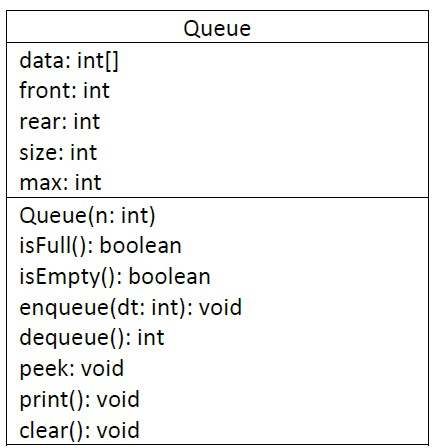

   Berdasarkan diagram class tersebut, akan dibuat program class Queue dalam Java.

2. Buat package dengan nama **Praktikum1**, kemudian buat class baru dengan nama **Queue**.
3. Tambahkan atribut-atribut Queue sesuai diagram class, kemudian tambahkan pula konstruktornya.

   ```
   package Praktikum1;
   import java.util.Scanner;
   public class Queue {
      int[] data;
      int front;
      int rear;
      int size;
      int max;

      public Queue(int n){
         max = n;
         data = new int[max];
         size = 0;
         front = rear = -1;
      }
   }
   ```

4. Buat method **IsEmpty** bertipe boolean yang digunakan untuk mengecek apakah queue kosong.

   ```
      public boolean IsEmpty(){
        if(size == 0){
            return true;
        }else{
            return false;
        }
      }
   ```

5. Buat method **IsFull** bertipe boolean yang digunakan untuk mengecek apakah queue sudah penuh.

   ```
      public boolean IsFull(){
        if(size == max){
            return true;
        }else{
            return false;
        }
      }
   ```

6. Buat method **peek** bertipe void untuk menampilkan elemen queue pada posisi paling depan.

   ```
      public void peek(){
        if(!IsEmpty()){
            System.out.println("Elemen terdepan: " +data[front]);
        }else{
            System.out.println("Queue masih kosong");
        }
      }
   ```

7. Buat method **print** bertipe void untuk menampilkan seluruh elemen pada queue mulai dari posisi front sampai dengan posisi rear.

   ```
      public void print(){
        if(IsEmpty()){
            System.out.println("Queue masih kosong");
        }else{
            int i = front;
            while (i != rear){
                System.out.print(data[i] + " ");
                i = (i+1) % max;
            }
            System.out.println(data[i] + " ");
            System.out.println("Jumlah elemen = " + size);
        }
      }
   ```

8. Buat method **clear** bertipe void untuk menghapus semua elemen pada queue

   ```
      public void clear(){
        if(!IsEmpty()){
            front = rear = -1;
            size = 0;
            System.out.println("Queue berhasil dikosongkan");
        }else{
            System.out.println("Queue masih kosong");
        }
      }
   ```

9. Buat method **Enqueue** bertipe void untuk menambahkan isi queue dengan parameter **dt** yang bertipe integer

   ```
       public void Enqueue(int dt){
        if(IsFull()){
            System.out.println("Queue sudah penuh");
        }else{
            if(IsEmpty()){
                front = rear = 0;
            }else{
                if(rear == max - 1){
                    rear = 0;
                }else{
                    rear++;
                }
            }
            data[rear] = dt;
            size++;
        }
      }
   ```

10. Buat method **Dequeue** bertipe int untuk mengeluarkan data pada queue di posisi belakang
      
      ```
      public int Dequeue(){
        int dt = 0;
        if(IsEmpty()){
            System.out.println("Queue masih kosong");
        }else{
            dt = data[front];
            size--;
            if(IsEmpty()){
                front = rear = -1;
            }else{
                if(front == max - 1){
                    front =0;
                }else{
                    front++;
                }
            }
        }
        return dt;
      }
      ```

11. Selanjutnya, buat class baru dengan nama **QueueMain** tetap pada package **Praktikum1**. Buat method **menu** bertipe void untuk memilih menu program pada saat dijalankan.

      ```
      class QueueMain{
         public static void menu(){
            System.out.println("Masukkan operasi yang diinginkan:");
            System.out.println("1. Enqueue");
            System.out.println("2. Dequeue");
            System.out.println("3. Print");
            System.out.println("4. Peek");
            System.out.println("5. Clear");
            System.out.println("----------------------------------");
      }
      ```

12. Buat fungsi **main**, kemudian deklarasikan Scanner dengan nama **sc**.
13. Buat variabel **n** untuk menampung masukan berupa jumlah maksimal elemen yang dapat disimpan pada queue.


      ```
       public static void main(String[] args) {
        Scanner sc = new Scanner(System.in);
        System.out.print("Masukkan kapasitas queue: ");
        int n = sc.nextInt();
       }
      ```


14. Lakukan instansiasi objek Queue dengan nama **Q** dengan mengirimkan parameter **n** sebagai kapasitas elemen queue

      ```
      Queue Q = new Queue(n);
      ```

15. Deklarasikan variabel dengan nama **pilih** bertipe integer untuk menampung pilih menu dari pengguna.
16. Lakukan perulangan menggunakan do-while untuk menjalankan program secara terus menerus sesuai masukan yang diberikan. Di dalam perulangan tersebut, terdapat pemilihan kondisi menggunakan switch-case untuk menjalankan operasi queue sesuai dengan masukan pengguna.

      ```
      int pilih;
      do{
            menu();
            pilih = sc.nextInt();
            switch(pilih){
                case 1:
                    System.out.print("Masukkan data baru: ");
                    int dataMasuk = sc.nextInt();
                    Q.Enqueue(dataMasuk);
                    break;
                case 2:
                    int dataKeluar = Q.Dequeue();
                    if(dataKeluar != 0){
                        System.out.println("Data yang dikeluarkan: "+ dataKeluar);
                        break;
                    }
                case 3:
                    Q.print();
                    break;
                case 4:
                    Q.peek();
                    break;
                case 5:
                    Q.clear();
                    break;
            }
      }while(pilih == 1 || pilih == 2 || pilih == 3 || pilih == 4 || pilih == 5 );
      ```

17. Compile dan jalankan class **QueueMain**, kemudian amati hasilnya.


### **8.2.2 Verifikasi Hasil Percobaan**

Samakan hasil compile kode program Anda dengan gambar berikut ini.


   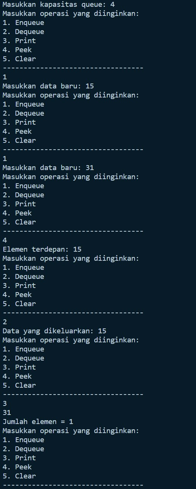


### **8.2.3 Pertanyaan**

1. Pada konstruktor, mengapa nilai awal atribut front dan rear bernilai -1, sementara atribut size bernilai 0?


   **Jawab:** Karena Queue telah disettings dalam keadaan kosong. Nilai dari atribut front dan rear = -1 dimaksud supaya tidak terdapat dalam queue atau index array manapun. Dan size sama dengan 0 yang artinya dalam queue masih kosong (data masih tidak ada).

   
2. Pada method **Enqueue**, jelaskan maksud dan kegunaan dari potongan kode berikut!

   ```
   if (rear == max - 1){
      rear = 0;
   }
   ```

   **Jawab:** Jika rear berada di index terakhir, maka rear di pindah ke index ke-0. Misal: max = 5, maka index dalam array dari 0-4, yang mana max - 1, yaitu 5-1 = 4 (index terakhir)


   
3. Pada method **Dequeue**, jelaskan maksud dan kegunaan dari potongan kode berikut!

   ```
   if (front == max - 1){
      front = 0;
   }
   ```
   **Jawab:** Jika front berada di index terakhir, maka front di pindah ke index ke-0. Misal: max = 5, maka index dalam array dari 0-4, yang mana max - 1, yaitu 5-1 = 4 (index terakhir)


4. Pada method **print**, mengapa pada proses perulangan variabel i tidak dimulai dari 0 (**int i=0**), melainkan **int i=front**?
   

   **Jawab:** Karena front tidak selalu ada di index ke-0.


5. Perhatikan kembali method **print**, jelaskan maksud dari potongan kode berikut!

   ```
   i = (i+1) % max;
   ```

   **Jawab:** Agar increament dari i nya itu sendiri maksimal sampai dengan jumlah max nya. Misal : jika max = 5, i = front = 4, maka (4+1)% 5 = 0. yang artinya jika nilai front itu ada pada index terakhir maka nanti akan bergeser ke index 0, bisa dikatakan juga potongan kode tersebut digunakan untuk membatasi dan mengarahkan ke index selanjutnya yang sesuai jumlah max.


6. Tunjukkan potongan kode program yang merupakan queue overflow!
   
   
   **Jawab:** Overflow: kondisi yang dihasilkan dari mencoba menambahkan elemen ke queue yang sudah penuh, potongan kode program terdapat di bawah ini:

   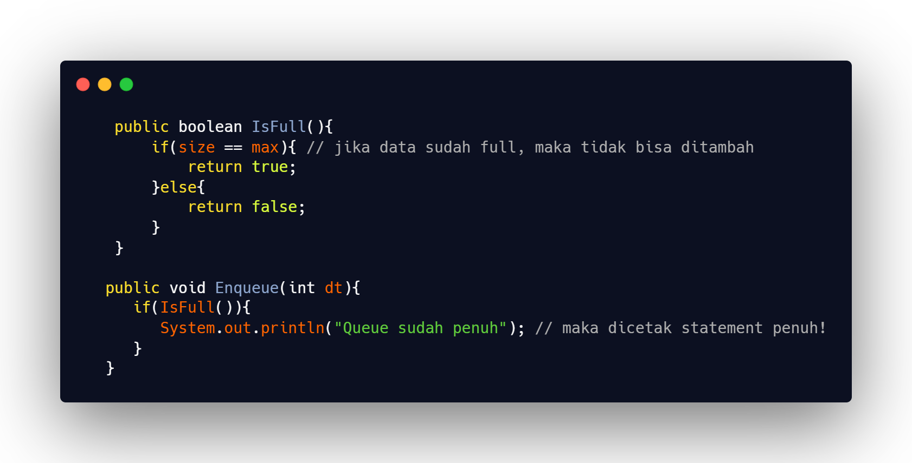


7. Pada saat terjadi queue overflow dan queue underflow, program tersebut tetap dapat berjalan dan hanya menampilkan teks informasi. Lakukan modifikasi program sehingga pada saat terjadi queue overflow dan queue underflow, program dihentikan!


   **Jawab:**

   - Overflow:

      - Code:
      

         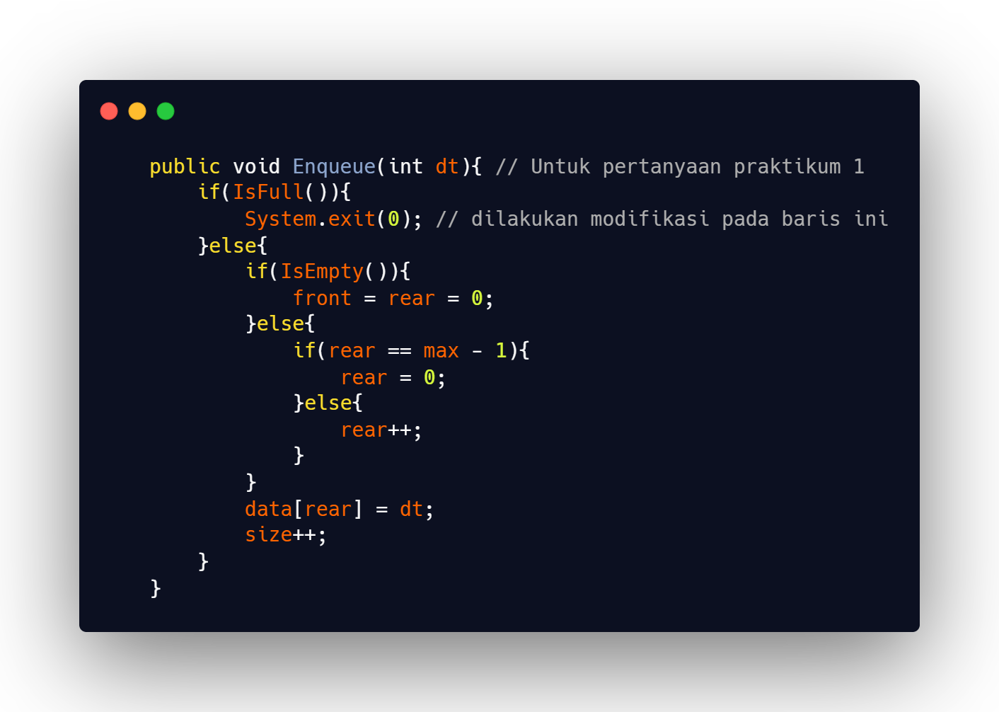


      - Output:

         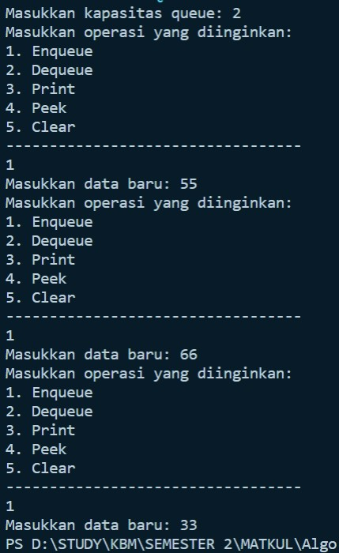


   - Underflow:

      - Code:


         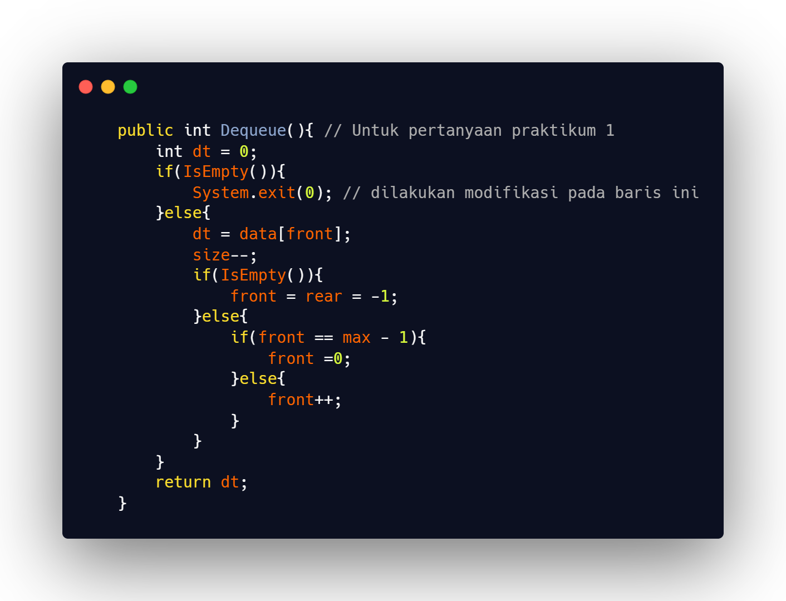

      
      - Output:


         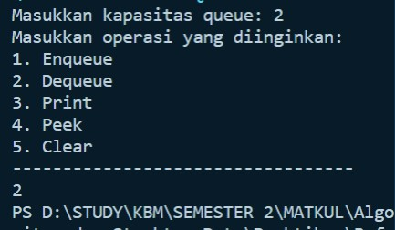


## **8.3 Praktikum 2**

### **Waktu percobaan : 45 menit**

Pada percobaan ini, kita akan membuat program yang mengilustrasikan teller di bank dalam melayani nasabah.

### **Langkah-langkah Percobaan**
1. Perhatikan Diagram Class berikut ini:

   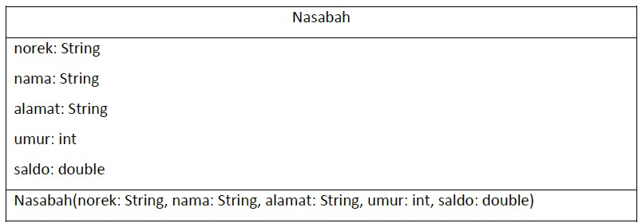

   Berdasarkan diagram class tersebut, akan dibuat program class Nasabah dalam Java.

2. Buat package dengan nama **Praktikum2**, kemudian buat class baru dengan nama **Nasabah**.
3. Tambahkan atribut-atribut Nasabah seperti pada Class Diagram, kemudian tambahkan pula konstruktornya seperti gambar berikut ini.

   ```
   package Praktikum2;
   import java.util.Scanner;
   public class Nasabah {
      String norek, nama, alamat;
      int umur;
      double saldo;

      Nasabah(String norek, String nama, String alamat, int umur, double saldo){
         this.norek = norek;
         this.nama = nama;
         this.alamat = alamat;
         this.umur = umur;
         this.saldo = saldo;
      }
   }
   ```

4. Salin kode program class **Queue** pada **Praktikum 1** untuk digunakan kembali pada **Praktikum 2** ini. Karena pada **Praktikum 1**, data yang disimpan pada queue hanya berupa array bertipe integer, sedangkan pada **Praktikum 2** data yang digunakan adalah object, maka perlu dilakukan modifikasi pada class **Queue** tersebut.
5. Lakukan modifikasi pada class **Queue** dengan mengubah tipe **int[] data** menjadi **Nasabah[] data** karena pada kasus ini data yang akan disimpan pada queue berupa object Nasabah. Modifikasi perlu dilakukan pada **atribut**, method **Enqueue**, dan method **Dequeue**.

   ```
   class Queue {
      Nasabah[] data;
      int front;
      int rear;
      int size;
      int max;

      public Queue(int n){
         max = n;
         data = new Nasabah[max];
         size = 0;
         front = rear = -1;
      }

      public void Enqueue(Nasabah dt){
        if(IsFull()){
            System.out.println("Queue sudah penuh");
        }else{
            if(IsEmpty()){
                front = rear = 0;
            }else{
                if(rear == max - 1){
                    rear = 0;
                }else{
                    rear++;
                }
            }
            data[rear] = dt;
            size++;
        }
      }

      public Nasabah Dequeue(){
        Nasabah dt = new Nasabah();
        if(IsEmpty()){
            System.out.println("Queue masih kosong");
        }else{
            dt = data[front];
            size--;
            if(IsEmpty()){
                front = rear = -1;
            }else{
                if(front == max - 1){
                    front =0;
                }else{
                    front++;
                }
            }
        }
        return dt;
      }
   ```

   Baris program **Nasabah dt = new Nasabah();** akan ditandai sebagai error, untuk mengatasinya, tambahkan konstruktor default di dalam class Nasabah.

      ```
      Nasabah(){

      }
      ```

6. Karena satu elemen queue terdiri dari beberapa informasi (norek, nama, alamat, umur, dan saldo), maka ketika mencetak data juga perlu ditampilkan semua informasi tersebut, sehingga meodifikasi perlu dilakukan pada method **peek** dan method **print**.

   ```
   public void peek(){
      if(!IsEmpty()){
         System.out.println("Elemen terdepan: " + data[front].norek + " " + data[front].nama + " " + 
         data[front].alamat + " " + data[front].umur + " " + data[front].saldo);
      }else{
         System.out.println("Queue masih kosong");
      }
    }

    public void print(){
      if(IsEmpty()){
         System.out.println("Queue masih kosong");
      }else{
         int i = front;
         while (i != rear){
            System.out.print(data[i].norek + " " + data[i].nama + " " + data[i].alamat + " " +
            data[i].umur + " " + data[i].saldo);
                i = (i+1) % max;
         }
         System.out.println(data[i].norek + " " + data[i].nama + " " + data[i].alamat + " " +
         data[i].umur + " " + data[i].saldo);
         System.out.println("Jumlah elemen = " + size);
        }
    }
   ```

7. Selanjutnya, buat class baru dengan nama **QueueMain** tetap pada package **Praktikum2**. Buat method menu untuk mengakomodasi pilihan menu dari masukan pengguna

   ```
   class QueueMain{
      public static void menu(){
         System.out.println("Pilihan menu: ");
         System.out.println("1. Antrian baru");
         System.out.println("2. Antrian keluar");
         System.out.println("3. Cek Antrian terdepan");
         System.out.println("4. Cek Semua Antrian");
         System.out.println("---------------------------");
      }
   }
   ```

8. Buat fungsi **main**, deklarasikan Scanner dengan nama **sc**
9. Buat variabel **max** untuk menampung kapasitas elemen pada queue. Kemudian lakukan instansiasi objek queue dengan nama **antri** dan nilai parameternya adalah variabel **jumlah**.

   ```
      public static void main(String[] args) {
        Scanner sc = new Scanner(System.in);
        System.out.print("Masukkan kapasitas queue: ");
        int jumlah = sc.nextInt();
        Queue antri = new Queue(jumlah);
      }
   ```

10. Deklarasikan variabel dengan nama **pilih** bertipe integer untuk menampung pilih menu dari pengguna.
11. Tambahkan kode berikut untuk melakukan perulangan menu sesuai dengan masukan yang diberikan oleh pengguna.

      ```
            int pilih;
            do{
               menu();
               pilih = sc.nextInt();
               sc.nextLine();
               switch(pilih){
                  case 1:
                     System.out.print("No Rekening: ");
                     String norek = sc.nextLine();
                     System.out.print("Nama: ");
                     String nama = sc.nextLine();
                     System.out.print("Alamat: ");
                     String alamat = sc.nextLine();
                     System.out.print("Umur: ");
                     int umur = sc.nextInt();
                     System.out.print("Saldo: ");
                     double saldo = sc.nextDouble();
                     Nasabah nb = new Nasabah(norek, nama, alamat, umur, saldo);
                     sc.nextLine();
                     antri.Enqueue(nb);
                     break;
                  case 2:
                     Nasabah data = antri.Dequeue();
                     if(!"".equals(data.norek) && !"".equals(data.nama) && !"".equals(data.alamat)
                     && data.umur !=0 && data.saldo !=0){
                           System.out.println("Antrian yang keluar: " + data.norek + " " + data.nama + " " + 
                           data.alamat + " " + data.umur + " " + data.saldo);
                           break;
                     }
                  case 3:
                     antri.peek();
                     break;
                  case 4:
                     antri.print();
                     break;
               }
            } while (pilih == 1 || pilih == 2 || pilih == 3 || pilih == 4);
      ```

12. Compile dan jalankan class **QueueMain**, kemudian amati hasilnya.


### **8.3.2 Verifikasi Hasil Percobaan**

Samakan hasil compile kode program Anda dengan gambar berikut ini.

   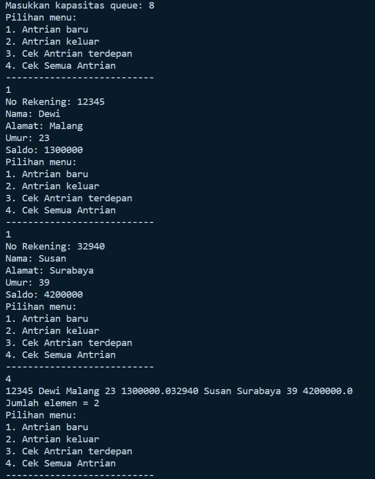

### **8.3.3 Pertanyaan**
1. Pada class QueueMain, jelaskan fungsi IF pada potongan kode program berikut!

   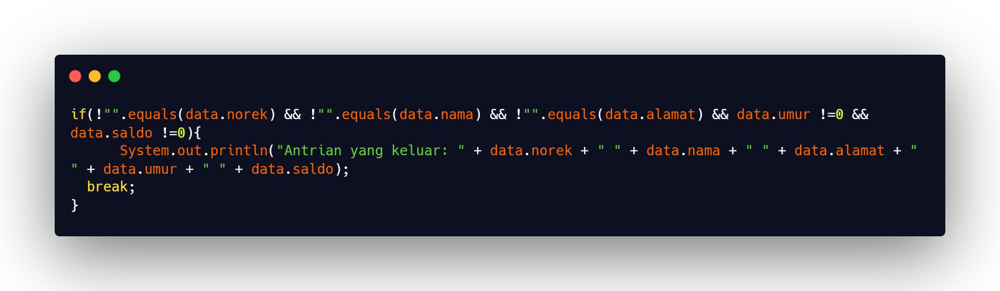


   **Jawab:** Jika norek, nama, dan alamat tidak harus memperhatikan spasi, umur tidak sama dengan 0 dan saldo tidak sama dengan 0, maka akan mencetak ``Antrian yang keluar: norek, nama, alamat, saldo``. Sedangkan jika semua persyaratan itu ada salah satu yang tak terpenuhi, maka tidak akan mencetak statement tersebut.


2. Lakukan modifikasi program dengan menambahkan method baru bernama **peekRear** pada class Queue yang digunakan untuk mengecek antrian yang berada di posisi belakang! Tambahkan pula daftar menu **5. Cek Antrian paling belakang** pada class **QueueMain** sehingga method **peekRear** dapat dipanggil!

   - Code:


      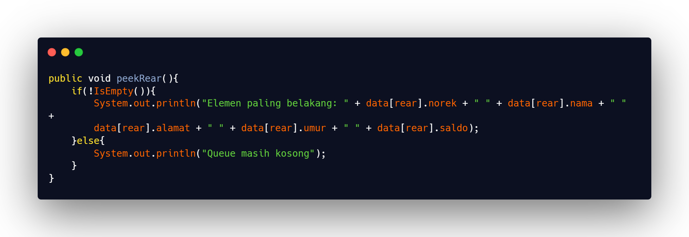


   - Output:


      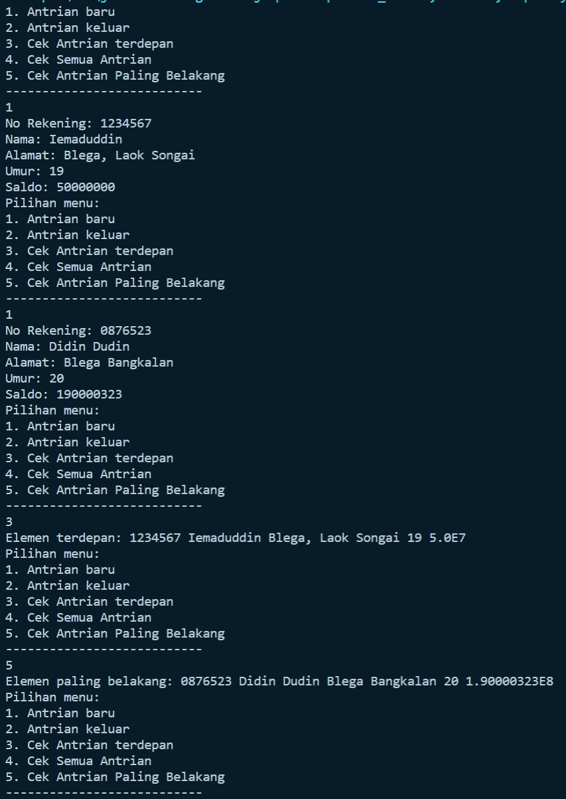
      

## **8.4 Tugas**

1. Tambahkan dua method berikut ke dalam class Queue pada **Praktikum 1**:


      a. Method **peekPosition(data: int) : void**

      Untuk menampilkan posisi dari sebuah data di dalam queue, misalnya dengan mengirimkan data tertentu, akan diketahui posisi (indeks) data tersebut berada di urutan ke berapa

      b. Method **peekAt(position: int) : void**

      Untuk menampilkan data yang berada pada posisi (indeks) tertentu 
      
      Sesuaikan daftar menu yang terdapat pada class **QueueMain** sehingga kedua method tersebut dapat dipanggil!


      **Jawab:** 


   - Code:

      - peekPosition()

         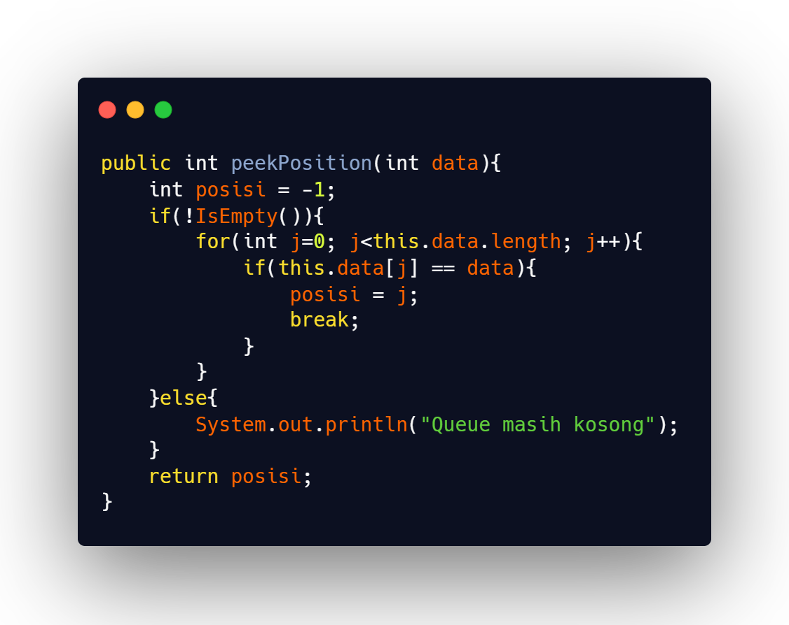


      - peekAt()

         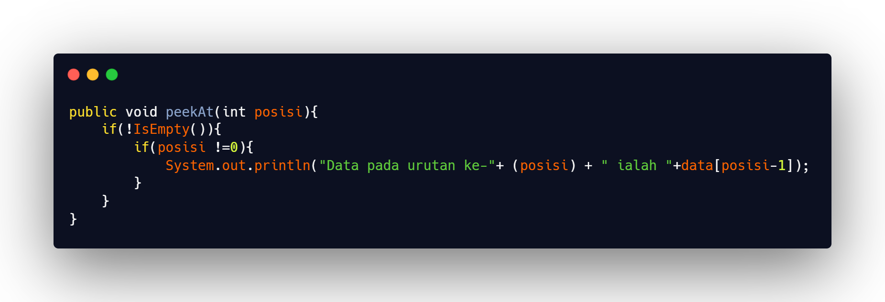
         
      - Main()

         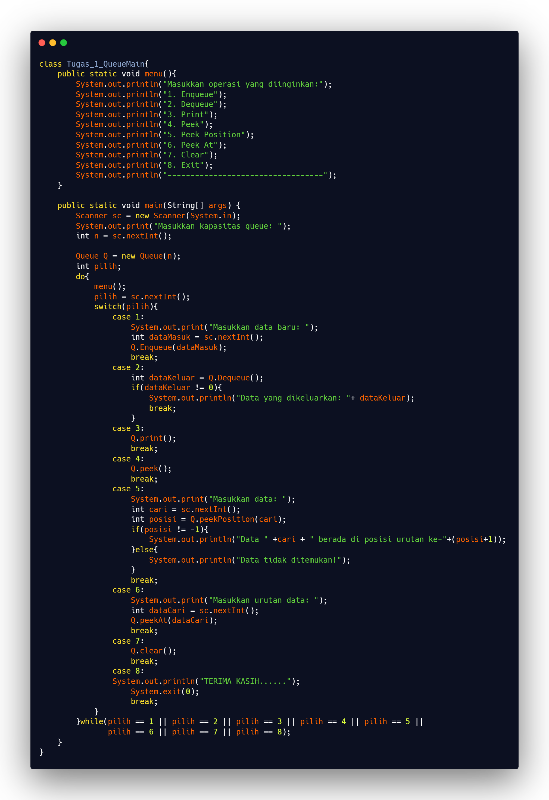
      - Output:


         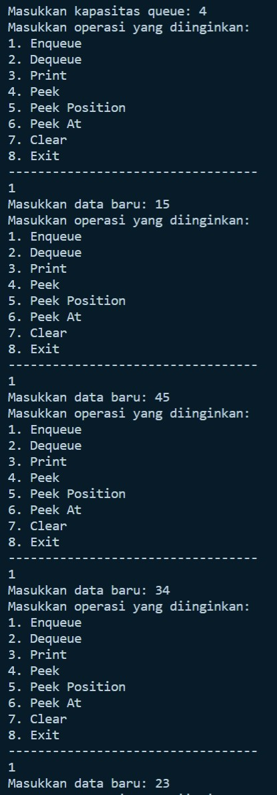
         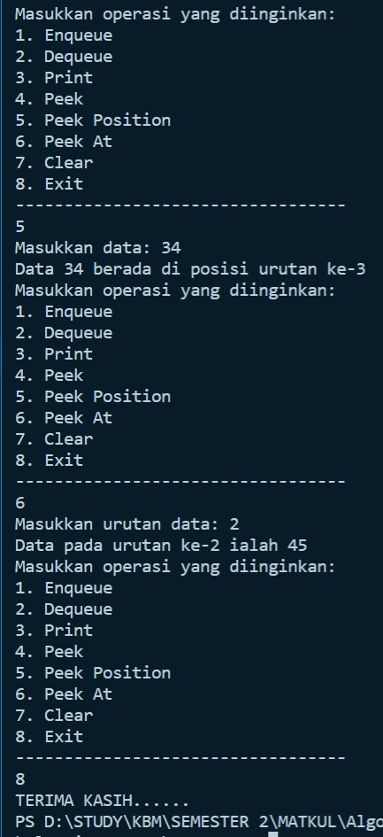


2. Buatlah program antrian untuk mengilustasikan mahasiswa yang sedang meminta tanda tangan KRS pada dosen DPA di kampus. Ketika seorang mahasiswa akan mengantri, maka dia harus menuliskan terlebih dulu NIM, nama, absen, dan IPK seperti yang digambarkan pada Class diagram berikut:

   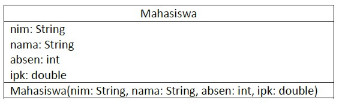

   Class diagram Queue digambarkan sebagai berikut:

   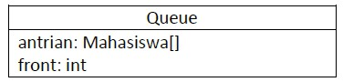
   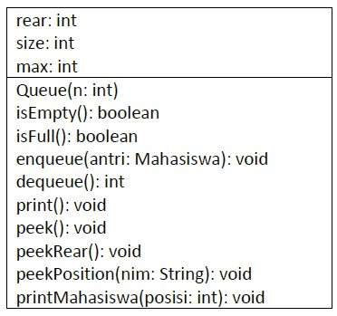


   Keterangan:

   - Method create(), isEmpty(), isFull(), enqueue(), dequeue() dan print(), kegunaannya sama seperti yang telah dibuat pada Praktikum
   - Method peek(): digunakan untuk menampilkan data Mahasiswa yang berada di posisi antrian paling depan
   - Method peekRear(): digunakan untuk menampilkan data Mahasiswa yang berada di posisi antrian paling belakang
   - Method peekPosition(): digunakan untuk menampilkan posisi antrian ke berapa, seorang Mahasiswa berada. Pengecekan dilakukan berdasarkan NIM
   - Method printMahasiswa(): digunakan untuk menampilkan data mahasiswa pada suatu posisi tertentu dalam antrian

      **Jawab:**

      - Code:
         ```
         package Tugas.No_2;
         import java.util.Scanner;
         public class Mahasiswa {
            String nim, nama;
            int absen;
            double ipk;

            Mahasiswa(String nim, String nama, int absen, double ipk){
               this.nim = nim;
               this.nama = nama;
               this.absen = absen;
               this.ipk = ipk;
            }

            Mahasiswa(){

            }
         }

         class Queue {
            Mahasiswa[] data;
            int front;
            int rear;
            int size;
            int max;

            public Queue(int n){
               max = n;
               data = new Mahasiswa[max];
               size = 0;
               front = rear = -1;
            }

            public boolean IsEmpty(){
               if(size == 0){
                     return true;
               }else{
                     return false;
               }
            }

            public boolean IsFull(){
               if(size == max){
                     return true;
               }else{
                     return false;
               }
            }

            public void peek(){
               if(!IsEmpty()){
                     System.out.println("Mahasiswa Antrian terdepan: " + data[front].nim + " " + data[front].nama + " " + 
                     data[front].absen + " " + data[front].ipk);
               }else{
                     System.out.println("Queue masih kosong");
               }
            }

            public void print(){
               if(IsEmpty()){
                     System.out.println("Queue masih kosong");
               }else{
                     int i = front;
                     while (i != rear){
                        System.out.println(data[i].nim + " " + data[i].nama + " " + data[i].absen + " " +
                        data[i].ipk);
                        i = (i+1) % max;
                     }
                     System.out.println(data[i].nim + " " + data[i].nama + " " + data[i].absen + " " +
                     data[i].ipk);
                     System.out.println("Jumlah Antrian = " + size);
               }
            }

            public void Enqueue(Mahasiswa antri){
               if(IsFull()){
                     System.out.println("Queue sudah penuh");
               }else{
                     if(IsEmpty()){
                        front = rear = 0;
                     }else{
                        if(rear == max - 1){
                           rear = 0;
                        }else{
                           rear++;
                        }
                     }
                     data[rear] = antri;
                     size++;
               }
            }

            public Mahasiswa Dequeue(){
               Mahasiswa dt = new Mahasiswa();
               if(IsEmpty()){
                     System.out.println("Queue masih kosong");
               }else{
                     dt = data[front];
                     size--;
                     if(IsEmpty()){
                        front = rear = -1;
                     }else{
                        if(front == max - 1){
                           front =0;
                        }else{
                           front++;
                        }
                     }
               }
               return dt;
            }

            public void peekRear(){
               if(!IsEmpty()){
                     System.out.println("Antrian paling belakang: " + data[rear].nim + " " + data[rear].nama + " " + 
                     data[rear].absen + " " + data[rear].ipk);
               }else{
                     System.out.println("Queue masih kosong");
               }
            }
            
            public int peekPosition(String nim){
               int posisi = -1;
               if(!IsEmpty()){
                     for(int j=0; j<data.length; j++){
                        if(nim.equalsIgnoreCase(data[j].nim)){
                           posisi = j;
                           break;
                        }
                     }
               }else{
                     System.out.println("Queue masih kosong");
               }
               return posisi;
            }
            
            public void printMahasiswa(int posisi){
               if(!IsEmpty()){
                     System.out.println("=====================================================================");
                     System.out.println("                             DATA MAHASISWA                          ");
                     System.out.println("=====================================================================");
                     System.out.println("---------------------------------------------------------------------");
                     System.out.println("NIM\t: " + data[posisi-1].nim);
                     System.out.println("Nama\t: " + data[posisi-1].nama);
                     System.out.println("Absen\t: " + data[posisi-1].absen);
                     System.out.println("IPK\t: " + data[posisi-1].ipk);
               }else{
                     System.out.println("Queue masih kosong");
               }
            }
         }

         class Tugas_2_QueueMain{
            public static void menu(){
               System.out.println("\nPilihan menu: ");
               System.out.println("1. Antrian baru");
               System.out.println("2. Antrian keluar");
               System.out.println("3. Cek Antrian terdepan");
               System.out.println("4. Cek Semua Antrian");
               System.out.println("5. Cek Antrian Paling Belakang");
               System.out.println("6. Cek Antrian Mahasiswa");
               System.out.println("7. Cetak Data Mahasiswa");
               System.out.println("8. Exit");
               System.out.println("---------------------------------------------------------------------");
            }

            public static void main(String[] args) {
               Scanner sc = new Scanner(System.in);
               System.out.print("Masukkan kapasitas queue: ");
               int jumlah = sc.nextInt();
               Queue antri = new Queue(jumlah);

               int pilih;
               do{
                     menu();
                     pilih = sc.nextInt();
                     sc.nextLine();
                     switch(pilih){
                        case 1:
                           System.out.print("NIM: ");
                           String nim = sc.nextLine();
                           System.out.print("Nama: ");
                           String nama = sc.nextLine();
                           System.out.print("Absen: ");
                           int absen = sc.nextInt();
                           System.out.print("IPK: ");
                           double ipk = sc.nextDouble();
                           Mahasiswa nb = new Mahasiswa(nim, nama, absen, ipk);
                           sc.nextLine();
                           antri.Enqueue(nb);
                           break;
                        case 2:
                           Mahasiswa data = antri.Dequeue();
                           if(!"".equals(data.nim) && !"".equals(data.nama)
                           && data.absen !=0 && data.ipk !=0){
                                 System.out.println("Antrian yang keluar: " + data.nim + " " + data.nama + " " 
                                 + data.absen + " " + data.ipk);
                                 break;
                           }
                        case 3:
                           antri.peek();
                           break;
                        case 4:
                           antri.print();
                           break;
                        case 5:
                           antri.peekRear();
                           break;
                        case 6:
                           System.out.print("NIM : ");
                           String cari = sc.nextLine();
                           int posisi = antri.peekPosition(cari);
                           if(posisi != -1){
                                 System.out.println("Mahasiswa dengan NIM " +cari + " mendapatkan posisi antrian ke-"+(posisi+1));
                           }else{
                                 System.out.println("NIM tidak ditemukan!");
                           }
                           break;
                        case 7:
                           System.out.print("Masukkan Nomor Antrian: ");
                           int noAntrian = sc.nextInt();
                           antri.printMahasiswa(noAntrian);
                           break;
                        case 8:
                           System.out.println("TERIMA KASIH....");
                           System.exit(0);
                           break;
                     }
               } while (pilih == 1 || pilih == 2 || pilih == 3 || pilih == 4 || pilih == 5 || 
                        pilih == 6 || pilih == 7 || pilih == 8);
            }
         }
         ```


         
      - Output:

         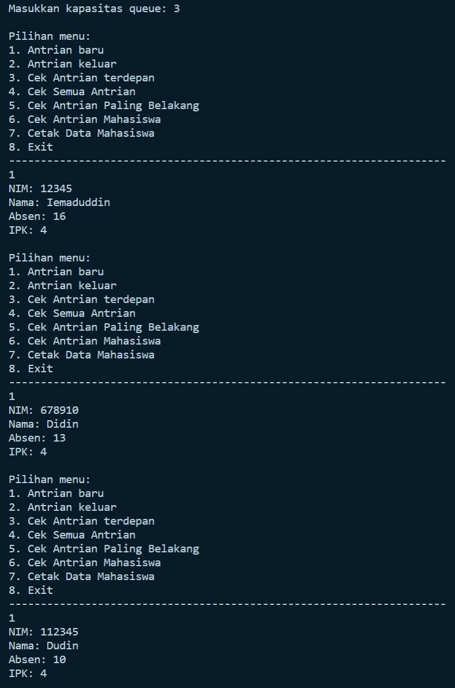
         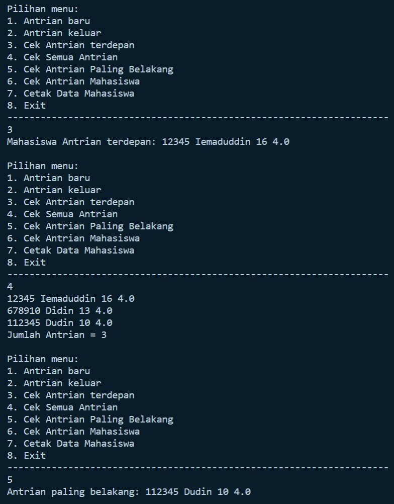
         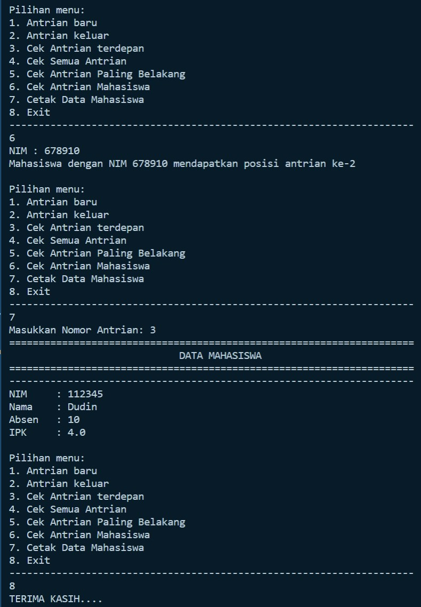