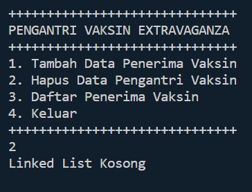
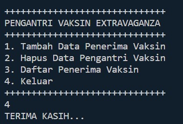
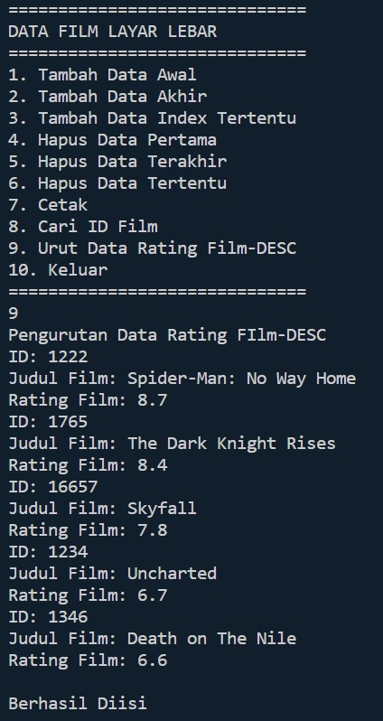

# **JOBSHEET 12 Double Linked Lists**

### **Nama : Iemaduddin**
### **No. Absen/Kelas : 16/TI-1F**
### **NIM : 2141720055**

#
## **12.1 Tujuan Praktikum**

Setelah melakukan praktikum ini, mahasiswa mampu:

1. memahami algoritma double linked lists;
2. membuat dan mendeklarasikan struktur algoritma double linked lists; 
3. menerapkan algoritma double linked lists dalam beberapa *study case*. 

## **12.2 Kegiatan Praktikum 1**

### **12.2.1 Percobaan 1**

Pada percobaan 1 ini akan dibuat class Node dan class DoubleLinkedLists yang didalamnya terdapat operasi-operasi untuk menambahkan data dengan beberapa cara (dari bagian depan linked list, belakang ataupun indeks tertentu pada linked list).

1. Perhatikan diagram class Node dan class DoublelinkedLists di bawah ini! Diagram class ini yang selanjutnya akan dibuat sebagai acuan dalam membuat kode program DoubleLinkedLists.


2. Buat paket baru dengan nama **doublelinkedlists** 
3. Buat class di dalam paket tersebut dengan nama **Node** 

    ```
    package Pertemuan_12.Praktikum_1;

    public class Node{
        
    }
    ```

4. Di dalam class tersebut, deklarasikan atribut sesuai dengan diagram class di atas. 

    ```
    package Pertemuan_12.Praktikum_1;

    public class Node{
        int data;
        Node prev, next;
    }
    ```

5. Selanjutnya tambahkan konstruktor default pada class Node sesuai diagram di atas. 


    ```
        Node(Node prev, int data, Node next){
            this.prev = prev;
            this.data = data;
            this.next =  next;
        }
    ```

6. Buatlah sebuah class baru bernama DoubleLinkedLists pada package yang sama dengan node seperti gambar berikut: 

    ```
    class DoubleLinkedLists{

    }
    ```

7. Pada class DoubleLinkedLists tersebut, deklarasikan atribut sesuai dengan diagram class di atas. 

    ```
        Node head;
        int size;
    ```

8. Selajuntnya, buat konstruktor pada class DoubleLinkedLists sesuai gambar berikut. 

    ```
        public DoubleLinkedLists(){
            head = null;
            size = 0;
        }
    ```

9. Buat method **isEmpty()**. Method ini digunakan untuk memastikan kondisi linked list kosong. 

    ```
        public boolean isEmpty(){
            return head == null;
        }
    ```

10. Kemudian, buat method **addFirst().** Method ini akan menjalankan penambahan data di bagian depan linked list. 

    ```
        public void addFirst(int item){
            if(isEmpty()){
                head = new Node(null, item, null);
            }else{
                Node newNode = new Node(null, item, head);
                head.prev = newNode;
                head = newNode;
            }
            size++;
        }
    ```

11. Selain itu pembuatan method **addLast()** akan menambahkan data pada bagian belakang linked list. 

    ```
        public void addLast(int item){
            if(isEmpty()){
                addFirst(item);
            }else{
                Node current = head;
                while (current.next != null){
                    current = current.next;
                }
                Node newNode = new Node(current, item, null);
                current.next = newNode;
                size++;
            }
        }
    ```

12. Untuk menambakan data pada posisi yang telah ditentukan dengan indeks, dapat dibuat dengan method **add(int item, int index)** 

    ```
        public void add(int item, int index) throws Exception{
            if(isEmpty()){
                addFirst(item);
            }else if(index < 0 || index > size){
                throw new Exception("Nilai indeks di luar batas");
            }else{
                Node current = head;
                int i = 0;
                while (i < index){
                    current = current.next;
                    i++;
                }
                if(current.prev == null){
                    Node newNode = new Node(null, item, current);
                    current.prev = newNode;
                    head = newNode;
                }else{
                    Node newNode = new Node(current.prev,item, current);
                    newNode.prev = current.prev;
                    newNode.next = current;
                    current.prev.next = newNode;
                    current.prev = newNode;
                }
            }
            size++;
        }
    ```

13. Jumlah data yang ada di dalam linked lists akan diperbarui secara otomatis, sehingga dapat dibuat method **size()** untuk mendapatkan nilai dari size. 

    ```
        public int size(){
            return size;
        }
    ```

14. Selanjutnya dibuat method **clear()** untuk menghapus semua isi linked lists, sehingga linked lists dalam kondisi kosong. 

    ```
        public void clear(){
            head = null;
            size = 0;
        }
    ```

15. Untuk mencetak isi dari linked lists dibuat method **print().** Method ini akan mencetak isi linked lists berapapun size-nya. Jika kosong akan dimunculkan suatu pemberitahuan bahwa linked lists dalam kondisi kosong. 

    ```
        public void print(){
            if(!isEmpty()){
                Node tmp = head;
                while (tmp != null){
                    System.out.print(tmp.data + "\t");
                    tmp = tmp.next;
                }
                System.out.println("\nberhasil diisi");
            }else{
                System.out.println("Linked List Kosong");
            }
        }
    ```

16. Selanjutya dibuat class Main DoubleLinkedListsMain untuk mengeksekusi semua method yang ada pada class DoubleLinkedLists. 

    ```
    class prak1_DoubleLinkedListsMain{
        public static void main(String[] args) throws Exception{
        }
    }
    ```

17. Pada main class pada langkah 16 di atas buatlah object dari class DoubleLinkedLists kemudian eksekusi  potongan program berikut ini. 

    ```
            DoubleLinkedLists dll = new DoubleLinkedLists();
            dll.print();
            System.out.println("Size : " + dll.size());
            System.out.println("==================================================");
            dll.addFirst(3);
            dll.addLast(4);
            dll.addFirst(7);
            dll.print();
            System.out.println("Size: " + dll.size());
            System.out.println("==================================================");
            dll.add(40, 1);
            dll.print();
            System.out.println("Size: " + dll.size());
            System.out.println("==================================================");
            dll.clear();
            dll.print();
            System.out.println("Size: " + dll.size());
    ```

### **12.2.2 Verifikasi Hasil Percobaan** 

Verifikasi hasil kompilasi kode program Anda dengan gambar berikut ini. 


### **12.2.3 Pertanyaan Percobaan** 

1. Jelaskan perbedaan antara single linked list dengan double linked lists! 


    **Jawab:** Perbedaan antara single linked list dan double linked list terletak pada pointer yang dimiliki. Jika **single linked list** memiliki pointer hanya 1, yaitu pointer **next**. Sedangkan, **double linked list** memiliki 2 pointer, yakni pointer next dan previous (prev).


2. Perhatikan class Node, didalamnya terdapat atribut next dan prev. Untuk apakah atribut tersebut? 


    **Jawab:** **Atribut next** digunakan untuk menunjukkan alamat node selanjutnya, sedangkan **atribut prev** untuk menunjukkan alamat node sebelumnya.


3. Perhatikan konstruktor pada class DoubleLinkedLists. Apa kegunaan inisialisasi atribut head dan size seperti pada gambar berikut ini?** 

    ```
    public DoubleLinkedLists(){
        head == null;
        size = 0;
    }
    ```


    **Jawab:** **Atribut head == null** diinisialisasi dengan tujuan menunjukkan bahwa head masih belum menunjukkan ke node manapun atau null. Sedangkan **atribut size = 0** bertujuan untuk menyimpan jumlah data pada linked list dan masih berjumlah 0.


4. Pada  method  **addFirst()**,  kenapa  dalam  pembuatan  object  dari  konstruktor  class  Node  prev dianggap sama dengan null?

    
    Node newNode = new Node(**null**, item, head);


    **Jawab:** Karena Node prev itu sendiri merujuk kepada Node sebelum data yang akan ditambahkan sedangkan pada method ini untuk menambahkan pada Node pertama (awal), maka tentunya tidak ada node sebelumnya atau disebut dengan null.


5. Perhatikan pada method **addFirst().**  Apakah arti statement head.prev = newNode ?** 


    **Jawab:** `head.prev = newNode` memiliki arti, yakni dimana node yang berperan sebagai head yang sebelum data ditambahkan akan dipindahkan atau ditempatkan sebagai node yang baru/selanjutnya. Dan node atau data yang ditambahkan di awal itu akan menjadi node baru.


6. Perhatikan isi method **addLast()**, apa arti dari pembuatan object Node dengan mengisikan parameter prev dengan current, dan next dengan null? 

    
    Node newNode = new Node(**current**, item, **null**);


    **Jawab:** parameter prev diisi dengan current bertujuan untuk menyimpan atau mengarah pada node sebelumnya (indeks terakhir) dan parameter next diisi dengan null karena setelah node yang ditambahkan tidak ada node selanjutnya atau bersifat null.


## **12.3 Kegiatan Praktikum 2** 

### **12.3.1 Tahapan Percobaan** 

Pada praktikum 2 ini akan dibuat beberapa method untuk menghapus isi LinkedLists pada class DoubleLinkedLists. Penghapusan dilakukan dalam tiga cara di bagian paling depan, paling belakang, dan sesuai indeks yang ditentukan pada linkedLists. Method tambahan tersebut akan ditambahkan sesuai pada diagram class berikut ini. 


1. Buatlah method **removeFirst()** di dalam class **DoubleLinkedLists.** 

    ```
        public void removeFirst() throws Exception {
            if (isEmpty()){
                throw new Exception("Linked List masih kosong, tidak dapat dihapus");
            }else if (size == 1){
                removeLast();
            }else{
                head = head.next;
                head.prev = null;
                size--;
            }
        }
    ```

2. Tambahkan method **removeLast()** di dalam class **DoubleLinkedLists.** 

    ```
        public void removeLast() throws Exception {
            if (isEmpty()){
                throw new Exception("Linked List masih kosong, tidak dapat dihapus");
            }else if (head.next == null){
                head = null;
                size--;
                return;
            }else{
                Node current = head;
                while (current.next.next != null){
                    current = current.next;
                }
                current.next = null;
                size--;
            }
        }
    ```

3. Tambahkan pula method **remove(int index)** pada class **DoubleLinkedLists** dan amati hasilnya. 

    ```
        public void remove(int index) throws Exception {
            if (isEmpty()){
                throw new Exception("Nilai index di luar batas");
            }else if (index == 0){
                removeFirst();
            }else{
                Node current = head;
                int i=0;
                while (i < index){
                    current = current.next;
                    i++;
                }
                if(current.next == null){
                    current.prev.next = null;
                }else if (current.prev == null){
                    current = current.next;
                    current.prev = null;
                    head = current;
                }else{
                    current.prev.next = current.next;
                    current.next.prev = current.prev;
                }
                size--;
            }
        }
    ```

4. Untuk mengeksekusi method yang baru saja dibuat,  tambahkan potongan kode program berikut pada **main class.** 

    ```
    class prak2_DoubleLinkedListsMain{
        public static void main(String[] args) throws Exception {
            DoubleLinkedLists dll = new DoubleLinkedLists();
            dll.print();
            System.out.println("Size : " + dll.size);
            System.out.println("==================================================");
            dll.addLast(50);
            dll.addLast(40);
            dll.addLast(10);
            dll.addLast(20);
            dll.print();
            System.out.println("Size : " + dll.size);
            System.out.println("==================================================");
            dll.removeFirst();
            dll.print();
            System.out.println("Size : " + dll.size);
            System.out.println("==================================================");
            dll.removeLast();
            dll.print();
            System.out.println("Size : " + dll.size);
            System.out.println("==================================================");
            dll.remove(1);
            dll.print();
            System.out.println("Size : " + dll.size);
        }
    }
    ```

### **12.3.2 Verifikasi Hasil Percobaan** 

Verifikasi hasil kompilasi kode program Anda dengan gambar berikut ini. 


### **12.3.3 Pertanyaan Percobaan** 

1. Apakah maksud statement berikut pada method **removeFirst()**?**

    ```
    head = head.next; 
    head.prev = null; 
    ```

    **Jawab:** `head = head.next` bertujuan untuk memberikan perintah node yang selanjutnya didefinisikan sebagai head yang baru setelah dilakukan pneghapusan pada node yang paling awal. Sedangkan `head.prev = null` berguna untuk menunjukkan node prev itu bersifat null atau tidak ada node sebelum node first itu sendiri.


2. Bagaimana cara mendeteksi posisi data ada pada bagian akhir pada method **removeLast()**?** 


    **Jawab:** Cara mendeteksi posisi data ada pada bagian akhir ialah dengan melihat apakah pointer next itu sendiri bernilai **null** atau tidak? Jika iya, maka Node tersebut merupakan terletak pada bagian akhir.


3. Jelaskan alasan potongan kode program di bawah ini tidak cocok untuk perintah **remove!** 

    ```
    Node tmp = head.next;

    head.next = tmp.next;
    tmp.next.prev = head;
    ```

    **Jawab:** Dikatakan tidak cocok karena disini menggunakan head yang berarti kepala, maka digunakan untuk first/awal dan lebih cocok untuk menghapus node awal yang berperan sebagai head atau **removeFirst**. Alasan teknisnya ialah object **tmp** menyimpan data head setelahnya. head setelahnya itu menyimpan data tmp selanjutnya, data tmp setelah dan tmp sebelumnya diberikan peran sebagai head karena node sebelumnya telah dihapus

4. Jelaskan fungsi kode program berikut ini pada fungsi **remove**!** 

    ```
    current.prev.next = current.next;
    current.next.prev =  current.prev;
    ```

    **Jawab:** `current.prev.next` memiliki arti bahwa node sebelum current dan node setelah current itu mempunyai data setelah current. Sedangkan code `current.next.prev` itu hanya menyambungkan definisi saja, yaitu node setelah current dan node sebelum current itu memiliki data setelah current.


## **12.4 Kegiatan Praktikum 3** 

### **12.4.1 Tahapan Percobaan** 

Pada praktikum 3 ini dilakukan uji coba untuk mengambil data pada linked list dalam 3 kondisi, yaitu mengambil data paling awal, paling akhir dan data pada indeks tertentu dalam linked list. Method mengambil data dinamakan dengan **get**. Ada 3 method get yang dibuat pada praktikum ini sesuai dengan diagram class DoubleLinkedLists. 


1. Buatlah method **getFirst()** di dalam class DoubleLinkedLists untuk mendapatkan data pada awal linked lists.** 

    ```
        public int getFirst() throws Exception {
            if (isEmpty()){
                throw new Exception("Nilai index di luar batas");
            }
            return head.data;
        }
    ```

2. Selanjutnya, buatlah method **getLast()** untuk mendapat data pada akhir linked lists. 

    ```
        public int getLast() throws Exception {
            if (isEmpty()){
                throw new Exception("Linked List Kosong");
            }
            Node tmp = head;
            while (tmp.next != null){
                tmp = tmp.next;
            }
            return tmp.data;
        }
    ```

3. Method **get(int index)** di buat untuk mendapatkan data pada indeks tertentu 

    ```
        public int get(int index) throws Exception {
            if (isEmpty() || index >= size){
                throw new Exception("Nilai index di luar batas");
            }
            Node tmp = head;
            for(int i = 0; i < index; i++){
                tmp = tmp.next;
            }
            return tmp.data;
        }
    ```

4. Pada main class tambahkan potongan program berikut dan amati hasilnya! 

    ```
    class prak3_DoubleLinkedListsMain{
        public static void main(String[] args) throws Exception {
            DoubleLinkedLists dll = new DoubleLinkedLists();
            dll.print();
            System.out.println("Size : " + dll.size);
            System.out.println("==================================================");
            dll.addFirst(3);
            dll.addLast(4);
            dll.addFirst(7);
            dll.print();
            System.out.println("Size : " + dll.size);
            System.out.println("==================================================");
            dll.add(40, 1);
            dll.print();
            System.out.println("Size : " + dll.size);
            System.out.println("Data awal pada Linked List adalah : " + dll.getFirst());
            System.out.println("Data akhir pada Linked List adalah : " + dll.getLast());
            System.out.println("Data indeks ke-1 pada Linked List adalah : " + dll.get(1));
        }
    }
    ```

### **12.4.2 Verifikasi Hasil Percobaan** 

Verifikasi hasil kompilasi kode program Anda dengan gambar berikut ini. 


### **12.4.3 Pertanyaan Percobaan** 

1. Jelaskan method **size()** pada class DoubleLinkedLists!**

    **Jawab:** method **size()** pada class DoubleLinkedLists memiliki perintah untuk me-returnkan nilai size berupa 0 jika belum diisi atau kosong dan akan menyesuaikan sesuai dengan perintah/inputan yang dimasukkan/diperintahkan.
    

2. Jelaskan cara mengatur indeks pada double linked lists supaya dapat dimulai dari indeks ke- 1!

    **Jawab:** perlu dilakukan sebuah inisialisasi indeks yang memiliki nilai sama dengan 1 agar dimulai dari indeks ke-1. Dan untuk perintah pada method" setelahnya menggunakan atribut indeks tersebut sebagai patokan.

3. Jelaskan perbedaan karakteristik fungsi **Add** pada Double Linked Lists dan Single Linked Lists!  

    **Jawab:** Jika pada **Single Linked Lists** fungsi **add** dibagi menjadi beberapa method, yaitu "addFirst(), addLast(), insertAfter() dan insertAt()". Sedangkan pada **Double Linked Lists** dijadikan satu method dari "insertAfter() dan insertAt()" pada single linked list yaitu pada method **add**. Di sana terdapat perintah untuk menambahkan data sesuai dengan indeks yang diinginkan. Dapat dikatakan juga bahwasanya Double Linked Lists lebih efisien dalam penggunaannya oleh user.

4. Jelaskan perbedaan logika dari kedua kode program di bawah ini! 

    

    
   
   
    **Jawab:**
    
    - Logika pada **gambar (a)**, yakni jika sizenya memiliki nilai sama dengan 0, maka direturnkan nilai tersebut berupa true dan jika tidak, maka false. True atau False nya tergantung dari kondisi yang ada.
    - Logika pada **gambar (b)**, yaitu langsung mereturnkan nilai head sama dengan null. Pada logika ini langsung dikatakan bahwa head itu berupa null.


**12.5 Tugas Praktikum** 

1. Buat program antrian vaksinasi menggunakan queue berbasis double linked list sesuai ilustrasi dan menu di bawah ini! **(counter jumlah antrian tersisa di menu cetak(3) dan data orang yang telah divaksinasi di menu Hapus Data(2) harus ada)**  

    **Ilustrasi Program** 

    *Menu Awal dan Penambahan Data* 

    

    *Cetak Data (**Komponen di area merah harus ada**)* 

    


    *Hapus Data (**Komponen di area merah harus ada**)* 

    


    **Jawab:**

    - Code:

        ```
        package Pertemuan_12.Tugas;

        import java.util.Scanner;
        public class Tugas1_Node {
            String nik, nama;
            int nomor;
            Tugas1_Node prev, next;

            Tugas1_Node(Tugas1_Node prev, int nomor, String nama, Tugas1_Node next){
                this.prev = prev;
                this.nomor = nomor;
                this.nama = nama;
                this.next = next;
            }
        }

        class Tugas1_DoubleLinkedLists{
            Tugas1_Node front, rear;
            int size;

            public Tugas1_DoubleLinkedLists(){
                front = null;
                rear = null;
                size = 0;
            }

            public boolean isEmpty(){
                return front == null;
            }

            public void Enqueue(int nomor, String nama){
                Tugas1_Node newNode = new Tugas1_Node(null, nomor, nama, null);
                if(isEmpty()){
                    front = newNode;
                    rear = newNode;
                }else{
                    rear.next = newNode;
                    rear = newNode;
                }
                size++;
            }

            public void Dequeue() throws Exception {
                if(isEmpty()){
                    throw new Exception("Linked List masih kosong, tidak dapat dihapus!");
                }else if(size == 1){
                    removeLast();
                }else{
                    System.out.println(front.nama + " telah selesai divaksinasi.");
                    front = front.next;
                    front.prev = null;
                    size--;
                }
            }

            public void removeLast() throws Exception {
                if(isEmpty()){
                    throw new Exception("Linked List masih kosong, tidak dapat dihapus!");
                }else if(front.next == null){
                    front = null;
                    size--;
                    return;
                }
                Tugas1_Node current = front;
                while (current.next.next != null){
                    current = current.next;
                }
                current.next = null;
                size--;
            }

            public void print(){
                if(!isEmpty()){
                    Tugas1_Node tmp = front;
                    System.out.println("++++++++++++++++++++++++");
                    System.out.println("Daftar Pengantri Vaksin");
                    System.out.println("++++++++++++++++++++++++");
                    System.out.println("|No.\t | Nama |");
                    while(tmp != null){
                        System.out.println("|"+tmp.nomor + "\t | " + tmp.nama + "|");
                        tmp = tmp.next;
                    }
                    System.out.println("Size Antrian = " + size);
                }else{
                    System.out.println("Linked List Kosong");
                }
            }
        }

        class Tugas1_DLL_VaksinMain{
            public static void menu(){
                System.out.println("++++++++++++++++++++++++++++++");
                System.out.println("PENGANTRI VAKSIN EXTRAVAGANZA");
                System.out.println("++++++++++++++++++++++++++++++");
                System.out.println("1. Tambah Data Penerima Vaksin");
                System.out.println("2. Hapus Data Pengantri Vaksin");
                System.out.println("3. Daftar Penerima Vaksin");
                System.out.println("4. Keluar");
                System.out.println("++++++++++++++++++++++++++++++");
            }

            public static void main(String[] args) throws Exception {
                Scanner sc = new Scanner(System.in);
                Scanner input = new Scanner(System.in);
                int menu = 0;
                Tugas1_DoubleLinkedLists dll = new Tugas1_DoubleLinkedLists();

                do{
                    System.out.println();
                    menu();
                    menu = sc.nextInt();
                    switch (menu){
                        case 1:
                            System.out.println("-----------------------------");
                            System.out.println("Masukkan Data Penerima Vaksin");
                            System.out.println("-----------------------------");
                            System.out.println("Nomor Antrian: ");
                            int noAntrian = sc.nextInt();
                            System.out.println("Nama Penerima: ");
                            String namaPenerima = input.nextLine();
                            dll.Enqueue(noAntrian, namaPenerima);
                            break;
                        case 2:
                            dll.Dequeue();
                            dll.print();
                            break;
                        case 3:
                            dll.print();
                            break;
                        case 4:
                            System.out.println("TERIMA KASIH...");
                            System.exit(0);
                    }
                }while(menu > 0 && menu < 5);
            }
        }
        ```

    - Output:

        - **Menu Awal dan Penambahan Data**

            
            


            

        - **Cetak Data**


            


        - **Penghapusan Data**


            


            


            


            


        - **Keluar**

            


2. Buatlah program daftar film yang terdiri dari id, judul dan rating menggunakan double linked lists, bentuk program memiliki fitur pencarian melalui ID Film dan pengurutan Rating secara descending. Class Film wajib diimplementasikan dalam soal ini. 

    **Contoh Ilustrasi Program** 

    *Menu Awal dan Penambahan Data* 


    


    *Cetak Data* 


    


    *Pencarian Data* 


    


    **Jawab:**

    - Code:

        ```
        package Pertemuan_12.Tugas;

        import java.util.Scanner;

        public class Tugas2_Node {
            String id, judul;
            double rating;
            int data;
            Tugas2_Node prev, next;

            public Tugas2_Node(Tugas2_Node prev, String id, String judul, double rating, Tugas2_Node next){
                this.prev = prev;
                this.id = id;
                this.judul = judul;
                this.rating = rating;
                this.next = next;
            }
        }

        class Tugas2_DoubleLinkedLists{
            Tugas2_Node head;
            int size;

            public Tugas2_DoubleLinkedLists(){
                head = null;
                size = 0;
            }

            public boolean isEmpty(){
                return head == null;
            }

            public void addFirst(String id, String judul, double rating){
                if(isEmpty()){
                    head = new Tugas2_Node(null, id, judul, rating, null);
                }else{
                    Tugas2_Node newNode = new Tugas2_Node(null, id, judul, rating, head);
                    head.prev = newNode;
                    head = newNode;
                }
                size++;
            }

            public void addLast(String id, String judul, double rating){
                if(isEmpty()){
                    addFirst(id, judul, rating);
                }else{
                    Tugas2_Node current = head;
                    while (current.next != null){
                        current = current.next;
                    }
                    Tugas2_Node newNode = new Tugas2_Node(current, id, judul, rating, null);
                    current.next = newNode;
                    size++;
                }
            }

            public void add(String id, String judul,  double rating, int index) throws Exception {
                if (isEmpty()) {
                    addFirst(id, judul, rating);
                } else if (index < 0 || index > size) {
                    throw new Exception("Nilai index di luar batas");
                } else {
                    Tugas2_Node current = head;
                    int i = 0;
                    while (i < index) {
                        current = current.next;
                        i++;
                    }
                    if (current.prev == null) {
                        Tugas2_Node newNode = new Tugas2_Node(null, id, judul, rating, current);
                        current.prev = newNode;
                        head = newNode;
                    } else {
                        Tugas2_Node newNode = new Tugas2_Node(current.prev, id, judul, rating, current);
                        newNode.prev = current.prev;
                        newNode.next = current;
                        current.prev.next = newNode;
                        current.prev = newNode;
                    }
                }
                size++;
            }

            public int size(){
                return size;
            }

            public void clear(){
                head = null;
                size = 0;
            }

            public void print(){
                if(!isEmpty()){
                    Tugas2_Node tmp = head;
                    while (tmp != null){
                        System.out.println("ID: " + tmp.id);
                        System.out.println("Judul Film: " + tmp.judul);
                        System.out.println("Rating Film: " + tmp.rating);
                        tmp = tmp.next;
                    }
                    System.out.println("\nBerhasil Diisi");
                }else{
                    System.out.println("Linked List Kosong");
                }
            }


            public void removeFirst() throws Exception {
                if (isEmpty()){
                    throw new Exception("Linked List masih kosong, tidak dapat dihapus");
                }else if (size == 1){
                    removeLast();
                }else{
                    head = head.next;
                    head.prev = null;
                    size--;
                }
            }
            
            public void removeLast() throws Exception {
                if (isEmpty()){
                    throw new Exception("Linked List masih kosong, tidak dapat dihapus");
                }else if (head.next == null){
                    head = null;
                    size--;
                    return;
                }
                Tugas2_Node current = head;
                while (current.next.next != null){
                        current = current.next;
                }
                current.next = null;
                size--;
            }

            public void remove(int index) throws Exception {
                if (isEmpty()){
                    throw new Exception("Nilai index di luar batas");
                }else if (index == 0){
                    removeFirst();
                }else{
                    Tugas2_Node current = head;
                    int i=0;
                    while (i < index){
                        current = current.next;
                        i++;
                    }
                    if(current.next == null){
                        current.prev.next = null;
                    }else if (current.prev == null){
                        current = current.next;
                        current.prev = null;
                        head = current;
                    }else{
                        current.prev.next = current.next;
                        current.next.prev = current.prev;
                    }
                    size--;
                }
            }

            public String getFirst() throws Exception {
                if (isEmpty()){
                    throw new Exception("Linked List Kosong");
                }
                return (head.id + head.judul + head.rating);
            }
            
            public String getLast() throws Exception {
                if (isEmpty()){
                    throw new Exception("Linked List Kosong");
                }
                Tugas2_Node tmp = head;
                while (tmp.next != null){
                    tmp = tmp.next;
                }
                return (tmp.id + tmp.judul + tmp.rating);
            }
            
            public String get(int index) throws Exception {
                if (isEmpty() || index >= size){
                    throw new Exception("Nilai index di luar batas");
                }
                Tugas2_Node tmp = head;
                for(int i = 0; i < index; i++){
                    tmp = tmp.next;
                }
                return (tmp.id + tmp.judul + tmp.rating);
            }

            public void search(String id) {
                int i = 0;
                boolean cek = false;
                Tugas2_Node current = head;
                if (head == null){
                    System.out.println("List Kosong");
                    return;
                }
                while (current != null){
                    if(current.id.equalsIgnoreCase(id)){
                        cek = true;
                        break;
                    }
                    current = current.next;
                    i++;
                }
                if (cek){
                    System.out.println("Data ID Film: " + id + " berada di node ke-" + (i+1));
                    System.out.println("IDENTITAS:");
                    System.out.println(" ID Film: " + current.id);
                    System.out.println(" Judul FIlm: " + current.judul);
                    System.out.println(" IMDB Rating: " + current.rating);
                }else{
                    System.out.println("Data tidak ditemukan");
                }
            }

            public void BubbleSort() {
                Tugas2_Node current = null, index = null;
                String tmp;
                double temp;
                if (head == null) {
                    return;
                } else {
                    for (current = head; current.next != null; current = current.next) {
                        for (index = current.next; index != null; index = index.next) {
                            if (current.rating < index.rating) {
                                temp = current.rating;
                                current.rating = index.rating;
                                index.rating = temp;
                                tmp = current.judul;
                                current.judul = index.judul;
                                index.judul = tmp;
                            }
                        }
                    }
                }
            }
        }

        class Tugas2_DLL_FilmMain{
            public static void menu(){
                System.out.println("==============================");
                System.out.println("DATA FILM LAYAR LEBAR");
                System.out.println("==============================");
                System.out.println("1. Tambah Data Awal");
                System.out.println("2. Tambah Data Akhir");
                System.out.println("3. Tambah Data Index Tertentu");
                System.out.println("4. Hapus Data Pertama");
                System.out.println("5. Hapus Data Terakhir");
                System.out.println("6. Hapus Data Tertentu");
                System.out.println("7. Cetak");
                System.out.println("8. Cari ID Film");
                System.out.println("9. Urut Data Rating Film-DESC");
                System.out.println("10. Keluar");
                System.out.println("==============================");
            }

            public static void main(String[] args) throws Exception {
                Scanner sc = new Scanner(System.in);
                Scanner input = new Scanner(System.in);
                Scanner in = new Scanner(System.in);
                int menu, index;
                String id, judul, cari;
                double rating;
                Tugas2_DoubleLinkedLists dll = new Tugas2_DoubleLinkedLists();

            
                    do{
                        menu();
                        menu = sc.nextInt();

                        try {
                            switch (menu) {
                                case 1:
                                    System.out.println("Masukkan Data Film Posisi Awal");
                                    System.out.println("ID Film: ");
                                    id = input.nextLine();
                                    System.out.println("Judul Film: ");
                                    judul = input.nextLine();
                                    System.out.println("Rating Film: ");
                                    rating = sc.nextDouble();
                                    dll.addFirst(id, judul, rating);
                                    break;
                                case 2:
                                    System.out.println("Masukkan Data Film Posisi Akhir");
                                    System.out.println("ID Film: ");
                                    id = input.nextLine();
                                    System.out.println("Judul Film: ");
                                    judul = input.nextLine();
                                    System.out.println("Rating Film: ");
                                    rating = sc.nextDouble();
                                    dll.addLast(id, judul, rating);
                                    break;
                                case 3:
                                    System.out.println("Masukkan Data Film Urutan ke-");
                                    System.out.println("ID Film: ");
                                    id = input.nextLine();
                                    System.out.println("Judul Film: ");
                                    judul = input.nextLine();
                                    System.out.println("Rating Film: ");
                                    rating = sc.nextDouble();
                                    System.out.println("Data Film ini akan masuk di urutan ke-");
                                    index = sc.nextInt();
                                    dll.add(id, judul, rating, index);
                                    break;
                                case 4:
                                    dll.removeFirst();
                                    System.out.println("Penghapusan Data Awal berhasil");
                                    break;
                                case 5:
                                    dll.removeLast();
                                    System.out.println("Penghapusan Data Akhir berhasil");
                                    break;
                                    case 6:
                                    System.out.println("Masukkan posisi index yang ingin dihapus: ");
                                    index = sc.nextInt();
                                    dll.remove(index);
                                    System.out.println("Penghapusan Data Pada Indeks ke-"+ index +" berhasil");
                                    break;
                                case 7:
                                    System.out.println("Cetak Data");
                                    dll.print();
                                    System.out.println("Size : " + dll.size());
                                    break;
                                case 8:
                                    System.out.println("Cari Data");
                                    System.out.println("Masukkan Id Film yang dicari");
                                    cari = in.nextLine();
                                    dll.search(cari);
                                    break;
                                case 9:
                                    System.out.println("Pengurutan Data Rating FIlm-DESC");
                                    dll.BubbleSort();
                                    dll.print();
                                    break;
                                case 10:
                                    System.out.println("TERIMA KASIH.....");
                                    System.exit(0);
                                    break;

                                default:
                                    System.out.println("Inputan yang Anda masukkan salah");
                                    break;
                                }
                        } catch (Exception e){
                        }
                    }while (menu > 0 && menu < 11);
                }
                
        }
        ```

        - Output:

            - **Menu Awal dan Penambahan Data**

                - **Penambahan Data Awal**


                


                - **Penambahan Data Akhir**


                


                - **Penambahan Data Index Tertentu**


                


                


                


            - **Cetak**


                
            

            - **Pencarian Data ID Film**

                


            - **Pengurutan Data**

                
            

            - **Penghapusan Data Pertama**

                


            - **Penghapusan Data Akhir**

                
            
            
            - **Penghapusan Data Tertentu**

                


            - **Keluar**

                

#
# **TERIMA KASIH**
