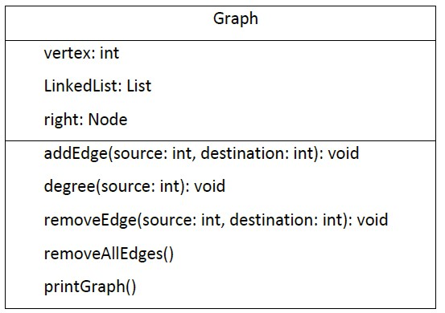
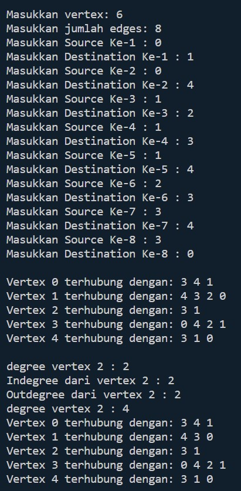
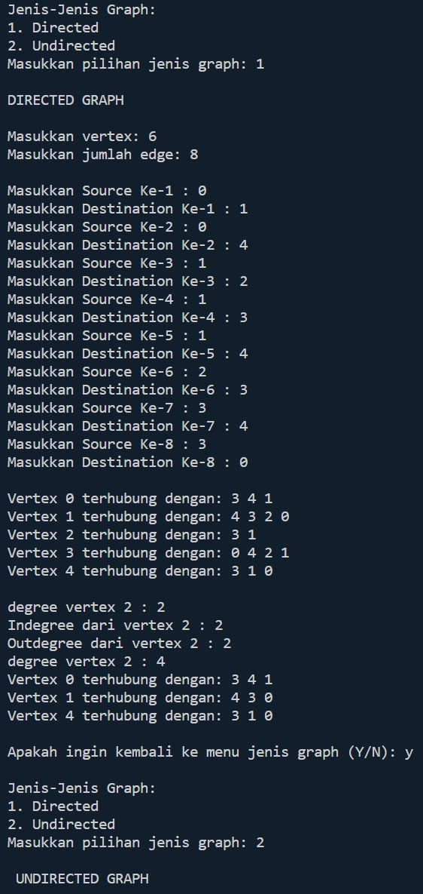
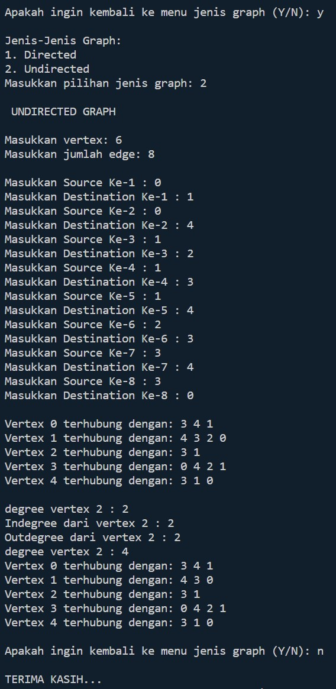
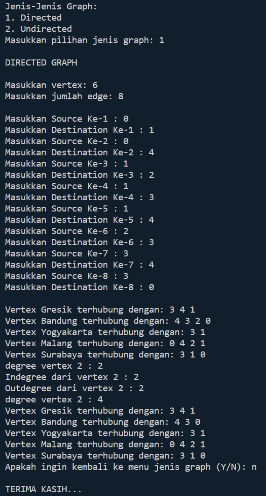

# **JOBSHEET XII** (**Graph**)

## **Nama : Iemaduddin**
## **No. Absen/Kelas : 16/TI-1F**
## **NIM : 2141720055**

#

> ## **1.Tujuan Praktikum**
>
> Setelah melakukan praktikum ini, mahasiswa mampu:\
> 1.memahami model graph;\
> 2.membuat dan mendeklarasikan struktur algoritma graph; 3.menerapkan
> algoritma dasar graph dalam beberapa studi kasus.
>
> ## **2.Praktikum**
>
> ### **2.1 Implementasi Graph menggunakan Linked List**
>
> **2.1.1 Tahapan Percobaan**
>
> **Waktu percobaan (30 menit)**\
> Pada percobaan ini akan diimplementasikan Graph menggunakan Linked
> Lists untuk merepresentasikan graph adjacency. Silakan lakukan
> langkah-langkah praktikum sebagai berikut.


1.Buatlah class **Node**, dan class **Linked Lists** sesuai dengan praktikum **DoubleLinked Lists.**

  

2.Tambahkan class **Graph** yang akan menyimpan method-method dalam graph dan juga method main().

  ```
  public class Graph{

  }
  ```

3.Di dalam class **Graph**, tambahkan atribut **vertex** bertipe integer dan **list[]** bertipe LinkedList.

  ```
  public class Graph {
      int vertex;
      LinkedLists list[];
  }
  ```

4.Tambahkan konstruktor default untuk menginisialisasi variabel vertex dan menambahkan perulangan untuk jumlah vertex sesuai dengan jumlah length array yang telah ditentukan.

  ```
    public Graph(int vertex){
        this.vertex = vertex;
        list = new LinkedLists[vertex];
        for(int i=0; i<vertex; i++){
            list[i] = new LinkedLists();
        }
    }
  ```

5.Tambahkan method **addEdge()**. Jika yang akan dibuat adalah graph berarah, maka yang dijalankan hanya baris pertama saja. Jika graph tidak berarah yang dijalankan semua baris pada method **addEdge()**.

  ```
    public void addEdge(int source, int destination){
        //add Edge
        list[source].addFirst(destination);
        //add back edge (for undirected)
        list[destination].addFirst(source);
    }
  ```

6.Tambahkan method **degree()** untuk menampilkan jumlah derajat lintasan pada suatu vertex. Di dalam metode ini juga dibedakan manakah statement yang digunakan untuk graph berarah atau graph tidak berarah. Eksekusi hanya sesuai kebutuhan saja.

  ```
    public void degree(int source) throws Exception{
        //degree undirected graph
        System.out.println("degree vertex " + source + " : " + list[source].size());

        //degree directed graph
        //inDegree
        int k, totalIn = 0, totalOut = 0;
        for(int i=0; i<vertex; i++){
            for(int j=0; j<list[i].size(); j++){
                if(list[i].get(j) == source){
                    ++totalIn;
                }
            }
            //outDegree
            for(k=0; k<list[source].size(); k++){
                list[source].get(k);
            }
            totalOut = k;
        }
        System.out.println("Indegree dari vertex " + source + " : " + totalIn);
        System.out.println("Outdegree dari vertex " + source + " : " + totalOut);
        System.out.println("degree vertex " + source + " : " + (totalIn+totalOut));
    }
  ```

7.Tambahkan method **removeEdge()**. Method ini akan menghapus> lintasan ada suatu graph. Oleh karena itu, dibutuhkan 2 parameter untuk menghapus lintasan yaitu source dan destination.

  --
  ```
    public void removeEdge(int source, int destination) throws Exception{
        for(int i=0; i<vertex; i++){
            if(i == destination){
                list[source].remove(destination);
            }
        }
    }
  ```

8.Tambahkan method **removeAllEdges()** untuk menghapus semua vertex yang ada di dalam graph.

  ```
    public void removeAllEdges(){
        for(int i=0; i<vertex; i++){
            list[i].clear();
        }
        System.out.println("Graph berhasil dikosongkan");
    }
  ```

9.Tambahkan method **printGraph()** untuk mencatak graph ter-*update.*

  ```
    public void printGraph() throws Exception{
        for(int i=0; i<vertex; i++){
            if(list[i].size() > 0){
                System.out.print("Vertex " + i + " terhubung dengan: ");
                for(int j=0; j<list[i].size(); j++){
                    System.out.print(list[i].get(j) + " ");
                }
                System.out.println("");
            }
        }
        System.out.println(" ");
    }
  ```

10.Compile dan jalankan method **main()** dalam class **Graph** untuk menambahkan beberapa edge pada graph, kemudian tampilkan. Setelah itu keluarkan hasilnya menggunakan pemanggilan method main(). **Keterangan:** degree harus disesuaikan dengan jenis graph yang telah dibuat (directed/undirected).

  ```
  class GraphMain{
      public static void main(String[] args) throws Exception {
          Graph graph = new Graph(6);
          graph.addEdge(0, 1);
          graph.addEdge(0, 4);
          graph.addEdge(1, 2);
          graph.addEdge(1, 3);
          graph.addEdge(1, 4);
          graph.addEdge(2, 3);
          graph.addEdge(3, 4);
          graph.addEdge(3, 0);
          graph.printGraph();
          graph.degree(2);
          
          graph.removeEdge(1, 2);
          graph.printGraph();
      }
  }
  ```

11.Amati hasil running tersebut.

12.Tambahkan pemanggilan method **removeEdge()** sesuai potongan code di bawah ini pada method main(). Kemudian tampilkan graph tersebut.

  ```
          graph.removeEdge(1,2);
          graph.printGraph();
  ```

13.Amati hasil running tersebut.

14.Uji coba penghapusan lintasan yang lain! Amati hasilnya!

### **2.1.2 Verifikasi Hasil Percobaan**

Verifikasi hasil kompilasi kode program Anda dengan gambar berikut ini.

  **Hasil running pada langkah ke-11**


  

                 
  **Hasil running pada langkah ke-13**                       


  


### **2.1.3 Pertanyaan Percobaan**

1.Sebutkan beberapa jenis (minimal 3) algoritma yang menggunakan dasar Graph, dan apakah kegunaan algoritma-algoritma tersebut?


**Jawab:** 

  - **Algoritma Floyd**, untuk menentukan adanya jalur pada **Graph**

  - **Algoritma Brent**, untuk menentukan adanya jalur pada **Graph**

  - **Algoritma Hopcroft-Karp**, untuk penjodohan maksimum

  - **Algoritma Hungaria**, untuk penjodohan sempurna


2.Pada class Graph terdapat array bertipe LinkedList, yaitu LinkedList list[]. Apakah tujuan pembuatan variabel tersebut ?


**Jawab:** Tujuannya ialah untuk memanggil method **Linkedlist** dan membuat objek bernama **list** yang gunanya untuk mengintansiasi list yang berupa vertex pada linked list tersebut.


3.Apakah alasan pemanggilan method **addFirst()** untuk menambahkan data, bukan method add jenis lain pada linked list ketika digunakan pada method addEdge pada **class Graph?**


**Jawab:** alasan pemanggilan method **addFirst()** untuk menambahkan data, bukan method add jenis lain pada linked list ketika digunakan pada method addEdge pada **class Graph?** ialah untuk mengenalkan vertex tersebut dan koneksinya


4.Bagaimana cara mendeteksi prev pointer pada saat akan melakukan penghapusan suatu edge pada graph ?


**Jawab:** Cara mendeteksi prev pointer pada saat akan melakukan penghapusan suatu edge pada graph, yakni ketika `i == destination`, maka akan dilihat source dari i. Jadi, jika vertex lebih besar dari **"i"** dan **destination** sama dengan **"i"**, maka edge akan secara otomatis dihapus.


5.Kenapa pada praktikum 2.1.1 langkah ke-12 untuk menghapus path yang bukan merupakan
lintasan pertama kali menghasilkan output yang salah ? Bagaimana solusinya ?

  ```
      graph.removeEdge(1,3);
      grap.printGraph();
  ```


**Jawab:** yakni dengan mengubah isi dari vertex dan edges serta source dan destintion yang ada.


## **2.2 Implementasi Graph menggunakan Matriks**

Kegiatan praktikum 2 merupakan implementasi Graph dengan Matriks. Silakan lakukan langkahlangkah
percobaan praktikum berikut ini, kemudian verifikasi hasilnya. Setelah itu jawablah
pertanyaan terkait percobaan yang telah Anda lakukan.

### **2.2.1 Tahapan Percobaan**

**Waktu percobaan: 30 menit**

Pada praktikum 2.2 ini akan diimplementasikan Graph menggunakan matriks untuk
merepresentasikan graph adjacency. Silakan lakukan langkah-langkah praktikum sebagai berikut.

1. Uji coba graph bagian 2.2 menggunakan array 2 dimensi sebagai representasi graph. Buatlah class graphArray yang didalamnya terdapat variabel vertices dan array twoD_array!

  ```
  public class graphArray {
    private final int vertices;
    private final int[][] twoD_array;
  }
  ```

2. Buatlah konstruktor graphArray sebagai berikut!

  ```
    public graphArray(int v){
        vertices = v;
        twoD_array = new int[vertices + 1][vertices + 1];
    }
  ```


3. Untuk membuat suatu lintasan maka dibuat method makeEdge() sebagai berikut.


  ```
    public void makeEdge(int to, int from, int edge){
        try {
            twoD_array[to][from] = edge;
        } catch(ArrayIndexOutOfBoundsException index){
            System.out.println("Vertex tidak ada");
        }
    }  
  ```

Untuk menampilkan suatu lintasan diperlukan pembuatan method getEdge() berikut.


  ```
    public int getEdge(int to, int from){
        try {
            return twoD_array[to][from];
        } catch (ArrayIndexOutOfBoundsException index){
            System.out.println("Vertex tidak ada");
        }
        return -1;
    } 
  ```

4.Kemudian buatlah method **main()** seperti berikut ini.


  ```
  class graphArrayMain{
      public static void main(String[] args) {
          int v, e, count = 1, to = 0, from = 0;
          Scanner sc = new Scanner(System.in);
          graphArray graph;
          try {
              System.out.println("Masukkan jumlah vertices: ");
              v = sc.nextInt();
              System.out.println("Masukkan jumlah edges: ");
              e = sc.nextInt();

              graph = new graphArray(v);

              System.out.println("Masukkan edges: <to> <from>");
              while (count <= e){
                  to = sc.nextInt();
                  from =  sc.nextInt();

                  graph.makeEdge(to, from, 1);
                  count++;
              }
              System.out.println("Array 2D sebagao representasi graph sbb: ");
              System.out.print("  ");
              for(int i=1; i<=v; i++){
                  System.out.print(i + " ");
              }
              System.out.println();

              for(int i=1; i<= v; i++){
                  System.out.print(i + " ");
                  for(int j=1; j<=v; j++){
                      System.out.print(graph.getEdge(i, j) + " ");
                  }
                  System.out.println();
              }
          } catch (Exception E) {
              System.out.println("Error. Silahkan cek kembali\n" +  E.getMessage());
          }
          sc.close();
      }
  }
  ```

5.Jalankan class **graphArray** dan amati hasilnya!

### **2.2.2 Verifikasi Hasil Percobaan**

Verifikasi hasil kompilasi kode program Anda dengan gambar berikut ini.

  

### **2.2.3 Pertanyaan Percobaan**

1.Apakah perbedaan degree/derajat pada *directed* dan *undirected graph?*

**jawab:** perbedaan degree/derajat pada **directed** dan **undirected graph?** adalah :

- jika **directed** `degreeIn` dan `degreeOut`nya berbeda, tetapi pada **undirected graph?** `degreeIn` dan `degreeOut`nya sama.

- Pada **directed** degree dapat mempengaruhi bobot pada edge antar vertex, misalnya pada X ke Y bobotnya 4, tetapi Y ke X bobotnya belum tentu sama 4. Sedangkan pada **undirected graph?** degree tidak dapat mempengaruhi bobot.

2.Pada implementasi graph menggunakan adjacency matriks. Kenapa jumlah vertices harus ditambahkan dengan 1 pada indeks array berikut?

  ```
  public graphArray(int v){
    vertices = v;
    twoD_array = new int[vertices + 1][vertices + 1];
  }
  ```


**jawab:** Karena indexnya dimulai dari 0, maka vertexnya perlu ditambahkan 1.


3.Apakah kegunaan method **getEdge()** ?


**jawab:** Kegunaan method **getEdge()** ialah untuk menampilkan suatu lintasan yang diperlukan.


4.Termasuk jenis graph apakah uji coba pada praktikum 2.2?


**jawab:** Ter masuk **Directed Graph**.


5.Mengapa pada method main harus menggunakan *try-catch Exception* ?


**jawab:** Pada method main harus menggunakan *try-catch Exception* supaya dapat menangani error pada saat program dijalankan.


## **3. Tugas Praktikum**

1.Ubahlah lintasan pada praktikum 2.1 menjadi inputan!

**Jawab:**

  - Code:

    ```
    class Tugas1GraphMain{
        public static void main(String[] args) throws Exception {
            Scanner input = new Scanner(System.in);
            System.out.print("Masukkan vertex: ");
            int vertex = input.nextInt();
            Tugas1_Graph graph = new Tugas1_Graph(vertex);

            System.out.print("Masukkan jumlah edges: ");
            int edge = input.nextInt();

            for(int i=0; i<edge; i++){
                System.out.print("Masukkan Source Ke-" + (i+1) + " : ");
                int source = input.nextInt();
                System.out.print("Masukkan Destination Ke-" + (i+1) + " : ");
                int dest = input.nextInt();
                
                graph.addEdge(source, dest);
            }
            System.out.println();
            graph.printGraph();

            graph.degree(2);
            graph.removeEdge(1, 2);
            graph.printGraph();
        }
    }
    ```

  - Output:

    


2.Tambahkan method **graphType** dengan tipe boolean yang akan membedakan *graph* termasuk *directed* atau *undirectedgraph*. Kemudian update seluruh method yang berelasi dengan method **graphType** tersebut (hanya menjalankan statement sesuai dengan jenis graph) pada praktikum 2.1


**Jawab:**

  - Code:

    ```
    package Pertemuan_15.Tugas.Nomor_2;

    import java.util.Scanner;
    class Node{
        int data;
        Node prev, next;
        
        Node(Node prev, int data, Node next){
            this.prev = prev;
            this.data = data;
            this.next =  next;
        }
    }

    class LinkedLists {
        Node head;
        int size;

        public LinkedLists(){
            head = null;
            size = 0;
        }

        public boolean isEmpty(){
            return head == null;
        }

        public void addFirst(int item){
            if(isEmpty()){
                head = new Node(null, item, null);
            }else{
                Node newNode = new Node(null, item, head);
                head.prev = newNode;
                head = newNode;
            }
            size++;
        }

        public void addLast(int item){
            if(isEmpty()){
                addFirst(item);
            }else{
                Node current = head;
                while (current.next != null){
                    current = current.next;
                }
                Node newNode = new Node(current, item, null);
                current.next = newNode;
                size++;
            }
        }

        public void add(int item, int index) throws Exception{
            if(isEmpty()){
                addFirst(item);
            }else if (index < 0 || index > size){
                throw new Exception("Nilai index di luar batas");
            }else{
                Node current = head;
                int i = 0;
                while (i < index){
                    current = current.next;
                    i++;
                }
                if(current.prev == null){
                    Node newNode = new Node(null, item, current);
                    current.prev = newNode;
                    head = newNode;
                }else{
                    Node newNode = new Node(current.prev, item, current);
                    newNode.prev = current.prev;
                    newNode.next = current;
                    current.prev.next = newNode;
                    current.prev = newNode;
                }
            }
            size++;
        }

        public int size(){
            return size;
        }

        public void clear(){
            head = null;
            size = 0;
        }

        public void print(){
            if(!isEmpty()){
                Node tmp = head;
                while (tmp != null){
                    System.out.print(tmp.data + "\t");
                    tmp = tmp.next;
                }
                System.out.println("\nBerhasil Diisi");
            }else{
                System.out.println("Linked List Kosong");
            }
        }


        public void removeFirst() throws Exception {
            if (isEmpty()){
                throw new Exception("Linked List masih kosong, tidak dapat dihapus");
            }else if (size == 1){
                removeLast();
            }else{
                head = head.next;
                head.prev = null;
                size--;
            }
        }
        
        public void removeLast() throws Exception {
            if (isEmpty()){
                throw new Exception("Linked List masih kosong, tidak dapat dihapus");
            }else if (head.next == null){
                head = null;
                size--;
                return;
            }
            Node current = head;
            while (current.next.next != null){
                current = current.next;
            }
            current.next = null;
            size--;

        }

        public void remove(int index) throws Exception {
            if (isEmpty()){
                throw new Exception("Nilai index di luar batas");
            }else if (index == 0){
                removeFirst();
            }else{
                Node current = head;
                int i=0;
                while (i < index){
                    current = current.next;
                    i++;
                }
                if(current.next == null){
                    current.prev.next = null;
                }else if (current.prev == null){
                    current = current.next;
                    current.prev = null;
                    head = current;
                }else{
                    current.prev.next = current.next;
                    current.next.prev = current.prev;
                }
                size--;
            }
        }

        public int getFirst() throws Exception {
            if (isEmpty()){
                throw new Exception("Nilai index di luar batas");
            }
            return head.data;
        }
        
        public int getLast() throws Exception {
            if (isEmpty()){
                throw new Exception("Linked List Kosong");
            }
            Node tmp = head;
            while (tmp.next != null){
                tmp = tmp.next;
            }
            return tmp.data;
        }
        
        public int get(int index) throws Exception {
            if (isEmpty() || index >= size){
                throw new Exception("Nilai index di luar batas");
            }
            Node tmp = head;
            for(int i = 0; i < index; i++){
                tmp = tmp.next;
            }
            return tmp.data;
        }
    }


    public class Tugas2_Graph {
        int vertex;
        LinkedLists list[];

        public Tugas2_Graph(int vertex){
            this.vertex = vertex;
            list = new LinkedLists[vertex];
            for(int i=0; i<vertex; i++){
                list[i] = new LinkedLists();
            }
        }

        public void addEdge(int source, int destination){
            //add Edge
            list[source].addFirst(destination);
            //add back edge (for undirected)
            list[destination].addFirst(source);
        }

        public void degree(int source) throws Exception{
            //degree undirected graph
            System.out.println("degree vertex " + source + " : " + list[source].size());

            //degree directed graph
            //inDegree
            int k, totalIn = 0, totalOut = 0;
            for(int i=0; i<vertex; i++){
                for(int j=0; j<list[i].size(); j++){
                    if(list[i].get(j) == source){
                        ++totalIn;
                    }
                }
                //outDegree
                for(k=0; k<list[source].size(); k++){
                    list[source].get(k);
                }
                totalOut = k;
            }
            System.out.println("Indegree dari vertex " + source + " : " + totalIn);
            System.out.println("Outdegree dari vertex " + source + " : " + totalOut);
            System.out.println("degree vertex " + source + " : " + (totalIn+totalOut));
        }

        public void removeEdge(int source, int destination) throws Exception{
            for(int i=0; i<vertex; i++){
                if(i == destination){
                    list[source].remove(destination);
                }
            }
        }

        public void removeAllEdges(){
            for(int i=0; i<vertex; i++){
                list[i].clear();
            }
            System.out.println("Graph berhasil dikosongkan");
        }
        
        
        public void printGraph() throws Exception{
            for(int i=0; i<vertex; i++){
                if(list[i].size() > 0){
                    System.out.print("Vertex " + i + " terhubung dengan: ");
                    for(int j=0; j<list[i].size(); j++){
                        System.out.print(list[i].get(j) + " ");
                    }
                    System.out.println("");
                }
            }
            System.out.println(" ");
        }

        // Tugas Nomor 2
        public boolean graphType(boolean pilih){
            return pilih;
        }
    }

    class Tugas2GraphMain{
        public static void main(String[] args) throws Exception {
            Scanner input = new Scanner(System.in);
            boolean type;
            int pil;
            char ulang;
            do {
                System.out.println("Jenis-Jenis Graph: ");
                System.out.println("1. Directed ");
                System.out.println("2. Undirected ");
                System.out.print("Masukkan pilihan jenis graph: ");
                pil =  input.nextInt();
                do {
                    switch(pil){
                        case 1:
                            System.out.println("\nDIRECTED GRAPH");
                            type = true;
                            break;
                        case 2:
                            System.out.println("\n UNDIRECTED GRAPH");
                            type = false;
                            break;
                        default:
                            System.out.println("Inputan Anda Salah!");
                            System.exit(0);
                            break;
                    }
            
                    System.out.println();
                    System.out.print("Masukkan vertex: ");
                    int vertex = input.nextInt();
                    Tugas2_Graph graph = new Tugas2_Graph(vertex);
                    System.out.print("Masukkan jumlah edge: ");
                    int edge = input.nextInt();
                    System.out.println();
                    for(int i=0; i<edge; i++){
                        System.out.print("Masukkan Source Ke-" + (i+1) + " : ");
                        int source = input.nextInt();
                        System.out.print("Masukkan Destination Ke-" + (i+1) + " : ");
                        int dest = input.nextInt();
                        
                        graph.addEdge(source, dest);
                    }
                    System.out.println();
                    graph.printGraph();
            
                    graph.degree(2);
                    graph.removeEdge(1, 2);
                    graph.printGraph();
                } while (pil == 1 && pil == 2);
                    System.out.print("Apakah ingin kembali ke menu jenis graph (Y/N): ");
                    ulang = input.next().charAt(0);
                    System.out.println();

            } while (ulang == 'y' || ulang == 'Y');
              System.out.println("TERIMA KASIH...");
        }
    }
    ```
    
  - Output:

    

    


3.Modifikasi method **removeEdge()** pada praktikum 2.1 agar tidak menghasilkan output yang salah untuk path selain path pertama kali!


**Jawab:**

  - Code:

    ```
    public void removeEdge(int source, int destination) throws Exception{
        for(int i=0; i<vertex; i++){
            if(i == destination){
                list[source].remove(destination);
            }
        }
    }
    ```
    
  - Output:

    


4.Ubahlah tipe data *vertex* pada seluruh graph pada praktikum 2.1 dan 2.2 dari Integer menjadi tipe generic agar dapat menerima semua tipe data dasar Java! Misalnya setiap *vertex* yang awalnya berupa angka 0,1,2,3, dst. selanjutnya ubah menjadi suatu nama daerah seperti Gresik, Bandung, Yogya, Malang, dst.


**Jawab:**

  - Code:

    ```
    public void printGraph() throws Exception{
        String kota = "";
        for(int i=0; i<vertex; i++){
            if(list[i].size() > 0){
                if ( i == 0){
                    kota = "Gresik";
                } else if (i == 1){
                    kota = "Bandung";
                } else if (i == 2){
                    kota = "Yogyakarta";
                } else if (i == 3){
                    kota = "Malang";
                } else if (i == 4){
                    kota = "Surabaya";
                } else {
                    kota = "Denpasar";
                }
                System.out.print("Vertex " + kota + " terhubung dengan: ");
                for(int j=0; j<list[i].size(); j++){
                    System.out.print(list[i].get(j) + " ");
                }
                System.out.println("");
            }
        }
    }
    ```
    
  - Output:

    

#

## **TERIMA KASIH**
