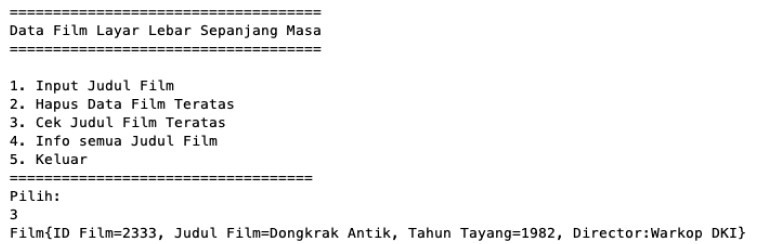
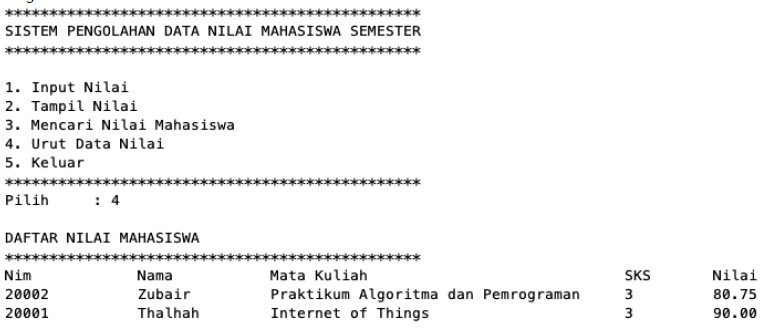

# **JOBSHEET 16 Collection**

### **NAMA    : IEMADUDDIN**
### **NO. ABSEN/KELAS    : IEMADUDDIN**
### **NIM     : 2141720055**

#
## **16.1. Tujuan Praktikum** 

Setelah melakukan praktikum ini, mahasiswa mampu: 

1. memahami bentuk-bentuk collection dan hierarkinya; 
2. menerapkan collection sesuai dengan fungsi dan jenisnya; 
3. menyelesaikan kasus menggunakan collection yang sesuai.

## **16.2. Kegiatan Praktikum 1**

### **16.2.1 Percobaan 1** 

Pada percobaan 1 ini akan dicontohkan penggunaan collection untuk menambahkan sebuah elemen, mengakses elemen, dan menghapus sebuah elemen. 

1. Buatlah sebuah class ContohList yang main methode berisi kode program seperti di bawah ini 

    ```
        List l = new ArrayList();
        l.add(1);
        l.add(2);
        l.add(3);
        l.add("Cireng");
        System.out.printf("Elemen 0: %d total elemen: %d elemen terakhir: %s\n"
        ,l.get(0), l.size(), l.get(l.size() - 1));
        
        l.add(4);
        l.remove(0);
        
        System.out.printf("Elemen 0: %d total elemen: %d elemen terakhir: %s\n"
        ,l.get(0), l.size(), l.get(l.size() - 1));
    ```

2. Tambahkan  kode  program  untuk  menggunakan  collection  dengan  aturan  penulisan  kode program seperti berikut 

    ```
        List<String> names = new LinkedList<>();
        names.add("Noureen");
        names.add("Akhleema");
        names.add("Shannum");
        names.add("Uwais");
        names.add("Al-Qarni");
        
        System.out.printf("Elemen 0: %s total elemen: %s elemen terakhir: %s\n"
        ,names.get(0), names.size(), names.get(names.size() - 1));
        
        names.set(0, "My kid");

        System.out.printf("Elemen 0: %s total elemen: %s elemen terakhir: %s\n"
        ,names.get(0), names.size(), names.get(names.size() - 1));

        System.out.println("Names: " + names.toString());
    ```

### **16.2.2. Verifikasi Hasil Percobaan** 

Verifikasi hasil kompilasi kode program Anda dengan gambar berikut ini. 


### **16.2.3. Pertanyaan Percobaan**

1. Perhatikan  baris  kode  25-36,  mengapa  semua  jenis  data  bisa  ditampung  ke  dalam  sebuah Arraylist?

    **Jawab:** Karena pada baris kode 25-36 menggunakan list dengan tipe data dinamis (tidak diberi kurung sudut "<>") dan tidak dapat menentukan tipe data. Jadi, arraylist yang ditambahkan secara dinamis, dapat menampung semua data (tipe data).
    

2. Modifikasi baris kode 25-36 sehingga data yang ditampung hanya satu jenis atau spesifik tipe tertentu! 

    **Jawab:** Dengan mengganti intansiasi list array menjadi *List<Integer> l = new ArrayList<>();*

    

3. Ubah kode pada baris kode 38  menjadi seperti ini 

    ```
    LinkedList<String> names = new LinkedList<>();
    ```

    **Jawab:** 

    - Jika diubah menjadi kode baris seperti di atas, maka akan terjadi error, seperti gambar di bawah ini:

        

    - Dan untuk perbaikannya seperti berikut disertai dengan hasil compilenya

        

        


4. Tambahkan juga baris berikut ini, untuk memberikan perbedaan dari tampilan yang sebelumnya 

    ```
    names.push("Mei-mei);
    System.out.printf("Elemen 0: %s total elemen: %s elemen terakhir: %s\n)",
        names.getFirst(), names.size(), names.getLast());
    System.out.println("Names: " + names.toString()); 
    ```

    **Jawab:** 

    


5. Dari penambahan kode tersebut, silakan dijalankan dan apakah yang dapat Anda jelaskan! 

    **Jawab:**

    

## **16.3 Kegiatan Praktikum 2** 

### **16.3.1 Tahapan Percobaan** 

Pada praktikum 2 ini akan dibuat beberapa method untuk menampilkan beberapa cara yang dapat dilakukan untuk mengambil/menampilkan elemen pada sebuah collection. Silakan ikutilah Langkah-langkah di bawah ini 

1. Buatlah class dengan nama LoopCollection serta tambahkan method main yang isinya adalah sebagai berikut**.** 

    ```
        Stack<String> fruits = new Stack<>();
        fruits.push("Banana");
        fruits.add("Orange");
        fruits.add("Watermelon");
        fruits.add("Leci");
        fruits.add("Salak");

        for(String fruit : fruits){
            System.out.printf("%s ", fruit);
        }

        System.out.println("\n" + fruits.toString());

        while(!fruits.empty()){
            System.out.printf("%s ", fruits.pop());
        }
    ```

2. Tambahkan  potongan  kode  berikut  ini  dari  yang  sebelumnya  agar  proses  menampilkan elemen pada sebuah stack bervariasi. 

    ```
        fruits.push("Melon");
        fruits.push("Durian");
        System.out.println("");
        for(Iterator<String> it = fruits.iterator(); it.hasNext();){
            String fruit = it.next();
            System.out.printf("%s ", fruit);
        }
        System.out.println("");
        fruits.stream().forEach(e ->{
            System.out.printf("%s ", e);
        });
        System.out.println("");
        for(int i=0; i<fruits.size(); i++){
            System.out.printf("%s ", fruits.get(i));
        }
    ```

### **16.3.2 Verifikasi Hasil Percobaan** 

Verifikasi hasil kompilasi kode program Anda dengan gambar berikut ini. 


### **16.3.3 Pertanyaan Percobaan**

1. Apakah perbedaan fungsi push() dan add() pada objek *fruits*?

    **Jawab:** Yang membedakan keduanya ialah pada jenis struktur data yang digunakan. Jika fungsi push() merupakan stack, sedangkan fungsi add() merupakan list.

2. Silakan hilangkan baris 43 dan 44, apakah yang akan terjadi? Mengapa bisa demikian?*

    **Jawab:** Melon dan Durian akan terhapus karena tidak ada penambahan data (push) Melon dan Durian.

    - Kondisi sebelum dihapus:
    
    

    - Kondisi setelah dihapus:

    

3. Jelaskan fungsi dari baris 46-49?

    **Jawab:** Fungsi dari baris 46-49 ialah untuk menginisialisasi fungsi iterator dengan tipe data String. `hashNext()` digunakan untuk mengecek apakah iterator memiliki elemet berikutnya atau tidak. Jika bernilai **true**, maka variabel fruit akan menyimpan nilai berikutnya. Kemudian ditampilkan elemen tersebut.

4. Silakan ganti baris kode 25, `Stack<String>` menjadi `List<String>` dan apakah yang terjadi? Mengapa bisa demikian?

    **Jawab:** Akan terjadi error, karena list tidak compatible dengan fungsi-fungsi dan inisialisasi dengan stack.

    

5. Ganti elemen terakhir dari dari objek fruits menjadi “Strawberry”!

    **Jawab:**
    
    - Code:

    

    - Output:

    

6. Tambahkan 3 buah seperti “Mango”,”guava”, dan “avocado” kemudian dilakukan sorting!

    **Jawab:**

    - Code:

    

    - Output:

    


## **16.4 Kegiatan Praktikum 3**

### **16.4.1 Tahapan Percobaan** 

Pada praktikum 3 ini dilakukan uji coba untuk mengimplementasikan sebuah collection untuk menampung  objek  yang  dibuat  sesuai  kebutuhan.  Objek  tersebut  adalah  sebuah  objek mahasiswa  dengan  fungsi-fungsi  umum  seperti  menambahkan,  menghapus,  mengubah,  dan mencari. 

1. Buatlah sebuah class Mahasiswa dengan attribute, kontruktor, dan fungsi sebagai berikut.** 

    ```
    public class Mahasiswa {
            String nim;
            String nama;
            String notelp;

            public Mahasiswa () {
                
            }

            public Mahasiswa(String nim, String nama, String notelp){
                    this.nim = nim;
                    this.nama = nama;
                    this.notelp = notelp;
            }

            @Override
            public String toString(){
                    return "Mahasiswa{" + "nim= " + nim + ", nama=" + nama + ", notelp=" + notelp + '}';
            }
    }
    ```

2. Selanjutnya, buatlah sebuah class ListMahasiswa yang memiliki attribute seperti di bawah ini 

    ```
    List<Mahasiswa> mahasiswas = new ArrayList<>();
    ```

3. Method **tambah(), hapus(), update(), dan tampil()** secara berurut dibuat agar bisa melakukan operasi-operasi seperti yang telah disebutkan. 

    ```
        public void tambah(Mahasiswa... mahasiswa) {
                mahasiswas.addAll(Arrays.asList(mahasiswa));
        }

        public void hapus(int index) {
                mahasiswas.remove(index);
        }

        public void update(int index, Mahasiswa mhs) {
                mahasiswas.set(index, mhs);
        }

        public void tampil() {
                mahasiswas.stream().forEach(mhs -> {
                        System.out.println("" + mhs.toString());
                });
        }
    ```

4. Untuk proses hapus, update membutuhkan fungsi pencarian terlebih dahulu yang potongan kode programnya adalah sebagai berikut 

    ```
        int LinearSearch(String nim) {
                for(int i=0; i<mahasiswas.size(); i++) {
                        if(nim.equals(mahasiswas.get(i).nim)) {
                                return i;
                        }
                }
                return -1;
        }
    ```

5. Pada class yang sama, tambahkan main method seperti potongan program berikut dan amati hasilnya! 

    ```
        public static void main(String[] args) {
                ListMahasiswa lm = new ListMahasiswa();
                Mahasiswa m = new Mahasiswa("201234", "Noureen", "021xx1");
                Mahasiswa m1 = new Mahasiswa("201235", "Akhleema", "021xx2");
                Mahasiswa m2 = new Mahasiswa("201236", "Shannum", "021xx3");

                // Menambahkan Objek Mahasiswa
                lm.tambah(m, m1, m2);
                // Menampilkan List Mahasiswa
                lm.tampil();
                // Update Mahasiswa
                lm.update(lm.LinearSearch("201235"), new Mahasiswa("201235", "Akhleema Lela", "021xx2"));
                System.err.println("");
                lm.tampil();
        }
    ```

### **16.4.2. Verifikasi Hasil Percobaan** 

Verifikasi hasil kompilasi kode program Anda dengan gambar berikut ini. 


### **16.4.3. Pertanyaan Percobaan**

1. Pada fungsi tambah() yang menggunakan unlimited argument itu menggunakan konsep apa? Dan kelebihannya apa?**

    **Jawab:** **ArrayList**, alasannya ialah karena dengan konsep itu dapat memungkinkan metode untuk mengambil sejumlah argumen, dapat diakses sebagai array dalam method.

2. Pada fungsi linearSearch() di atas, silakan diganti dengan fungsi binarySearch() dari collection!

    **Jawab:**

    - Code:

        ```
        package Pertemuan_16.Praktikum_3;

        import java.util.ArrayList;
        import java.util.Arrays;
        import java.util.Collections;
        import java.util.Comparator;
        import java.util.LinkedList;
        import java.util.List;


        public class Mahasiswa_Pertanyaan_2 {
                String nim;
                String nama;
                String notelp;

                public Mahasiswa_Pertanyaan_2 () {
                    
                }

                public Mahasiswa_Pertanyaan_2(String nim, String nama, String notelp){
                        this.nim = nim;
                        this.nama = nama;
                        this.notelp = notelp;
                }

                @Override
                public String toString(){
                        return "Mahasiswa{" + "nim= " + nim + ", nama=" + nama + ", notelp=" + notelp + '}';
                }
        }

        class ListMahasiswa {
                List<Mahasiswa> mahasiswas = new ArrayList<>();

                public void tambah(Mahasiswa... mahasiswa) {
                    mahasiswas.addAll(Arrays.asList(mahasiswa));
                }
            
                public void hapus(int index) {
                    mahasiswas.remove(index);
                }
                public void update(int index, Mahasiswa mhs) {
                    mahasiswas.set(index, mhs);
                }
                public void tampil() {
                    mahasiswas.stream().forEach(mhs -> {
                        System.out.println("" + mhs.toString());
                    });
                }
                int linearSearch(String nim) {
                    for (int i = 0; i < mahasiswas.size(); i++) {
                        if (nim.equals(mahasiswas.get(i).nim)) {
                            return i;
                        }
                    }
                    return -1;
                }
                public static void main(String[] args) {
                    ListMahasiswa lm = new ListMahasiswa();
                    Mahasiswa m = new Mahasiswa("201234", "Noureen", "021xx1");
                    Mahasiswa m1 = new Mahasiswa("201235", "Akhleena", "021xx2");
                    Mahasiswa m2 = new Mahasiswa("201236", "Shannum", "021xx3");
                    lm.tambah(m, m1, m2);
                    lm.tampil();
            //        lm.update(lm.linearSearch("201235"), new Mahasiswa("201235", "Akhleena Lela", "021xx2"));
            //        System.out.println("");
            //        lm.tampil();
            
                    // --------------------------------------------------//
                    Mahasiswa key = new Mahasiswa("201235", null, null);
                    lm.update(Collections.binarySearch(lm.mahasiswas, key, new MhsComparator()),
                            new Mahasiswa("201235", "Akhleema", "021xx2"));
                    System.out.println("");
                    lm.tampil();
                }
            }

        class MhsComparator implements Comparator<Mahasiswa> {

                public int compare(Mahasiswa mhs1, Mahasiswa mhs2) {
                    if (mhs1.nim == mhs2.nim) {
                        return 0;
                    } else {
            
                        return -1;
                    }
                }
            
                @Override
                public Comparator<Mahasiswa> reversed() {
                    return Comparator.super.reversed();
                }
        }
        ```

    - Output:

        

3. Tambahkan fungsi sorting baik secara ascending ataupun descending pada class tersebut! 

    **Jawab:**

    - Code:
    
        ```
        package Pertemuan_16.Praktikum_3;

        import java.util.ArrayList;
        import java.util.Arrays;
        import java.util.Collections;
        import java.util.Comparator;
        import java.util.LinkedList;
        import java.util.List;


        class Mahasiswa {
                String nim;
                String nama;
                String notelp;

                public Mahasiswa () {
                    
                }

                public Mahasiswa(String nim, String nama, String notelp){
                        this.nim = nim;
                        this.nama = nama;
                        this.notelp = notelp;
                }

                @Override
                public String toString(){
                        return "Mahasiswa{" + "nim= " + nim + ", nama=" + nama + ", notelp=" + notelp + '}';
                }
        }

        public class ListMahasiswa_No_3 {
            List<Mahasiswa> mahasiswas = new ArrayList<>();

            public void tambah(Mahasiswa... mahasiswa) {
                mahasiswas.addAll(Arrays.asList(mahasiswa));
            }

            public void hapus(int index) {
                mahasiswas.remove(index);
            }

            public void update(int index, Mahasiswa mhs) {
                mahasiswas.set(index, mhs);
            }

            public void tampil() {
                mahasiswas.stream().forEach(mhs -> {
                    System.out.println("" + mhs.toString());
                });
            }

            // -------------------------------------------------- //
            void ascendingSort() {
                this.mahasiswas.sort((Mahasiswa d1, Mahasiswa d2) -> d1.nama.compareTo(d2.nama));
            }

            void descending() {
                this.mahasiswas.sort((Mahasiswa d1, Mahasiswa d2) -> d2.nama.compareTo(d1.nama));

            }
            // --------------------------------------------------//

            int linearSearch(String nim) {
                for (int i = 0; i < mahasiswas.size(); i++) {
                    if (nim.equals(mahasiswas.get(i).nim)) {
                        return i;
                    }
                }
                return -1;
            }

            public static void main(String[] args) {
                ListMahasiswa_No_3 lm = new ListMahasiswa_No_3();
                Mahasiswa m = new Mahasiswa("201234", "Noureen", "021xx1");
                Mahasiswa m1 = new Mahasiswa("201235", "Akhleena", "021xx2");
                Mahasiswa m2 = new Mahasiswa("201236", "Shannum", "021xx3");
                lm.tambah(m, m1, m2);
                lm.tampil();
                lm.update(lm.linearSearch("201235"), new Mahasiswa("201235", "Akhleena Lela", "021xx2"));
                System.out.println("");
                lm.tampil();

                // --------------------------------------------------//
                Mahasiswa key = new Mahasiswa("201235", null, null);
                lm.update(Collections.binarySearch(lm.mahasiswas, key, new MhsComparator()),
                        new Mahasiswa("201235", "Akhleema", "021xx2"));
                System.out.println("");
                lm.tampil();

                System.out.println("\n");

                System.out.println("Ascending : ");
                lm.ascendingSort();
                lm.tampil();

                System.out.println("\n");

                System.out.println("Descending : ");
                lm.descending();
                lm.tampil();
            }
        }

        class MhsComparator implements Comparator<Mahasiswa> {

            public int compare(Mahasiswa mhs1, Mahasiswa mhs2) {
                if (mhs1.nim == mhs2.nim) {
                    return 0;
                } else {

                    return -1;
                }
            }

            @Override
            public Comparator<Mahasiswa> reversed() {
                return Comparator.super.reversed();
            }
        }
        ```

    - Output:

        

### **16.5 Tugas Praktikum** 

1. Implementasikan stack menggunakan collection dengan contoh kasus tumpukan daftar film sesuai dengan fitur-fitur yang ditunjukkan pada gambar di bawah ini! 

**Ilustrasi Program** 

*Menu Awal dan Tambah Data (Push)* 


*Cetak Semua Data Film* 


*Cek Judul Film di tumpukan teratas* 





*Hapus Film Teratas* 


**Jawab:**

- Code:

    ```
    package Pertemuan_16.Tugas.Nomor_1;

    import java.util.Scanner;
    import java.util.Stack;

    public class Tugas1_Stack_Collection {
        String id, judul, director;
        int tahun;

        public Tugas1_Stack_Collection(){

        }

        public Tugas1_Stack_Collection(String id, String judul, int tahun, String director){
            this.id = id;
            this.judul = judul;
            this.tahun = tahun;
            this.director = director;
        }

        @Override
        public String toString() {
            return "Film{" + "ID Film=" + id + ", Judul Film=" + judul + ", Tahun Tayang=" + tahun
                    + ", Director=" + director +"}";
        }
    }

    class Tugas1_Stack_CollectionMain {

        static void menu(){
            System.out.println("====================================");
            System.out.println("Data Film Layar Lebar Sepanjang Masa");
            System.out.println("====================================\n");
            System.out.println("1. Input Judul Film");
            System.out.println("2. Hapus Data Film Teratas");
            System.out.println("3. Cek Judul Film Teratas");
            System.out.println("4. Info semua Judul Film");
            System.out.println("5. Keluar");
            System.out.println("====================================\n");
        }

        public static void main(String[] args) {
            Scanner sc = new Scanner(System.in);
            Scanner input = new Scanner(System.in);
            Stack<Tugas1_Stack_Collection> film = new Stack<>();
            int pilih;

            do {
                menu();
                System.out.println("Pilih: ");
                pilih = input.nextInt();

                switch (pilih) {
                    case 1:
                        System.out.println("ID Film         :");
                        String id = sc.nextLine();
                        System.out.println("Judul Film      :");
                        String judul = sc.nextLine();
                        System.out.println("Tahun Tayang    :");
                        int tahun = input.nextInt();
                        System.out.println("Director        :");
                        String director = sc.nextLine();
                        
                        Tugas1_Stack_Collection flm = new Tugas1_Stack_Collection();
                        film.push(flm = new Tugas1_Stack_Collection(id, judul, tahun, director));
                        System.out.println("");
                        break;
                    case 2:
                        film.pop();
                        System.out.println("Film{" + "ID Film=" + (film.get(film.size()-1).id) + ", Judul Film=" + (film.get(film.size()-1).judul) + 
                        ", Tahun Tayang=" + (film.get(film.size()-1).tahun) + ", Director=" + (film.get(film.size()-1).director) +"}");
                        System.out.println("");
                        break;
                    case 3:
                        System.out.println("Film{" + "ID Film=" + (film.get(film.size()-1).id) + ", Judul Film=" + (film.get(film.size()-1).judul) + 
                        ", Tahun Tayang=" + (film.get(film.size()-1).tahun) + ", Director=" + (film.get(film.size()-1).director) +"}");
                        break;
                    case 4:
                        film.stream().forEach(f -> {
                            System.out.println("Film{" + "ID Film=" + f.id + ", judul=" + f.judul
                            + ", Tahun Tayang=" + f.tahun + ", Director=" + f.director + "}");
                        });
                        System.out.println("");
                        break;
                    case 5:
                        System.out.println("Terima kasih");
                        System.exit(0);
                    
                    default:
                        System.out.println("Inputan yang Anda Masukkan Salah!");
                        break;
                }   
            } while (pilih > 0 && pilih < 6);
        }
    }
    ```

- Output:

    *Menu Awal dan Tambah Data (Push)* 

    

    

    


    *Cetak Semua Data Film* 

    


    *Cek Judul Film di tumpukan teratas* 


    


    *Hapus Film Teratas* 

    


2. Buatlah implementasi program daftar nilai mahasiswa semester, minimal memiliki 3 class yaitu Mahasiswa, Nilai, dan Mata Kuliah. Khusus untuk data Mahasiswa dan Mata Kuliah harus sudah diinisialisasi, sehingga ketika memasukkan data nilai data mahasiswa dan mata kuliah cukup menginputkan  nim  ataupun  kode  mata  kuliah.  Yang  paling  penting  adalah  antara  objek mahasiswa, matakuliah, dan nilai harus saling terhubung. 

**Ilustrasi Program** 

*Menu Awal dan Penambahan Data* 


*Tampil Nilai* 


*Pencarian Data Mahasiswa* 


*Pengurutan Data Nilai* 




**Jawab:**

- Code:

    ```
    package Pertemuan_16.Tugas.Nomor_2;

    import java.util.Scanner;
    import java.util.ArrayList;
    import java.util.List;

    public class Tugas2_Stack_Collection_Mahasiswa {
        String nim, nama, noHp;   

        public Tugas2_Stack_Collection_Mahasiswa(){

        }

        public Tugas2_Stack_Collection_Mahasiswa(String nim, String nama, String noHp) {
            this.nim  = nim;
            this.nama =  nama;
            this.noHp = noHp;
        }

        @Override
        public String toString() {
            return "Mahasiswa{" + "nim=" + nim + ", nama=" + nama + ", noTelp=" +noHp + "}";
        }
    }

    class Tugas2_Stack_Collection_Matakuliah {
        String kode, matkul, sks;
        
        public Tugas2_Stack_Collection_Matakuliah(String kode, String matkul, String sks){
            this.kode = kode;
            this.matkul = matkul;
            this.sks = sks;
        }
    }

    class Tugas2_Stack_Collection_Nilai {
        String kdNilai, kdMatkul, nimMhs;
        double nilai;

        public Tugas2_Stack_Collection_Nilai(String kdNilai, double nilai, String kdMatkul, String nimMhs) {
            this.kdNilai = kdNilai;
            this.kdMatkul = kdMatkul;
            this.nimMhs = nimMhs;
            this.nilai = nilai;
        }
    }

    class MainTugas2_Stack_Collection_Pertemuan_16 {
        List<Tugas2_Stack_Collection_Mahasiswa> mhs = new ArrayList<>();
        List<Tugas2_Stack_Collection_Matakuliah> mk = new ArrayList<>();
        List<Tugas2_Stack_Collection_Nilai> nil = new ArrayList<>();
        static Scanner sc = new Scanner(System.in);

        void setData(){
            //Mahasiswa
            mhs.add(new Tugas2_Stack_Collection_Mahasiswa("20001", "Thalhah", "021xxx"));
            mhs.add(new Tugas2_Stack_Collection_Mahasiswa("20002", "Zubair", "021xxx"));
            mhs.add(new Tugas2_Stack_Collection_Mahasiswa("20003", "Abdur-Rahman", "021xxx"));
            mhs.add(new Tugas2_Stack_Collection_Mahasiswa("20004", "Sa'ad", "021xxx"));
            mhs.add(new Tugas2_Stack_Collection_Mahasiswa("20005", "Sa'id", "021xxx"));
            mhs.add(new Tugas2_Stack_Collection_Mahasiswa("20006", "Ubaidah", "021xxx"));
            
            //Matakuliah
            mk.add(new Tugas2_Stack_Collection_Matakuliah("00001", "Internet of Things", "3"));
            mk.add(new Tugas2_Stack_Collection_Matakuliah("00002", "Algoritma dan Struktur Data", "2"));
            mk.add(new Tugas2_Stack_Collection_Matakuliah("00003", "Algoritma dan Pemrograman", "2"));
            mk.add(new Tugas2_Stack_Collection_Matakuliah("00004", "Praktikum Algoritma dan Struktur Data", "3"));
            mk.add(new Tugas2_Stack_Collection_Matakuliah("00005", "Praktikum Algoritma dan Pemrograman", "3"));
        }
        void inputNilai() {
            System.out.println("Masukkan Data");
            System.out.print("Kode    :");
            String kode = sc.next();
            System.out.print("Nilai   :");
            double nilai = sc.nextDouble();
            System.out.println("");
            System.out.println("DAFTAR MAHASISWA");
            System.out.println("************************************************");
            System.out.printf("%-15s        %-15s   %-14s\n", "NIM", "Nama", "Telf");
            for(Tugas2_Stack_Collection_Mahasiswa mahasiswa : mhs) {
                System.out.printf("%-15s        %-15s   %-14s\n", mahasiswa.nim, mahasiswa.nama, mahasiswa.noHp);
            }
            boolean found = true;
            String pilMhs;
            int confirm = 0;
            do {
                System.out.print("Pilih Mahasiswa by NIM : ");
                pilMhs = sc.next();
                for(Tugas2_Stack_Collection_Mahasiswa mahasiswa : mhs) {
                    if(pilMhs.equals(mahasiswa.nim)) {
                        found = false;
                        confirm++;
                    }
                }
                if(confirm == 0) {
                    System.out.println("Data Kode NIM Tidak Ditemukan");
                }
            } while (found);
            System.out.println("");
            System.out.println("DAFTAR MATA KULIAH");
            System.out.println("************************************************");
            System.out.printf("%-15s        %-40s   %-40s\n", "Kode", "Mata Kuliah", "SKS");
            for(Tugas2_Stack_Collection_Matakuliah matkul : mk) {
                System.out.printf("%-15s        %-40s   %-40s\n", matkul.kode, matkul.matkul, matkul.sks);
            }
            boolean found1 = true;
            String pilMatkul;
            int confirm2 = 0;
            do {
                System.out.print("Pilih Mata Kuliah By Kode: ");
                pilMatkul = sc.next();
                for (Tugas2_Stack_Collection_Matakuliah matkul : mk){
                    if(pilMatkul.equals(matkul.kode)) {
                        found1 = false;
                        confirm2++;
                    }
                }
                if (confirm2 == 0) {
                    System.out.println("Data Kode Mata Kuliah Tidak Ditemukan");
                }
            } while (found1);
            nil.add(new Tugas2_Stack_Collection_Nilai(kode, nilai, pilMatkul, pilMhs));
        }

        void tampilNilai() {
            System.out.println("NIM\tNama Mahasiswa\t\tMata Kuliah\t\t\t\tSKS\tNilai");
            nil.forEach(ns -> {
                System.out.print(ns.nimMhs + "\t");
                for(Tugas2_Stack_Collection_Mahasiswa mahasiswa : mhs) {
                    if(mahasiswa.nim.equals(ns.nimMhs)) {
                        System.out.print(mahasiswa.nama + "\t\t");
                    }
                }
                for(Tugas2_Stack_Collection_Matakuliah matkul : mk) {
                    if(matkul.kode.equals(ns.kdMatkul)) {
                        System.out.print(matkul.matkul + "\t\t" + matkul.sks + "\t");
                    }
                }
                System.out.println(ns.nilai);
            });
        }

        void cariNilai() {
            tampilNilai();
            System.out.print("Masukkan Data Mahasiswa[nim] : ");
            String searchNIM = sc.next();
            int confirm3 = 0;
            System.out.println("DAFTAR NILAI MAHASISWA");
            System.out.println("************************************************");
            System.out.println("NIM\t\tNama\t\tMata Kuliah\t\t\t\tSKS\tNilai");
            for(Tugas2_Stack_Collection_Nilai searchNilai : nil) {
                if(searchNilai.nimMhs.equals(searchNIM)) {
                    System.out.print(searchNilai.nimMhs + "\t\t");
                    for(Tugas2_Stack_Collection_Mahasiswa mahasiswa : mhs) {
                        if(mahasiswa.nim.equals(searchNilai.nimMhs)) {
                            System.out.print(mahasiswa.nama + "\t\t");
                        }
                    }
                    for(Tugas2_Stack_Collection_Matakuliah matkul : mk) {
                        if(matkul.kode.equals(searchNilai.kdMatkul)) {
                            System.out.print(matkul.matkul + "\t" + matkul.sks + "\t" + searchNilai.nilai);
                            System.out.println("\nTotal SKS " + matkul.sks + " telah diambil");
                        }
                    }
                    confirm3++;
                }
            }
            if(confirm3 == 0) {
                System.out.println("Data dengan NIM " + searchNIM + " Tidak Ditemukan");
            }
        }
        
        void urutNilai() {
            for(int i=0; i<nil.size()-1; i++) {
                for(int j=0; j<nil.size()-i-1; j++) {
                    if(nil.get(j).nilai > nil.get(j+1).nilai) {
                        double swap = nil.get(j).nilai;
                        nil.get(j).nilai = nil.get(j+1).nilai;
                        nil.get(j+1).nilai = swap;
                    }
                }
            }
            tampilNilai();
        }


        static void menu(){

        }

        public static void main(String[] args) {
            MainTugas2_Stack_Collection_Pertemuan_16 ddn = new MainTugas2_Stack_Collection_Pertemuan_16();
            int pilih;
            ddn.setData();
            do {
                System.out.println("************************************************");
                System.out.println("SISTEM PENGOLAHAN DATA NILAI MAHASISWA SEMESTER");
                System.out.println("************************************************");
                System.out.println("1. Input Nilai");
                System.out.println("2. Tampil Nilai");
                System.out.println("3. Mencari Nilai Mahasiswa");
                System.out.println("4. Urut Data Nilai");
                System.out.println("5. Keluar");
                System.out.print("Pilih   : ");
                pilih = sc.nextInt();
                switch (pilih) {
                    case 1:
                        ddn.inputNilai();
                        break;
                    case 2:
                        ddn.tampilNilai();
                        break;
                    case 3:
                        ddn.cariNilai();
                        break;
                    case 4:
                        ddn.urutNilai();
                        break;
                    case 5:
                        System.out.println("Terima Kasih........");
                        System.exit(0);
                    default:
                        System.out.println("Plihan Anda Salah!");
                        System.exit(0);
                }
            } while (pilih > 0 && pilih < 6);
        }
    }
    ```
- Output:

    - ## **Input Nilai**

    

    

    - ## **Tampil Nilai**

    

    - ## **Mencari Nilai Mahasiswa**
    
    
   
    - ## **Urutan Data Nilai dan Keluar**
    
    