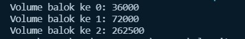
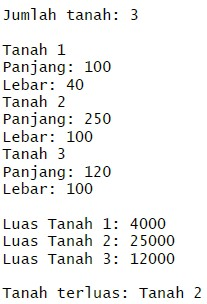

# **Algoritma dan Struktur Data 2021-2022**

**JOBSHEET III ARRAY OF OBJEK** 

**3.2 Membuat Array dari Object, Mengisi dan Menampilkan** 


**3.2.1 Langkah-langkah Percobaan** 
```
public class PersegiPanjang {
    public int panjang;
    public int lebar;
}

class ArrayObjects {
    public static void main(String args[]) {
        PersegiPanjang[] ppArray = new PersegiPanjang[3];

        ppArray[0] = new PersegiPanjang();
        ppArray[0].panjang = 110;
        ppArray[0].lebar = 30;
        
        ppArray[1] = new PersegiPanjang();
        ppArray[1].panjang = 80;
        ppArray[1].lebar = 40;
        
        ppArray[2] = new PersegiPanjang();
        ppArray[2].panjang = 100;
        ppArray[2].lebar = 20;

        System.out.println("Persegi Panjang ke-0, panjang: "+ppArray[0].panjang+ ", lebar: "+ppArray[0].lebar);
        System.out.println("Persegi Panjang ke-1, panjang: "+ppArray[1].panjang+ ", lebar: "+ppArray[1].lebar);
        System.out.println("Persegi Panjang ke-2, panjang: "+ppArray[2].panjang+ ", lebar: "+ppArray[2].lebar);
    }
}
```

**3.2.2 Verifikasi Hasil Percobaan** 


**3.2.3 Pertanyaan** 
1. Berdasarkan uji coba 3.2, apakah class yang akan dibuat array of object harus selalu memiliki atribut dan sekaligus method?Jelaskan! 

    **Jawab:** Harus, jika tidak memiliki atribut dan method maka program tidak akan bisa di run, karena pada class main terdapat kostruktor yang dipanggil. Maka, harus ada atribut dan method.

2. Apakah  class  PersegiPanjang  memiliki  konstruktor?Jika  tidak,  kenapa  dilakukan  pemanggilan konstruktur pada baris program berikut : 

    **Jawab:** Memang di class PersegiPanjang tidak memiliki Konstruktor, tetapi pada class main terdapat instansiasi konstruktor Persegi Panjang yang berupa array, yaitu ```PersegiPanjang[] ppArray = new new PersegiPanjang```.

3. Apa yang dimaksud dengan kode berikut ini:
    ```
    PersegiPanjang[] ppArray = new new PersegiPanjang
    ```

    **Jawab:** Code tersebut merupakan instansiasi konstruktor class PersegiPanjang berupa array. 
4. Apa yang dimaksud dengan kode berikut ini:
    ```
    ppArray[1] = new PersegiPanjang();
    ppArray[1].panjang = 80;
    ppArray[1].lebar = 40;
    ```
    **Jawab:** proses pengisian atribut-atribut yang dibutuhkan ke dalam array yang telah diinstansiasi tadi.

5. Mengapa class main dan juga class PersegiPanjang dipisahkan pada uji coba 3.2? 

    **Jawab:** Karena pada class main terdapat instansiasi konstruktor yang berada di class PersegiPanjang.

**3.3 Menerima Input Isian Array Menggunakan Looping** 

**3.3.1 Langkah-langkah Percobaan** 
```
import java.util.Scanner;
public class PersegiPanjang {
    public int panjang;
    public int lebar;
}

class ArrayObjects {
    public static void main(String[] args) {
        PersegiPanjang[] ppArray = new PersegiPanjang[3];
        Scanner sc = new Scanner(System.in);

        for(int i=0; i<3;i++){
            ppArray[i] = new PersegiPanjang();
            System.out.println("Persegi panjang ke-"+i);
            System.out.print("Masukkan panjang: ");
            ppArray[i].panjang = sc.nextInt();
            System.out.print("Masukkan lebar: ");
            ppArray[i].lebar = sc.nextInt();
        }
       
        for(int i=0; i<3;i++){
            System.out.println("Persegi Panjang ke-"+i);
            System.out.println("Panjang: "+ppArray[i].panjang+", lebar: "+ppArray[i].lebar);
        }
    }
}
```
**3.3.2 Verifikasi Hasil Percobaan** 


**3.3.3 Pertanyaan** 
1. Apakah array of object dapat diimplementasikan pada array 2 Dimensi? 

    **Jawab:** Ada dan dapat diimplementasikan. 


2. Jika jawaban soal no satu iya, berikan contohnya! Jika tidak, jelaskan! 

    **Jawab:**Contoh pengimplementasiannya di bawah ini:

    - Code:

```
 import java.util.Scanner;
public class Pertanyaan {
    public int panjang, lebar;


    public int luas(){
        return panjang*lebar;
    }
}
class main {
    public static void main(String args[]) {
        Scanner sc = new Scanner(System.in);
        System.out.print("Masukkan jumlah: ");
        int jml = sc.nextInt();
        Pertanyaan[][] array1 = new Pertanyaan[jml][jml];
        
        for(int i=0; i<jml; i++){
            array1[i][i] = new Pertanyaan();
            System.out.print("Masukkan panjang ke-"+(i+1)+": ");
            array1[i][i].panjang = sc.nextInt();
            System.out.print("Masukkan lebar ke-"+(i+1)+": ");
            array1[i][i].lebar = sc.nextInt();
        }
        
        for(int j=0; j<jml; j++){
            System.out.println();
            System.out.println("Perhitungan yang ke-"+(j+1));
            System.out.println("panjang: "+array1[j][j].panjang);
            System.out.println("lebar: "+array1[j][j].lebar);
            System.out.println("luas: "+array1[j][j].luas());
        }
    }
}   
```
- Output:
        

3. Jika diketahui  terdapat class **Persegi** yang memiliki atribut sisi bertipe integer, maka kode dibawah ini akan memunculkan error saat dijalankan. Mengapa? 
```
Persegi[] pgArray = new Persegi[100];
pgArray[5].sisi = 20;
```

**Jawab:** Karena belum diinstansiasi objek **pgArray** pada konstruktor **Persegi**

4. Modifikasi kode program pada praktikum 3.3 agar length array menjadi inputan dengan Scanner! 

    **Jawab:** File yang telah dimodifikasi ada di folder Latihan_Percobaan/3.3/Pertanyaan2
- code:

```
import java.util.Scanner;
public class Pertanyaan2 {
    public int panjang;
    public int lebar;
}

class ArrayObjects1 {
    public static void main(String[] args) {
        Scanner sc = new Scanner(System.in);
        System.out.print("Masukkan length array: ");
        int pjg = sc.nextInt();
        PersegiPanjang[] ppArray = new PersegiPanjang[pjg];
        
        for(int i=0; i<pjg;i++){
            ppArray[i] = new PersegiPanjang();
            System.out.println("Persegi panjang ke-"+(i+1));
            System.out.print("Masukkan panjang: ");
            ppArray[i].panjang = sc.nextInt();
            System.out.print("Masukkan lebar: ");
            ppArray[i].lebar = sc.nextInt();
        }
        
        for(int i=0; i<pjg;i++){
            System.out.println();
            System.out.println("Persegi Panjang ke-"+i);
            System.out.println("Panjang: "+ppArray[i].panjang+", lebar: "+ppArray[i].lebar);
        }
    }
}
```
- output:

    


4. Apakah boleh Jika terjadi duplikasi instansiasi array of objek, misalkan saja instansiasi dilakukan pada **ppArray[i]** sekaligus **ppArray[0]**?Jelaskan !

    **Jawab:** Boleh-boleh saja, namun tidak efektif dikarenakan membuang-buang baris kode. Instansiasi yag double itu nantinya akan dipilih baris yang paling bawah(terakhir)


**3.4 Operasi Matematika Atribut Object Array** 

**3.4.1 Langkah-langkah Percobaan** 
```
public class Balok {
    public int panjang;
    public int lebar;
    public int tinggi;

    public Balok(int p, int l, int t){
        panjang = p;
        lebar = l;
        tinggi = t;
    }

    public int hitungVolume(){
        return panjang*lebar*tinggi;
    }
}

class ArrayBalok {
    public static void main(String args[]) {
        Balok[] b1Array = new Balok[3];

        b1Array[0] = new Balok(100,30,12);
        b1Array[1] = new Balok(120,40,15);
        b1Array[2] = new Balok(210,50,25);

        for(int i=0; i<3;i++){
            System.out.println("Volume balok ke "+i+": "+b1Array[i].hitungVolume());
        }
    }
}
```


**3.4.2 Verifikasi Hasil Percobaan** 



**3.4.3 Pertanyaan** 
1. Dapatkah konstruktor berjumlah lebih dalam satu kelas? Jelaskan dengan contoh! 

    **Jawab:**
2. Jika diketahui terdapat class **Segitiga** seperti berikut ini: 

```
public class Segitiga {
    public int alas;
    public int tinggi;
} 
```

Tambahkan konstruktor pada class **Segitiga** tersebut yang berisi parameter **int a**, **int t** yang masing-masing digunakan untuk mengisikan atribut alas dan tinggi. 

**Jawab:**
```
public class segitiga{
    public int alas;
    public int tinggi;

    public int segitiga(int a, int t) {
        alas = a;
        tinggi = t;
    }
```

3. Tambahkan  method **hitungLuas()**  dan **hitungKeliling()**  pada  class **Segitiga** tersebut. 

    **Jawab:**
```
public class segitiga{
    public int alas;
    public int tinggi;
    public int miring;

    public int segitiga(int a, int t, int m) {
        alas = a;
        tinggi = t;
        miring = m;
    }
    public int hitungLuas(){
        return alas*tinggi/2;
    }

    public int hitungKeliling(){
        return alas+tinggi+miring;
    }
```

4. Pada fungsi **main**, buat array Segitiga **sgArray** yang berisi 4 elemen, isikan masing-masing atributnya sebagai berikut: 

    sgArray ke-0  alas: 10, tinggi: 4 

    sgArray ke-1  alas: 20, tinggi: 10 

    sgArray ke-2  alas: 15, tinggi: 6 

    sgArray ke-3  alas: 25, tinggi: 10 

    **Jawab:**
```
class segitigaMain{
    public static void main(String args[]) {
        System.out.print("Masukkan jumlah segitiga: ");
        int jml = sc.nextInt();
        
        segitiga[] sgt = new segitiga[jml];
        
        sgt[0] = new segitiga();
        sgt[0].alas = 10;
        sgt[0].tinggi = 4;
        
        sgt[1] = new segitiga();
        sgt[1].alas = 20;
        sgt[1].tinggi = 10;

        sgt[2] = new segitiga();
        sgt[2].alas = 15;
        sgt[2].tinggi = 6;

        sgt[3] = new segitiga();
        sgt[3].alas = 25;
        sgt[3].tinggi = 10;
```

5. Kemudian menggunakan looping, cetak luas dan keliling dengan cara memanggil method **hitungLuas()** dan **hitungKeliling()**. 

    **Jawab:**
```
class segitigaMain{
    public static void main(String args[]) {
        Scanner sc = new Scanner(System.in);
        System.out.print("Masukkan jumlah segitiga: ");
        int jml = sc.nextInt();
        
        segitiga[] sgt = new segitiga[jml];
        
        sgt[0] = new segitiga();
        sgt[0].alas = 10;
        sgt[0].tinggi = 4;
        
        sgt[1] = new segitiga();
        sgt[1].alas = 20;
        sgt[1].tinggi = 10;

        sgt[2] = new segitiga();
        sgt[2].alas = 15;
        sgt[2].tinggi = 6;

        sgt[3] = new segitiga();
        sgt[3].alas = 25;
        sgt[3].tinggi = 10;

        for(int i=0; i<jml; i++){
            sgt[i] = new segitiga();
            System.out.print("Masukkan miring segitiga: ");
            sgt[i].miring = sc.nextInt();
        }
        
        for(int j=0; j<jml; j++){
            System.out.println();
            System.out.println("Segitiga ke-"+(j));
            System.out.println("Alas : "+sgt[j].alas);
            System.out.println("tinggi : "+sgt[j].tinggi);
            System.out.println("Miring : "+sgt[j].miring);
            System.out.println("Luas : "+sgt[j].hitungLuas());
            System.out.println("Keliling : "+sgt[j].hitungKeliling());
        }
    }
}
```


**3.5 Latihan Praktikum** 
1. Buatlah program yang dapat menghitung luas permukaan dan volume beberapa bangun ruang (minimal 3, jenis bangun luas bebas). Buatlah 3 (tiga) class sesuai dengan jumlah jenis bangun ruang. Dan buat satu main class untuk membuat array of objek yang menginputkan atribut-atribut yang ada menggunakan konstruktor semua bangun ruang tersebut.  Keterangan : Buat looping untuk menginputkan masing-masing atributnya, kemudian tampilkan luas permukaan dan volume dari tiap jenis bangun ruang tersebut.

    **Jawab:**
- code:
```
import java.util.Scanner;
class Kubus {
    public int sisi;

    public int Kubus(int s){
        sisi = s;
        return sisi;
    }

    public int luasPermukaanKubus(){
        return 6*(sisi*sisi);
    }

    public int volumeKubus(){
        return sisi*sisi*sisi;
    }
}
class Balok {
    public int panjang, lebar, tinggi;

    public int Balok(int p, int l, int t){
        panjang = p;
        lebar = l;
        tinggi = t;
        return 0;
    }

    public int luasPermukaanBalok(){
        return 2*((panjang*lebar)+(panjang*tinggi)+(lebar*tinggi));
    }

    public int volumeBalok(){
        return panjang*lebar*tinggi;
    }
}

class Tabung {
    public int jariJari, tinggi;
    
    public int Tabung (int r, int t){
        jariJari = r;
        tinggi = t;
        return 0;
    }

    public double luasPermukaanTabung(){
        return 2*3.14*jariJari*(jariJari+tinggi);
    }
    public double volumeTabung(){
        return 3.14*(jariJari*jariJari)*tinggi;
    }
}

class Bola {
    public int jari_jari;

    public int Bola(int r){
        jari_jari = r;
        return jari_jari;
    }

    public double luasPermukaanBola(){
        return 4*3.14*(jari_jari*jari_jari);
    }
    
    public double volumeBola(){
        return (4/3)*3.14*(jari_jari*jari_jari*jari_jari);
    }
}


class BangunRuang {
    public static void main(String args[]) {

        Scanner input = new Scanner(System.in);
        int jml;
        char lagi ='y';
        do{

            System.out.println("=================================");
            System.out.println("   Program Hitung Bangun ruang   ");
            System.out.println("=================================");
            System.out.println("\nJenis-Jenis Bangun Ruang");
            System.out.println("1. Kubus");
            System.out.println("2. Balok");
            System.out.println("3. Tabung");
            System.out.println("4. Bola");
            System.out.print("\nPilihlah jenis bangun ruang yang akan dihitung: ");
            int br = input.nextInt();
            
            switch(br){
                case 1:
                System.out.println("=================================");
                System.out.println("Program Hitung Bangun ruang Kubus");
                System.out.println("=================================");
                System.out.print("Masukkan jumlah kubus: ");
                jml = input.nextInt();
                Kubus[] kbsArray = new Kubus[jml];
                
                for(int i=0; i<jml; i++){
                    kbsArray[i] = new Kubus();
                    System.out.print("Masukkan sisi ke-"+(i+1)+" :");
                    kbsArray[i].sisi = input.nextInt();
                }
                
                for(int j=0; j<jml; j++){
                    System.out.println();
                    System.out.println("Kubus ke-"+(j+1));
                    System.out.println("Sisi: "+kbsArray[j].sisi);
                    System.out.println("Volume Kubus: "+kbsArray[j].volumeKubus());
                    System.out.println("Luas Permukaan Kubus: "+kbsArray[j].luasPermukaanKubus());
                }
                System.out.print("Kembali ke menu utama ?(Y/T) :");
                lagi = input.next().charAt(0);
                
                break;
                case 2:
                System.out.println("=================================");
                System.out.println("Program Hitung Bangun Ruang Balok");
                System.out.println("=================================");
                System.out.print("Masukkan jumlah balok: ");
                jml = input.nextInt();
                Balok[] blkArray = new Balok[jml];
                
                for(int i=0; i<jml; i++){
                    blkArray[i] = new Balok();
                    System.out.print("Masukkan panjang ke-"+(i+1)+" :");
                    blkArray[i].panjang = input.nextInt();
                    System.out.print("Masukkan lebar ke-"+(i+1)+" :");
                    blkArray[i].lebar = input.nextInt();
                    System.out.print("Masukkan tinggi ke-"+(i+1)+" :");
                    blkArray[i].tinggi = input.nextInt();
                    System.out.println();
                }
                
                for(int j=0; j<jml; j++){
                    System.out.println();
                    System.out.println("Balok ke-"+(j+1));
                    System.out.println("Panjang: "+blkArray[j].panjang);
                    System.out.println("Lebar: "+blkArray[j].lebar);
                    System.out.println("Tinggi: "+blkArray[j].tinggi);
                    System.out.println("Volume Balok: "+blkArray[j].volumeBalok());
                    System.out.println("Luas Permukaan Balok: "+blkArray[j].luasPermukaanBalok());
                }
                System.out.print("Kembali ke menu utama ?(Y/T) :");
                lagi = input.next().charAt(0);
                break;
                case 3:
                System.out.println("=================================");
                System.out.println("Program Hitung Bangun Ruang Tabung");
                System.out.println("=================================");
                System.out.print("Masukkan jumlah tabung: ");
                jml = input.nextInt();
                Tabung[] tbgArray = new Tabung[jml];
                
                for(int i=0; i<jml; i++){
                    tbgArray[i] = new Tabung();
                    System.out.print("Masukkan jari-jari ke-"+(i+1)+" :");
                    tbgArray[i].jariJari = input.nextInt();
                    System.out.print("Masukkan tinggi ke-"+(i+1)+" :");
                    tbgArray[i].tinggi = input.nextInt();
                    System.out.println();
                }
                
                for(int j=0; j<jml; j++){
                    System.out.println("Tabung ke-"+(j+1));
                    System.out.println("Jari-Jari: "+tbgArray[j].jariJari);
                    System.out.println("Tinggi: "+tbgArray[j].tinggi);
                    System.out.println("Volume Tabung: "+tbgArray[j].volumeTabung());
                    System.out.println("Luas Permukaan Tabung: "+tbgArray[j].luasPermukaanTabung());
                    System.out.println();
                }
                System.out.print("Kembali ke menu utama ?(Y/T) :");
                lagi = input.next().charAt(0);
                break;
                case 4:
                System.out.println("=================================");
                System.out.println("Program Hitung Bangun ruang Bola");
                System.out.println("=================================");
                System.out.print("Masukkan jumlah bola: ");
                jml = input.nextInt();
                Bola[] bolaArray = new Bola[jml];
                
                for(int i=0; i<jml; i++){
                    bolaArray[i] = new Bola();
                    System.out.print("Masukkan jari-jari ke-"+(i+1)+" :");
                    bolaArray[i].jari_jari = input.nextInt();
                }
                
                for(int j=0; j<jml; j++){
                    System.out.println();
                    System.out.println("Bola ke-"+(j+1));
                    System.out.println("jari-jari: "+bolaArray[j].jari_jari);
                    System.out.println("Volume Bola: "+bolaArray[j].volumeBola());
                    System.out.println("Luas Permukaan Bola: "+bolaArray[j].luasPermukaanBola());
                }
                System.out.print("Kembali ke menu utama ?(Y/T) :");
                lagi = input.next().charAt(0);
                break;

                default:
                System.out.println("Maaf Kode yang Anda masukkan salah!");
            }
        }while(lagi == 'y' || lagi == 'Y');
        System.out.println("========================================");
        System.out.println("             TERIMA KASIH               ");
        System.out.println("----------------------------------------");
        System.out.println("             @iemaduddin                ");
        System.out.println("========================================");
    }
}
```
- Output:


2. Sebuah perusahaan jual beli tanah membutuhkan sebuah program yang dapat memberitahu luas tanah. Program tersebut dapat menerima input jumlah tanah yang akan dihitung dan atribut panjang dan lebar masing-masing dari tanah yang diinputkan. Program dapat menampilkan luas tanah masing-masing tanah yang diinputkan tadi dan juga tanah terluas dari ketiga tanah yang ada. Contoh output program: 


    

    **Jawab:**
- code:
```
import java.util.Scanner;
public class Tanah{
    public int panjang, lebar;

    public int luasTanah(){
        return panjang*lebar;
    }

    public int tanahTerluas(int luas[]){
        int terluas=0, a=0;
        for(int l=0; l<luas.length; l++){
            if(luas[l]>terluas){
                terluas = luas[l];
                a=l;
            }
        }
        return a;
    }

}

class tanahMain{
    public static void main(String args[]) {
        
        Scanner sc = new Scanner(System.in);
        System.out.println("=====================================");
        System.out.println("    PROGRAM MENGHITUNG LUAS TANAH    ");
        System.out.println("=====================================");
        System.out.print("\nMasukkan jumlah tanah: ");
        int jml = sc.nextInt();
        System.out.println();
        

        Tanah[] tnhArray = new Tanah[jml];

        for(int i=0; i<jml; i++){
            tnhArray[i] = new Tanah();
            System.out.println("Tanah "+(i+1));
            System.out.print("Masukkan panjang: ");
            tnhArray[i].panjang = sc.nextInt();
            System.out.print("Masukkan lebar: ");
            tnhArray[i].lebar = sc.nextInt();
        }

        for(int j=0; j<jml; j++){
            System.out.println("Luas Tanah "+(j+1)+": "+tnhArray[j].luasTanah());
        }
        System.out.println();
        int luas[] = new int[jml];
        for(int k=0; k<jml; k++){
            luas[k] = tnhArray[k].luasTanah();
        }
        int b = tnhArray[0].tanahTerluas(luas);
        System.out.println("Tanah terluas: Tanah "+(b+1));
    }
}
```

- output:


3. Sebuah kampus membutuhkan program untuk menampilkan informasi mahasiswa berupa nama, nim, jenis kelamin dan juga IPK mahasiswa. Program dapat menerima input semua informasi tersebut, kemudian menampilkanya kembali ke user. Implementasikan program tersebut jika dimisalkan terdapat 3 data mahasiswa yang tersedia. Contoh output program: 

    

    **Jawab:**
- code:
```
import java.util.Scanner;
public class Mahasiswa {
    public String nama, nim;
    public char jenisKelamin;
    public double ipk;

    public Mahasiswa(String nm, String ni, char jk, double ip ){
        nama = nm;
        nim = ni;
        jenisKelamin = jk;
        ipk = ip;
    }
}

class mahasiswaMain{
    public static void main(String args[]) {
        Scanner mhs = new Scanner(System.in);

        System.out.print("Masukkan jumlah mahasiswa: ");
        int jml = mhs.nextInt();
        Mahasiswa[] mhsArray = new Mahasiswa[jml];
        System.out.println();
        for(int i=0; i<jml; i++){
            System.out.println("Masukkan data mahasiswa ke- "+(i+1));
            System.out.print("Masukkan nama: ");
            String nm = mhs.next();
            System.out.print("Masukkan nim: ");
            String ni = mhs.next();
            System.out.print("Masukkan jenis kelamin: ");
            char jk = mhs.next().charAt(0);
            System.out.print("Masukkan IPK: ");
            double ip = mhs.nextDouble();
            System.out.println();
            
            mhsArray[i] = new Mahasiswa(nm, ni, jk, ip);
        }
        
        for(int j=0; j<jml; j++){
            System.out.println();
            System.out.println("Data Mahasiswa ke-"+(j+1));
            System.out.println("nama : "+mhsArray[j].nama);
            System.out.println("nim : "+mhsArray[j].nim);
            System.out.println("Jenis Kelamin : "+mhsArray[j].jenisKelamin);
            System.out.println("Nilai IPK : "+mhsArray[j].ipk);
        }
    }
}
```
- output:
