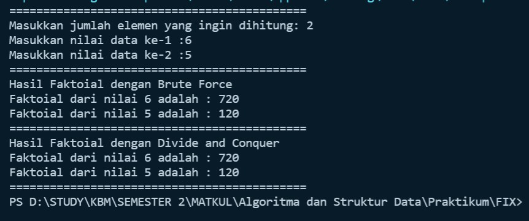
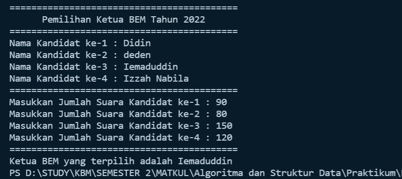

# **Algoritma dan Struktur Data 2021-2022** 

## **JOBSHEET IV** 

## **BRUTE FORCE DAN DIVIDE CONQUER**

**Nama: Iemaduddin**

**No. Absen/Kelas: 16/TI-1F**

**NIM: 2141720055**


### **4.1 Tujuan Praktikum** 

Setelah melakukan materi praktikum ini, mahasiswa mampu: 

1. Mahasiswa mampu membuat algoritma bruteforce dan divide-conquer 
1. Mahasiswa mampu menerapkan penggunaan algorima bruteforce dan divide-conquer 

**4.2 Menghitung Nilai Faktorial dengan Algoritma Brute Force dan Divide and Conquer** 

#### **4.2.1 Langkah-langkah Percobaan** 
1. Buat Project baru, dengan** nama “**BruteForceDivideConquer**”. Buat package dengan nama minggu5.

    **Jawab:** 

    

2. Buatlah class baru dengan nama **Faktorial**

    **Jawab:** 

    

3. Lengkapi class **Faktorial** dengan atribut dan method yang telah digambarkan di dalam diagram class di atas, sebagai berikut:  

    a) Tambahkan atribut nilai 

    **Jawab:**

    ```
    public int nilai;
    ```

    b) Tambahkan method faktorialBF() nilai 

    **Jawab:**

    ```
    public int faktoialBF(int n){
        int fakto = 1;
        for(int i=1; i<=n; i++){
            fakto *= i;
        }
        return fakto;
    }
    ```

3) Tambahkan method faktorialDC() nilai 

    **Jawab:**

    ```
    public int faktoialDC(int n){
        if(n == 1){
            return 1;
        }else{
            int fakto = n* faktoialDC(n-1);
            return fakto;
        }
    }
    ```


4. Coba jalankan (Run) class Faktorial dengan membuat class baru MainFaktorial. 


    **Jawab:**

    ```
    class MainFaktoial{
        public static void main(String args[]) {

        }
    }
    ```
    a) Di dalam fungsi main sediakan komunikasi dengan user untuk menginputkan jumlah angka yang akan dicari nilai faktorialnya 

    **Jawab:**

    ```
    class MainFaktoial{
        public static void main(String args[]) {
            Scanner sc = new Scanner(System.in);
            System.out.println("============================================");
            System.out.print("Masukkan jumlah elemen yang ingin dihitung: ");
            int elemen = sc.nextInt();
        }
    }
    ```

    b) Buat Array of Objek pada fungsi main, kemudian inputkan beberapa nilai yang akan dihitung faktorialnya 

    **Jawab:**

    ```
    class MainFaktoial{
        public static void main(String args[]) {
            Scanner sc = new Scanner(System.in);
        
            System.out.println("============================================");
            System.out.print("Masukkan jumlah elemen yang ingin dihitung: ");
            int elemen = sc.nextInt();
            
            Faktorial[] fk = new Faktorial[elemen];
            for(int i=0; i<elemen; i++){
                fk[i] = new Faktorial();
                System.out.print("Masukkan nilai data ke-"+(i+1)+" :");
                fk[i].nilai = sc.nextInt();
            }
        }
    }
    ```

    c) Tampilkan hasil pemanggilan method faktorialDC() dan faktorialBF() 

    **Jawab:**

    ```
    class MainFaktoial{
        public static void main(String args[]) {
            Scanner sc = new Scanner(System.in);
            
            System.out.println("============================================");
            System.out.print("Masukkan jumlah elemen yang ingin dihitung: ");
            int elemen = sc.nextInt();
            
            Faktorial[] fk = new Faktorial[elemen];
            for(int i=0; i<elemen; i++){
                fk[i] = new Faktorial();
                System.out.print("Masukkan nilai data ke-"+(i+1)+" :");
                fk[i].nilai = sc.nextInt();
            }
            
            System.out.println("============================================");
            System.out.println("Hasil Faktoial dengan Brute Force");
            for(int i=0; i<elemen; i++){
                System.out.println("Faktoial dari nilai "+fk[i].nilai+" adalah : "+fk[i].faktoialBF(fk[i].nilai));
            }
            System.out.println("============================================");
            System.out.println("Hasil Faktoial dengan Divide and Conquer");
            for(int i=0; i<elemen; i++){
                System.out.println("Faktoial dari nilai "+fk[i].nilai+" adalah : "+fk[i].faktoialDC(fk[i].nilai));
            }
            System.out.println("============================================");
        }
    }
    ```

    d) Pastikan program sudah berjalan dengan baik! 

#### **4.2.2 Verifikasi Hasil Percobaan** 

Cocokkan hasil compile kode program anda dengan gambar berikut ini.


**Jawab:**


#### **4.2.3 Pertanyaan** 
1. Jelaskan mengenai base line Algoritma Divide Conquer untuk melakukan pencarian nilai faktorial!


    ```
    public int faktoialDC(int n){
        if(n == 1){
            return 1;
        }else{
            int fakto = n* faktoialDC(n-1);
            return fakto;
        }
    }
    ```
    **Jawab:** Pada case ini menggunakan if-else, yang mana jika nilai n sama dengan 1 maka akan menghasilkan output 1. Dan jika nilai n selain 1, maka dilakukan perhitungan, yakni terdapat variabel fakto untuk melakukan perhitungan. fakto = nilai n dikalikan dengan nilai n-1 (n yang dikurangi 1).
    Contoh: nilai n = 6, maka perhitungan sebagai berikut: 
    - fakto = 6 --> 6*(6-1) = 6*5 = 30
    - fakto = 5 --> 30*(5-1) = 30*4 = 120
    - fakto = 4 --> 120*(4-1) = 120*3 = 360
    - fakto = 3 --> 360*(3-1) = 360*2 = 720
    - fakto = 2 --> 720*(2-1) = 720*1 = 720

2. Pada implementasi Algoritma Divide and Conquer Faktorial apakah lengkap terdiri dari 3 tahapan divide, conquer, combine? Jelaskan masing-masing bagiannya pada kode program! 

    **Jawab:** Dapat dijelaskan di codingan di bawah ini menggunakan kommentar

    ```
    public int faktoialDC(int n){
        if(n == 1){ //ini adalah divide
            return 1; //ini adalah conquer + combine
        }else{ //ini adalah divide
            int fakto = n* faktoialDC(n-1); //ini adalah conquer
            return fakto; //ini adalah combine
        }
    }
    ```

3. Apakah memungkinkan perulangan pada method faktorialBF() dirubah selain menggunakan for? Buktikan! 6

    **Jawab** Memungkinkan, buktinya ada di file **FaktorialBF_while.java** atau sebagai berikut:
    - code:
        ```
        public int faktoialBF(int n){
            int fakto = 1;
            int i=0;
            while(i<=n){
                fakto *= i;
                i++;
            }
            return fakto;
        }
        ```
    - Output:
    

4. Tambahkan pegecekan waktu eksekusi kedua jenis method tersebut! 

    **Jawab**
    - Code:
        ```
        long awal = System.currentTimeMillis();
        long selesai = System.currentTimeMillis();
        long time = selesai - awal;
        System.out.println("Waktu Eksekusi : "+String.valueOf(time)+" milidetik");
        ```
    - Output:
        

5. Buktikan dengan inputan elemen yang di atas 20 angka, apakah ada perbedaan waktu eksekusi? 

    **Jawab:** **Ada**, yaitu bisa terlihat pada output yang dihasilkan bahwa jumlah inputan mempengaruhi waktu eksekusi karena inputan itu juga di proses

    

### **4.3 Menghitung Hasil Pangkat dengan Algoritma Brute Force dan Divide and Conquer** 

Pada praktikum ini kita akan membuat program class dalam Java. Untuk menghitung nilai pangkat suatu angka menggunakan 2 jenis algoritma, Brute Force dan Divide and Conquer.

#### **4.3.1 Langkah-langkah Percobaan** 
1. Di dalam paket **minggu5**, buatlah class baru dengan nama **Pangkat**. Dan di dalam class **Pangkat** tersebut, buat atribut angka yang akan dipangkatkan sekaligus dengan angka pemangkatnya 
    
    **Jawab**

    ```
    public class Pangkat {
        public int nilai, pangkat;
    }
    ```

2. Pada class Pangkat tersebut, tambahkan method PangkatBF()
    
    **Jawab**

    ```
    public class Pangkat {
        public int nilai, pangkat;
        public int pangkatBF(int a, int n){
            int hasil = 1;
            for(int i=0; i<n; i++){
                hasil = hasil * a;
            }
            return hasil;
        }
    }
    ```

3. Pada class Pangkat juga tambahkan method PangkatDC()
    
    **Jawab**

    ```
    public class Pangkat {
        public int nilai, pangkat;
        public int pangkatBF(int a, int n){
            int hasil = 1;
            for(int i=0; i<n; i++){
                hasil = hasil * a;
            }
            return hasil;
        }
        public int pangkatDC(int a, int n){
            if(n==0){
                return 1;
            }else{
                if(n%2==1){
                    return (pangkatDC(a, n/2)*pangkatDC(a, n/2)*a);
                }else{
                    return (pangkatDC(a, n/2)*pangkatDC(a, n/2));
                }
            }
        }
    }
    ```

4. Perhatikan apakah sudah tidak ada kesalahan yang muncul dalam pembuatan class Pangkat 

5. Selanjutnya  buat  class  baru  yang  di  dalamnya  terdapat  method  main.  Class  tersebut  dapat dinamakan MainPangkat. Tambahkan kode pada class main untuk menginputkan jumlah nilai yang akan dihitung pangkatnya. 
    
    **Jawab**

    ```
    class MainPangkat{
        public static void main(String args[]) {
        Scanner sc = new Scanner(System.in);
        System.out.println("=================================================");
        System.out.print("Masukkan jumlah elemen yang ingin dihitung: ");
        int elemen = sc.nextInt();
        }
    }
    ```

6. Nilai pada tahap 5 selanjutnya digunakan untuk instansiasi array of objek. Di dalam Kode berikut ditambahkan  proses  pengisian  beberapa  nilai  yang  akan  dipangkatkan  sekaligus  dengan pemangkatnya. 
    
    **Jawab**

    ```
    class MainPangkat{
        public static void main(String args[]) {
            Scanner sc = new Scanner(System.in);
            System.out.println("=================================================");
            System.out.print("Masukkan jumlah elemen yang ingin dihitung: ");
            int elemen = sc.nextInt();
            Pangkat[] png = new Pangkat[elemen];
        
        for(int i=0; i<elemen; i++){
            png[i] = new Pangkat();
            System.out.print("Masukkan nilai yang akan dipangkatkan ke-"+(i+1)+" : ");
            png[i].nilai = sc.nextInt();
            System.out.print("Masukkan nilai pemangkat ke-"+(i+1)+" : ");
            png[i].pangkat = sc.nextInt();
            }
        }
    }
    ```

7. Kemudian, panggil hasil nya dengan mengeluarkan return value dari method PangkatBF() dan PangkatDC(). 
    
    **Jawab**

    ```
    class MainPangkat{
        public static void main(String args[]) {
            Scanner sc = new Scanner(System.in);
            System.out.println("=================================================");
            System.out.print("Masukkan jumlah elemen yang ingin dihitung: ");
            int elemen = sc.nextInt();
            Pangkat[] png = new Pangkat[elemen];
        
        for(int i=0; i<elemen; i++){
            png[i] = new Pangkat();
            System.out.print("Masukkan nilai yang akan dipangkatkan ke-"+(i+1)+" : ");
            png[i].nilai = sc.nextInt();
            System.out.print("Masukkan nilai pemangkat ke-"+(i+1)+" : ");
            png[i].pangkat = sc.nextInt();
            }
                System.out.println("=================================================");
        System.out.println("Hasil Pangkat dengan Bruce Force");
        for(int i=0; i<elemen; i++){
            System.out.println("Nilai "+png[i].nilai+" pangkat "+png[i].pangkat+" adalah : "+png[i].pangkatBF(png[i].nilai, png[i].pangkat));
        }
        
        System.out.println("=================================================");
        System.out.println("Hasil Pangkat dengan Divide and Conquer");
        for(int i=0; i<elemen; i++){
            System.out.println("Nilai "+png[i].nilai+" pangkat "+png[i].pangkat+" adalah : "+png[i].pangkatDC(png[i].nilai, png[i].pangkat));
        }
        System.out.println("=================================================");
        }
    }
    ```

#### **4.3.2 Verifikasi Hasil Percobaan** 

Pastikan output yang ditampilkan sudah benar seperti di bawah ini. 


**Jawab:**


#### **4.3.3 Pertanyaan** 

1. Jelaskan mengenai perbedaan 2 method yang dibuat yaitu PangkatBF() dan PangkatDC()! 

    **Jawab**
    
    - Method PangkatBF():
        - method PangkatBF() menggunakan perulangan "for".
        - method PangkatBF() langsung menentukan nilai hasil itu sama dengan 1 dan menghitung menggunakan perulangan, yaitu hasil = hasil * nilai a. setelah syarat dari perulangan sudah tidak terpenuhi/berhenti maka nilai dari hasil akan direturn-kan.
    - Method PangkatDC():
        - method PangkatDC() menggunakan pemilihan "if-else".
        - method PangkatDC() membaginya terlebih dahulu, yakni menggunakan pemilihan.
            - Jika nilai dari n = 0, maka nilainya akan bernilai 1.
            - Jika tidak, maka dibagi lagi dengan menggunakan pemilihan lagi, yaitu dengan membagi nilai ganjil dan genap.
                - Jika nilai pangkat itu ganjil, contoh: angka = 2, pangkat = 3.--> ((2, 3/2)*(2,3/2)*2)) -->((2,1)*(2,1)*2) --> ((2*2)*(1*1)*2) = 8.
                - Sedangkan nilai pangkat itu genap, contoh: angka = 2, pangkat 4 --> ((2, 4/2)*(2,4/2)*2)) -->((2,2)*(2,2)*2) --> (2*2)*(2*2) = 16.

2. Pada method PangkatDC() terdapat potongan program sebagai berikut: 

    
    Jelaskan arti potongan kode tersebut 

    **Jawab**
    - Jika nilai pangkat itu ganjil, contoh: angka = 2, pangkat = 3.--> ((2, 3/2)*(2,3/2)*2)) -->((2,1)*(2,1)*2) --> ((2*2)*(1*1)*2) = 8.
    - Sedangkan nilai pangkat itu genap, contoh: angka = 2, pangkat 4 --> ((2, 4/2)*(2,4/2)*2)) -->((2,2)*(2,2)*2) --> (2*2)*(2*2) = 16.

3. Apakah tahap *combine* sudah termasuk dalam kode tersebut?Tunjukkan! 

    **Jawab** Sudah termasuk, yaitu:
    ```
    if(n%2==1){ //ini adalah divide
        return (pangkatDC(a, n/2)*pangkatDC(a, n/2)*a); //ini adalah conquer + combine
    }else{
        return (pangkatDC(a, n/2)*pangkatDC(a, n/2)); //ini adalah conquer + combine
    }
    ```

4. Modifikasi  kode  program  tersebut,  anggap  proses  pengisian  atribut  dilakukan  dengan konstruktor. 

    **Jawab**

    ```
    public void Pangkat (int a, int n){
        nilai = a;
        pangkat = n;
    }
    ```

5. Tambahkan menu agar salah satu method yang terpilih saja yang akan dijalankan! 

    **Jawab**
    - Code:
    ```
    class MainPangkat_pertanyaan{
        public static void main(String args[]) {
            Scanner sc = new Scanner(System.in);
            char ulang;
            do{
            System.out.println("=================================================");
            System.out.print("Masukkan jumlah elemen yang ingin dihitung: ");
            int elemen = sc.nextInt();
            
            Pangkat_pertanyaan[] png = new Pangkat_pertanyaan[elemen];
            
            for(int i=0; i<elemen; i++){
                png[i] = new Pangkat_pertanyaan();
                System.out.print("Masukkan nilai yang akan dipangkatkan ke-"+(i+1)+" : ");
                png[i].nilai = sc.nextInt();
                System.out.print("Masukkan nilai pemangkat ke-"+(i+1)+" : ");
                png[i].pangkat = sc.nextInt();
                }
            System.out.println("=================================================");
            System.out.println("Pilihan Perhitungan");
            System.out.println("1. Brute Force");
            System.out.println("2. Divide and Conquer");
            System.out.println("=================================================");
            System.out.print("Masukkan pilihan Anda: ");
            int pil = sc.nextInt();
            
            switch(pil){
            case 1:
                System.out.println("=================================================");
                System.out.println("Hasil Pangkat dengan Bruce Force");
                for(int i=0; i<elemen; i++){
                    System.out.println("Nilai "+png[i].nilai+" pangkat "+png[i].pangkat+" adalah : "+png[i].pangkatBF(png[i].nilai, png[i].pangkat));
                }
            break;
            case 2:
                System.out.println("=================================================");
                System.out.println("Hasil Pangkat dengan Divide and Conquer");
                for(int i=0; i<elemen; i++){
                    System.out.println("Nilai "+png[i].nilai+" pangkat "+png[i].pangkat+" adalah : "+png[i].pangkatDC(png[i].nilai, png[i].pangkat));
                }
            break;
            default:
                System.out.println("Maaf input yang Anda masukkan salah");
            }
            System.out.println("=================================================");
            System.out.print("Apakah ingin kembali ke menu? (Y/T) : ");
            ulang = sc.next().charAt(0); 
            }while(ulang == 'Y' || ulang == 'y');
        }
    }
    ```
    - Output:

        

### **4.4 Menghitung Sum Array dengan Algoritma Brute Force dan Divide and Conquer** 

Di  dalam  percobaan  ini,  kita  akan  mempraktekkan  bagaimana  proses  *divide,  conquer*,  dan *combine* diterapkan pada studi kasus penjumlahan keuntungan suatu perusahaan dalam beberapa bulan. 

#### **4.4.1 Langkah-langkah Percobaan** 
1. Pada paket minggu5. Buat class baru yaitu class Sum. DI salam class tersebut terdapat beberapa atribut jumlah elemen array, array, dan juga total. Tambahkan pula konstruktor pada class Sum.

   **Jawab**
    ```
    public class Sum {
        public int elemen;
        public double keuntungan[];
        public double total;

        Sum(int elemen){
            this.elemen = elemen;
            this.keuntungan =  new double[elemen];
            this.total = 0;
        }
    }
    ```

2. Tambahkan method TotalBF() yang akan menghitung total nilai array dengan cara *iterative*. 

   **Jawab**
    ```
    public class Sum {
        public int elemen;
        public double keuntungan[];
        public double total;

        Sum(int elemen){
            this.elemen = elemen;
            this.keuntungan =  new double[elemen];
            this.total = 0;
        }
        double totalBF(double arr[]){
            for(int i=0; i<elemen; i++){
                total = total + arr[i];
            }
        return total;
        }
    }
    ```

3. Tambahkan  pula  method TotalDC()  untuk  implementasi  perhitungan  nilai  total  array menggunakan algoritma Divide and Conquer 

   **Jawab**
    ```
    public class Sum {
        public int elemen;
        public double keuntungan[];
        public double total;

        Sum(int elemen){
            this.elemen = elemen;
            this.keuntungan =  new double[elemen];
            this.total = 0;
        }
        double totalBF(double arr[]){
            for(int i=0; i<elemen; i++){
                total = total + arr[i];
            }
        return total;
        }
        double totalDC(double arr[], int l, int r){
            if(l==r){
                return arr[l];
            }else if(l<r){
                int mid = (l+r)/2;
                double lsum = totalDC(arr, l, mid-1);
                double rsum = totalDC(arr, mid+1, r);
                return lsum+rsum+arr[mid];
            }
        return 0;
        }
    }
    ```

4. Buat class baru yaitu MainSum. Di dalam kelas ini terdapat method main. Pada method ini user dapat menuliskan berapa bulan keuntungan yang akan dihitung. Dalam kelas ini sekaligus dibuat instansiasi objek untuk memanggil atribut ataupun fungsi pada class Sum

   **Jawab**
    ```
    class MainSum{
        public static void main(String args[]) {
            Scanner sc = new Scanner(System.in);
            System.out.println("=============================================");
            System.out.println("Program Menghitung Keuntungan Total (Satuan Juta. Misal 5.9 ");
            System.out.print("Masukkan jumlah bulan : ");
            int elm = sc.nextInt();
        }
    }
    ```

5. Karena yang akan dihitung adalah total nilai keuntungan, maka ditambahkan pula pada method main mana array yang akan dihitung. Array tersebut merupakan atribut yang terdapat di class Sum, maka dari itu dibutuhkan pembuatan objek Sum terlebih dahulu.

   **Jawab**
    ```
    class MainSum{
        public static void main(String args[]) {
            Scanner sc = new Scanner(System.in);
            System.out.println("=============================================");
            System.out.println("Program Menghitung Keuntungan Total (Satuan Juta. Misal 5.9 ");
            System.out.print("Masukkan jumlah bulan : ");
            int elm = sc.nextInt();
            Sum sm = new Sum(elm);
            System.out.println("=============================================");
            for(int i=0; i<sm.elemen; i++){
                System.out.print("Masukkan untung bulan ke - "+(i+1)+" = ");
                sm.keuntungan[i] = sc.nextDouble();
            }
        }
    }
    ```

6. Tampilkan hasil perhitungan melalui objek yang telah dibuat untuk kedua cara yang ada (Brute Force dan Divide and Conquer) 

   **Jawab**
    ```
    class MainSum{
        public static void main(String args[]) {
            Scanner sc = new Scanner(System.in);
            System.out.println("=============================================");
            System.out.println("Program Menghitung Keuntungan Total (Satuan Juta. Misal 5.9 ");
            System.out.print("Masukkan jumlah bulan : ");
            int elm = sc.nextInt();
            Sum sm = new Sum(elm);
            System.out.println("=============================================");
            for(int i=0; i<sm.elemen; i++){
                System.out.print("Masukkan untung bulan ke - "+(i+1)+" = ");
                sm.keuntungan[i] = sc.nextDouble();
            }
            System.out.println("=============================================");
            System.out.println("Algoritma Brute Force");
            System.out.println("Total keuntungan perusahaan selama "+sm.elemen+" bulan adalah = "+sm.totalBF(sm.keuntungan));
            System.out.println("=============================================");
            System.out.println("Algoritma Divide Conquer");
            System.out.println("Total keuntungan perusahaan selama "+sm.elemen+" bulan adalah = "+sm.totalDC(sm.keuntungan, 0, sm.elemen-1)); 
        }
    }
    ```
#### **4.4.2 Verifikasi Hasil Percobaan** 

Cocokkan hasil compile kode program anda dengan gambar berikut ini. 


**Jawab**


#### **4.4.3 Pertanyaan** 
1. Berikan ilustrasi perbedaan perhitungan keuntungan dengan method TotalBF() ataupun TotalDC()

    **Jawab:**
    - Method TotalBF(): Source code lebih mudah dimengerti dan ringkas, lalu menghasilkan algoritma yang standard.
    - Method TotalDC(): Source code tidak lebih mudah dimengerti dari pada method TotalBF(), namun pada method ini memiliki keuntungan, yakni kita dapat memecahkan sebuah masalah yang sulit dan memiliki efisiensi kerja program atau algoritma yang tinggi dan memiliki sistem kerja paralel.
    

2. Perhatikan output dari kedua jenis algoritma tersebut bisa jadi memiliki hasil berbeda di belakang koma. Bagaimana membatasi output di belakang koma agar menjadi standar untuk kedua jenis algoritma tersebut. 

    **Jawab:** Dengan memodifikasi baris **println** menjadi **printf** untuk membatasi karakter yang ada. Codenya sebagai berikut:
    ```
    System.out.printf("Total keuntungan perusahaan selama "+sm.elemen+" bulan adalah = %4.2f",sm.totalBF(sm.keuntungan));
    ```

3. Mengapa terdapat formulasi *return* *value* berikut?Jelaskan! 
    ```
    return lsum+rsum+arr[mid];
    ```

    **Jawab:** Return value tersebut digunakan untuk mengembalikan nilai dari variabel "lsum", "rsum", dan "arr[mid]", yang mana setiap dari variabel tersebut dijumlahkan terlebih dahulu.


4. Kenapa dibutuhkan variable mid pada method TotalDC()? 

    **Jawab:** Variabel **mid** dibutuhkan sebagai tempat menyimpan data, yaitu perhitungan "(l+r)/2", yang mana nantinya akan digunakan sebagai pengisian nilai dari salah satu parameter method TotalDC(), yakni arr[].


5. Program perhitungan keuntungan suatu perusahaan ini hanya untuk satu perusahaan saja. Bagaimana  cara  menghitung  sekaligus  keuntungan  beberapa  bulan  untuk  beberapa perusahaan.(Setiap perusahaan bisa saja memiliki jumlah bulan berbeda-beda)? Buktikan dengan program! 


    **Jawab:** Source Code ini ada di file **Sum_pertanyaan.java**

    - Code:
    ```
    import java.util.Scanner;
    public class Sum_pertanyaan {
        public int elemen;
        public double keuntungan[];
        public double total;

        Sum_pertanyaan(int elemen){
            this.elemen = elemen;
            this.keuntungan =  new double[elemen];
            this.total = 0;
        }

        double totalBF(double arr[]){
            for(int i=0; i<elemen; i++){
                total = total + arr[i];
            }
            return total;
        }

        double totalDC(double arr[], int l, int r){
            if(l==r){
                return arr[l];
            }else if(l<r){
                int mid = (l+r)/2;
                double lsum = totalDC(arr, l, mid-1);
                double rsum = totalDC(arr, mid+1, r);
                return lsum+rsum+arr[mid];
            }
            return 0;
        }
    }

    class MainSum_pertanyaan{
        public static void main(String args[]) {
            Scanner sc = new Scanner(System.in);
            System.out.println("=============================================================");
            System.out.println("Program Menghitung Keuntungan Total (Satuan Juta. Misal 5.9) ");
            System.out.println("=============================================================");
            System.out.print("Masukkan jumlah perusahaan : ");
            Sum_pertanyaan[] smArray = new Sum_pertanyaan[sc.nextInt()];
            
            for(int i=0; i<smArray.length; i++){
                System.out.println("=============================================================");
                System.out.println("Data perusahaan ke-"+(i+1));
                System.out.print("Masukkan jumlah bulan : ");
                int elemen = sc.nextInt();
                smArray[i] = new Sum_pertanyaan(elemen);
                
                for(int j=0; j<elemen; j++){
                    System.out.print("Masukkan untung bulan ke - "+(j+1)+" = ");
                    smArray[i].keuntungan[j] = sc.nextDouble();
                }
            }
            
            for(int i=0; i<smArray.length; i++){
                System.out.println("=============================================================");
                System.out.println("Hasil perhitungan perusahaan ke-"+(i+1));
                System.out.println("Algoritma Brute Force");
                System.out.printf("Total keuntungan perusahaan selama "+smArray[i].elemen+" bulan adalah = %4.2f%n",smArray[i].totalBF(smArray[i].keuntungan));
                System.out.println("Algoritma Divide Conquer");
                System.out.printf("Total keuntungan perusahaan selama "+smArray[i].elemen+" bulan adalah = %4.2f%n",smArray[i].totalDC(smArray[i].keuntungan, 0, smArray[i].elemen-1)); 
            }
            System.out.println("=============================================================");
        }
    }
    ```

    - Output:

    


### **4.5 Latihan Praktikum** 

1.  Suatu Perguruan Tinggi di kota Malang sedang mengadakan pemilihan suara untuk memilih ketua BEM tahun 2022. Jika jumlah suara yang terkumpul diumpamakan selalu genap. Maka dengan inputan kandidat terpilih, carilah mayoritas jumlah suara untuk masing-masing kandidat. (Jumlah elemen array dan hasil pemilhan suara merupakan inputan user). 

    **Elemen Mayoritas : Elemen mayoritas di dalam A adalah elemen yang terdapat pada lebih dari n/2 posisi. Contohnya, jika n=6 atau n=7 maka nilai mayoritas paling sedikit adalah 4. Berasal dari (7/2)+1 atau (6/2)+1).**  

    Nilai mayoritas berbeda konsep dengan menghitung total suara terbanyak kandidat terpilih !  
    Contoh : Hasil pemilihan suara sebagai berikut (m adalah mayoritas, nm adalah no mayoritas) 

    
    


    Karena n = 8, nilai mayoritas paling sedikit sejumlah 5 (8/2+1) 

    Keterangan : Warna Biru adalah proses divide, warna kuning dimulainya proses conquer, warna hijau dimulainya proses combine 

    **Jawab:**

    - Code:

    ```
    import java.util.Scanner;
    public class Bem {
        public int vote, jmlVote=0, jmlKandidat=4;
        public String kandidat;
        public int nilai=1, acc=0, acc2=0,control=0;
        public int[] array = new int[10000];

        public int hitungHasil(int js, int k1, int k2, int k3, int k4){
            if(nilai==5){
                nilai = 1;
            }
            if(nilai == 1 && k1>0){
                array[control] = nilai;
                control++;
                nilai++;
                return hitungHasil(js, k1-1, k2, k3, k4);
            }else if(nilai == 2 && k2>0){
                array[control] = nilai;
                control++;
                nilai++;
                return hitungHasil(js, k1, k2-1, k3, k4);
            }else if(nilai == 3 && k3>0){
                array[control] = nilai;
                control++;
                nilai++;
                return hitungHasil(js, k1, k2, k3-1, k4);
            }else if(nilai == 4 && k4>0){
                array[control] = nilai;
                control++;
                nilai++;
                return hitungHasil(js, k1, k2, k3, k4-1);
            }else if(k1==0 && k2==0 && k3==0 && k4==0){
                if(array[acc] == array[acc+1] && acc + 1<js){
                    return array[acc];
                }else if(acc+2<js){
                    acc +=2;
                    return hitungHasil(js, k1, k2, k3, k4);
                }else{
                    return 0;
                }
            }else{
                nilai++;
                return hitungHasil(js, k1, k2, k3, k4);
            }
        }
    }

    class MainBem{
        public static void main(String args[]){
            Scanner sc = new Scanner(System.in);

            System.out.println("==========================================");
            System.out.println("      Pemilihan Ketua BEM Tahun 2022     ");
            System.out.println("==========================================");
            
            Bem bem = new Bem();
            Bem[] bem2 = new Bem[bem.jmlKandidat];
            for(int i=0; i<bem.jmlKandidat; i++){
                bem2[i] = new Bem();
                System.out.print("Nama Kandidat ke-"+(i+1)+" : ");
                bem2[i].kandidat = sc.nextLine();
            }
            
            System.out.println("==========================================");
            for(int i=0; i<bem.jmlKandidat; i++){
                System.out.print("Masukkan Jumlah Suara Kandidat ke-"+(i+1)+" : ");
                bem2[i].vote = sc.nextInt();
                bem.jmlVote += bem2[i].vote;
            }
            
            System.out.println("==========================================");
            int hasil = bem.hitungHasil(bem.jmlVote, bem2[0].vote, bem2[1].vote, bem2[2].vote, bem2[3].vote); 
            if(hasil==0){
                System.out.println("Masing-masing kandidat memiliki mayoritas yang hampir sama");
            }else{
                System.out.println("Ketua BEM yang terpilih adalah "+bem2[hasil-1].kandidat);
            }
        }
    }
    ```

    - Output:

    