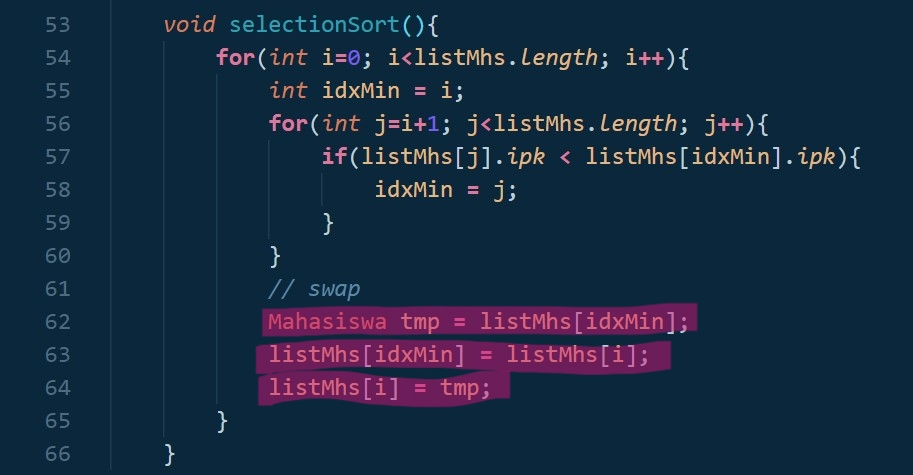

# **Algoritma dan Struktur Data 2021-2022** 

**JOBSHEET - 5** 

**SORTING (BUBBLE, SELECTION, DAN INSERTION SORT)** 

**Nama : Iemaduddin**

**No. Absen/Kelas: 16/TI-1F**

**NIM : 2141720055**

**5.1 Tujuan Praktikum** 

Setelah melakukan praktikum ini diharapkan mahasiswa mampu: 

1. Mahasiswa mampu  membuat algoritma searching bubble sort, selection sort dan insertion sort 
2. Mahasiswa mampu  menerapkan algoritma searching bubble sort, selection sort dan insertion sort pada program 

**5.2 Mengurutkan Data Mahasiswa Berdasarkan IPK Menggunakan Bubble Sort** 

Perhatikan diagram class Mahasiswa di bawah ini! Diagram class ini yang selanjutnya akan dibuat sebagai acuan dalam membuat kode program class Mahasiswa. 


Berdasarkan class diagram di atas, kita akan membuat sebuah class Mahasiswa yang berfunsi untuk membuat objek mahasiswa yang akan dimasukan ke dalam sebuah array. Terdapat sebuah konstruktor berparameter dan juga fungsi tampil() untuk menampilkan semua attribute yang ada. 


Selanjutnya  class  diagram  di  atas  merupakan  representasi  dari  sebuah  class  yang berfungsi untuk melakukan operasi-operasi dari objek array mahasiswa, misalkan untuk menambahkan objek mahasiswa, menampilkan semua data mahasiswa, dan juga untuk mengurutkan menggunakan Teknik bubble sort berdasarkan nilai IPK mahasiswa. 

**5.2.1 Langkah-langkah Percobaan** 
1. Buat project baru dengan nama “bubble-selection-insertion”, kemudian buat package dengan nama “jobsheet6”. 
2. Buatlah sebuah class dengan nama Mahasiswa 
3. Sesuaikan class Mahasiswa dengan melihat class diagram di atas dengan menambahkan attribute, konstruktor, dan fungsi atau method. Untuk lebih jelasnya class tersebut dapat dilihat pada potongan kode di bawah ini 

```
public class Mahasiswa{
    String nama;
    int thnMasuk, umur;
    double ipk;

    Mahasiswa(String n, int t, int u, double i){
        nama = n;
        thnMasuk = t;
        umur = u;
        ipk = i;
    }

    void tampil(){
        System.out.println("Nama        = "+nama);
        System.out.println("Tahun Masuk = "+thnMasuk);
        System.out.println("Umur        = "+umur);
        System.out.println("IPK         = "+ipk);
    }
}
```

4. Buat class DaftarMahasiswaBerprestasi seperti di bawah ini! 

```
class DaftarMahasiswaBerprestasi{
    Mahasiswa listMhs[] = new Mahasiswa[5];
    int idx;
}
```

5. Tambahkan  method  tambah()  di  dalam  class  tersebut!  Method  tambah()  digunakan untuk menambahkan objek dari class Mahasiswa ke dalam atribut listMhs. 

```
    void tambah(Mahasiswa m){
        if(idx < listMhs.length){
            listMhs[idx] = m;
            idx++;
        }else{
            System.out.println("Data Sudah Penuh !");
        }
    }
```

6. Tambahkan method tampil() di dalam class tersebut! Method tampil() digunakan untuk menampilkan  semua  data  mahasiswa-mahasiswa  yang  ada  di  dalam  class  tersebut! Perhatikan penggunaan sintaks for yang agak berbeda dengan for yang telah dipelajari sebelumnya, meskipun secara konsep sebenarnya mirip. 

```
    void tampil(){
        for(Mahasiswa m : listMhs){
            m.tampil();;
            System.out.println("=====================================");
        }
    }
```

7. Tambahkan method bubbleSort() di dalam class tersebut! 

```
    void bubbleSort(){
        for(int i=0; i<listMhs.length-1; i++){
            for(int j=1; j<listMhs.length-i; j++){
                if(listMhs[j].ipk > listMhs[j-1].ipk){
                    Mahasiswa tmp = listMhs[j];
                    listMhs[j] = listMhs[j-1];
                    listMhs[j-1] = tmp;
                }
            }
        }
    }
```

8. Buat class Main dan didalamnya buat method main() seperti di bawah ini! 

```
class Main_1{
    public static void main(String args[]) {
    }
}
```

9. **Di  dalam  method  main()**,  buatlah  sebuah  objek  DaftarMahasiswaBerprestasi  dan buatlah  5  objek  mahasiswa  kemudian  tambahkan  semua  objek  mahasiswa  tersebut dengan  memanggil  fungsi  tambah  pada  objek  DaftarMahasiswaBerprestasi.  Silakan dipanggil fungsi tampil() untuk melihat semua data yang telah dimasukan, urutkan data tersebut dengan memanggil fungsi bubbleSort() dan yang terakhir panggil fungsi tampil kembali. 

```
        DaftarMahasiswaBerprestasi list = new DaftarMahasiswaBerprestasi();
        Mahasiswa m1 = new Mahasiswa("Nusa", 2017, 25, 3);
        Mahasiswa m2 = new Mahasiswa("Rara", 2012, 19, 4);
        Mahasiswa m3 = new Mahasiswa("Dompu", 2018, 19, 5);
        Mahasiswa m4 = new Mahasiswa("Abdul", 2017, 23, 2);
        Mahasiswa m5 = new Mahasiswa("Ummi", 2019, 21, 3.75);

        list.tambah(m1);
        list.tambah(m2);
        list.tambah(m3);
        list.tambah(m4);
        list.tambah(m5);

        System.out.println("Data Mahasiswa sebelum sorting : ");
        list.tampil();
        System.out.println("Data Mahasiswa setelah sorting desc berdasarkan ipk : ");
        list.bubbleSort();
        list.tampil();
```

**5.2.2 Verifikasi Hasil Percobaan** 

Cocokan hasilnya dengan yang terdapat pada tampilan di bawah ini 


**5.2.3 Pertanyaan** 
1. Terdapat di method apakah proses bubble sort?** 

**Jawab:** Terdapat pada method **bubbleSort()** dan di class **DaftarMahasiswaBerprestasi**. Terdapat pada baris ke 41-51, dapat dilihat pada gambar di bawah ini:


2. Terdapat di method apakah proses selection sort?

**Jawab:** Berada di **percobaan 2**, yaitu di method **selectionSort()** dan di class **DaftarMahasiswaBerprestasi** pada baris ke 53-66, dapat di lihat pada gambar di bawah ini:


3. Apakah  yang  dimaksud  proses  swap?  Tuliskan  potongan  program  untuk  melakukan proses swap tersebut!

**Jawab:** Proses swap adalah suatu proses penukaran/pengurutan suatu objek/nilai pada sorting. Potongan kodenya sebagai berikut:
- Praktikum 1 --> bubbleSort():
    


- Praktikum 2 --> selectionSort():



- Praktikum 3 --> insertionSort():


4. Di dalam method bubbleSort(), terdapat baris program seperti di bawah ini: 

```
                if(listMhs[j].ipk > listMhs[j-1].ipk){
                    Mahasiswa tmp = listMhs[j];
                    listMhs[j] = listMhs[j-1];
                    listMhs[j-1] = tmp;
                }
```

Untuk apakah proses tersebut? 

**Jawab:** Baris program di atas merupakan proses swap. Pertama, dilakukan suatu perbandingan dimana jika nilai dari ``listMhs[j].ipk > listMhs[j-1].ipk`` memenuhi kriteria dan syarat, maka akan dilakukan proses swap yang tertera pada program di atas. lebih tepatnya pada baris program berikut:
```
Mahasiswa tmp = listMhs[j];
listMhs[j] = listMhs[j-1];
listMhs[j-1] = tmp;
```

5. Perhatikan perulangan di dalam bubbleSort() di bawah ini: 

```
        for(int i=0; i<listMhs.length-1; i++){
            for(int j=1; j<listMhs.length-i; j++){
```

a. Apakah perbedaan antara kegunaan perulangan i dan perulangan j?   

**Jawab:** Perbedaan yang ada dalam perulangan i dan j, yaitu pada perulangan i digunakan untuk melakukan perulangan sesuai dengan jumlah nilai yang ada untuk dilakukan perturkaran/perurutan, atau bisa dikatakan menjadi patokan berapa kali/tahap proses pertukaran dilakukan. Sedangkan, perulangan j digunakan untuk proses pertukaran sesuai dengan kriteria yang telah ditentukan


b. Mengapa syarat dari perulangan i adalah i<listMhs.length-1 ? 

**Jawab:** Karena pada perulangan i tersebut dimulai dari angka 0 agar dapat mencakup index array ke-0. Lalu, diberikan baris kode ``i<listMhs.length-1`` ini mempunyai tujuan yakni, panjang array listMhs tersebut adalah 5, dan pada kasus ini nilai terakhir tidak diperlukan pertukaran karena nilai terakhir.

c. Mengapa syarat dari perulangan j adalah j<listMhs.length-i ? 

**Jawab:** Karena pada tahapan perulangan j ini akan dilakukan sebanyak 4 kali yang mana jika nilai sudah berada di nilai terakhir yang telah dilakukan perbandingan sebelumnya, maka tidak perlu dilakukan pertukaran karena nilai sudah sesuai dengan apa yang telah diinginkan.

d. Jika  banyak  data  di  dalam  listMhs  adalah  50,  maka  berapakali  perulangan  i   akan berlangsung? Dan ada berapa **Tahap** bubble sort yang ditempuh? 

**Jawab:** Jika panjang array listMhs sebesar 50, maka akan dilakukan sebanyak 49 kali perulangan i tersebut. Sebagaimana pada baris code tersebut yaitu i dimulai dari 0, yang dibandingkan 0 < (50-1)= 0<49, jelas akan dilakukan sebanyak 49 kali. Perulangan dilakukan sebanyak = 25 x 49 = 1225. Jadi, akan dilakukan 49 tahap bubble sort dan sebanyak 1225 perulangan


**5.3 Mengurutkan Data Mahasiswa Berdasarkan IPK Menggunakan Selection Sort** 

Jika  pada  praktikum  yang  sebelumnya  kita  telah  mengurutkan  data  mahasiwa berdasarkan IPK menggunakan Bubble Sort secara descending, pada kali ini kita akan mencoba untuk menambahkan fungsi pengurutan menggunakan Selection Sort. 

**5.3.1 Langkah-langkah Percobaan.** 

1. Lihat kembali class DaftarMahasiswaBerprestasi, dan tambahkan method selectionSort() di dalamnya! Method ini juga akan melakukan proses sorting secara **ascending**, tetapi menggunakan pendekatan selection sort. 

```
    void selectionSort(){
        for(int i=0; i<listMhs.length; i++){
            int idxMin = i;
            for(int j=i+1; j<listMhs.length; j++){
                if(listMhs[j].ipk < listMhs[idxMin].ipk){
                    idxMin = j;
                }
            }
            // swap
            Mahasiswa tmp = listMhs[idxMin];
            listMhs[idxMin] = listMhs[i];
            listMhs[i] = tmp;
        }
    }
```

2. Setelah itu, buka kembali class Main, dan di dalam method main() tambahkan baris program untuk memanggil method selectionSort() tersebut! 

```
        System.out.println("Data Mahasiswa setelah sorting asc berdasarkan ipk : ");
        list.selectionSort();
        list.tampil();
```

3. Coba jalankan kembali class Main, dan amati hasilnya! Apakah kini data mahasiswa telah tampil urut menaik berdasar ipk? 

**5.3.2 Verifikasi Hasil Percobaan** 

Pastikan output yang ditampilkan sudah benar seperti di bawah ini 


**5.3.3 Pertanyaan** 

Di dalam method selection sort, terdapat baris program seperti di bawah ini: 

```
            int idxMin = i;
            for(int j=i+1; j<listMhs.length; j++){
                if(listMhs[j].ipk < listMhs[idxMin].ipk){
                    idxMin = j;
                }
            }
```

Untuk apakah proses tersebut, jelaskan! 

**Jawab:** Proses di atas ialah proses pengurutan secara Ascending (Kecil ke Besar). Adapun alur prosesnya sebagai berikut:
    - yang dilakukan pertama ialah menginisialisasi variabel **idxMin** nilainya sama dengan nilai i, yang nantinya menjadi tempat untuk menampung nilai perbandingan pada perulangan di atas.
    - Lalu, perbandingan dilakukan yaitu ``for(int j=i+1; j<listMhs.length; j++)`` yang mana artinya perulangan tetap dilakukan selama nilai dari j kurang dari panjang array listMhs. Pada case ini akan dilakukan sebanyak 4 kali, karena nilai j dimulai dari 0+1 = 1 dan jumlah elemen array yaitu 5 index.
    - Setelah itu, dilakukan perbandigan yang mana jika nilai ipk dari index ke-j < nilai ipk dari index idxMin, maka akan dilakukan swap.pertukaran dari kecil ke besar. Begitupun seterusnya sampai looping berhenti sesuai dengan syarat dan ketentuan yang telah ditentukan.

**5.4 Mengurutkan Data Mahasiswa Berdasarkan IPK Menggunakan Insertion Sort** 

Yang  terakhir  akan  diimplementasikan  Teknik  sorting  menggunakan  Insertion  Sort, dengan mengurutkan IPK mahasiswa secara ascending. 

**5.4.1 Langkah-langkah Percobaan** 

1. Lihat kembali class DaftarMahasiswaBerprestasi, dan tambahkan method insertionSort() di dalamnya.  Method  ini  juga  akan  melakukan  proses  sorting  secara  ***ascending***,  tetapi menggunakan pendekatan Insertion Sort. 

```
    void insertionSort(){
        for(int i=1; i<listMhs.length; i++){
            Mahasiswa temp = listMhs[i];
            int j=i;
            while(j>0 && listMhs[j-1].ipk > temp.ipk){
                listMhs[j] = listMhs[j-1];
                j--;
            }
            listMhs[j] = temp;
        }
    }
```

2. Setelah itu, buka kembali class Main, dan di dalam method main() tambahkan baris program untuk memanggil method insertionSort() tersebut! 

```
        System.out.println("Data Mahasiswa setelah sorting asc berdasarkan ipk : ");
        list.insertionSort();
        list.tampil();
```

3. Coba jalankan kembali class Main, dan amati hasilnya! Apakah kini data mahasiswa telah tampil urut menaik berdasar ipk? 

**5.4.2 Verifikasi Hasil Percobaan** 

Pastikan output yang ditampilkan sudah benar seperti di bawah ini
 


**5.4.3 Pertanyaan** 

Ubahlah fungsi pada InsertionSort sehingga fungsi ini dapat melaksanakan proses sorting dengan cara ascending atau decending, anda dapat melakukannya dengan menambahkan parameter pada pemanggilan fungsi insertionSort. 


**Jawab:**
- Code (dimodif pada method insertionSort() dan file terdapat pada Percobaan_3\Hasil modif InsertionSort())
    - Method insertionSort()
        ```
        void insertionSort(boolean asc){ 
            for(int i=1; i<listMhs.length; i++){
                Mahasiswa temp = listMhs[i];
                int j=i;
                if(asc){
                    for( ; j>0 && listMhs[j-1].ipk > temp.ipk; j--){
                        listMhs[j] = listMhs[j-1];
                    }
                }else{
                    for( ; j>0 && listMhs[j-1].ipk < temp.ipk; j--){
                        listMhs[j] = listMhs[j-1];
                    }
                }
                listMhs[j] = temp;
            }
        }
        ```

    - Method Main()
        ```
        System.out.println("Data Mahasiswa setelah sorting asc berdasarkan ipk : ");
        list.insertionSort(true);
        list.tampil();
        System.out.println("Data Mahasiswa setelah sorting dsc berdasarkan ipk : ");
        list.insertionSort(false);
        list.tampil();
        ```

- Output
    - Ascending:

        

    - Descending:

         

**5.5 Latihan Praktikum** 

Sebuah  yang  bergerak  dalam  bidang  penjualan  tiket  pesawat  sedang  mengembangkan backend untuk sistem pemesanan tiket, salah satu fiturnya adalah menampilkan daftar tiket yang tersedia berdasarkan pilihan filter yang diinginkan user. Daftar tiket ini harus dapat di sorting  berdasarkan  harga  dimulai  dari  harga  termurah  ke  harga  tertinggi. Implementasikanlah class diagram berikut ini kedalam bahasa pemrograman java kemudian buatlah  proses  sorting  data  untuk  harga  tiket  menggunakan  algoritma  **bubble  sort**  dan **selection sort**.  

**Jawab:**

- Code:

```
import java.util.Scanner;
public class Tiket {
    String maskapai, asal, tujuan;
    int harga;
    
    Tiket(String m, int h, String a, String t){
        maskapai = m;
        harga = h;
        asal = a;
        tujuan = t;
    }
    
    void tampilAll(){
        System.out.println("----------------------------------------------------------");
        System.out.println("                     AROBIDSH AIRPORT                     ");
        System.out.println("----------------------------------------------------------");
        System.out.println("NAMA MASKAPAI   : "+maskapai);
        System.out.println("ASAL            : "+asal);
        System.out.println("TUJUAN          : "+tujuan);
        System.out.println("HARGA           : "+harga);
    }
}

class TiketService{
    
    Tiket tikets[] = new Tiket[10];
    int tkt;

    void tambah(Tiket mskp){
       if(tkt < tikets.length){
           tikets[tkt] = mskp;
           tkt++;
       }
    }

    void tampilAll(){
        for(Tiket mskp : tikets){
            mskp.tampilAll();
        }
    }

    void bubbleSort(){
        for(int i=0; i<tikets.length; i++){
            for(int j=1; j<tikets.length; j++){
                if(tikets[j].harga > tikets[j-1].harga){
                    //swap
                    Tiket swp = tikets[j];
                    tikets[j] = tikets[j-1];
                    tikets[j-1] = swp;
                }
            }
        }
    }

    void selectionSort(){
        for(int i=0; i<tikets.length; i++){
            int idxMin = i;
            for(int j=i+1; j<tikets.length; j++){
                if(tikets[j].harga < tikets[idxMin].harga){
                    idxMin = j;
                }

                Tiket swap = tikets[idxMin];
                tikets[idxMin] = tikets[i];
                tikets[i] = swap;
            }
        }
    }
}

class MainTiket{
    public static void main(String args[]){
        Scanner sc = new Scanner(System.in);
        TiketService tgsPraktikum = new TiketService();

        Tiket tkt1 = new Tiket("Sriwijaya", 500000, "Surabaya", "Jakarta Barat");
        Tiket tkt2 = new Tiket("Lion Air", 350000, "Surabaya", "Malang");
        Tiket tkt3 = new Tiket("Garuda Indonesia", 450000, "Pekanbaru", "Jakarta Timur");
        Tiket tkt4 = new Tiket("indonesia AirAsia", 360000, "Malang", "Bogor");
        Tiket tkt5 = new Tiket("Nusantara Air", 370000, "Pontianak", "Jakarta Selatan");
        Tiket tkt6 = new Tiket("Pelita Air", 560000, "Malang", "Denpasar");
        Tiket tkt7 = new Tiket("Trigana Air Service", 510000, "Lombok", "Jakarta Utara");
        Tiket tkt8 = new Tiket("Wings Abadi Airlines", 530000, "Semarang", "Malang");
        Tiket tkt9 = new Tiket("Asialink", 550000, "Denpasar", "Solo");
        Tiket tkt10 = new Tiket("Batik Air", 570000, "Pati", "Surakarta");

        tgsPraktikum.tambah(tkt1);
        tgsPraktikum.tambah(tkt2);
        tgsPraktikum.tambah(tkt3);
        tgsPraktikum.tambah(tkt4);
        tgsPraktikum.tambah(tkt5);
        tgsPraktikum.tambah(tkt6);
        tgsPraktikum.tambah(tkt7);
        tgsPraktikum.tambah(tkt8);
        tgsPraktikum.tambah(tkt9);
        tgsPraktikum.tambah(tkt10);
        char ulang = 'Y';
        do{
            System.out.println("==========================================================");
            System.out.println("------------------ DATA SEBELUM SORTING ------------------");
            System.out.println("==========================================================");
            tgsPraktikum.tampilAll();
            System.out.println("---------------------------------------------------------");
            System.out.println("Pilihan Sorting: ");
            System.out.println("1. Ascending ");
            System.out.println("2. Descending ");
            System.out.println("---------------------------------------------------------");
            System.out.print("Masukkan Pilihan: ");
            int pil = sc.nextInt();
            
            switch(pil){
                case 1:
                System.out.println("\n\n======================================================");
                System.out.println("Pengurutan Besar ke Kecil (Ascending)");
                System.out.println("==========================================================");
                System.out.println("Daftar Data Maskapai setelah sorting berdasarkan harga");
                System.out.println("----------------------------------------------------------");
                tgsPraktikum.bubbleSort();
                tgsPraktikum.tampilAll();
                break;
                case 2:
                System.out.println("\n\n==========================================================");
                System.out.println("Pengurutan Kecil ke Besar (Descending)");
                System.out.println("==========================================================");
                System.out.println("Daftar Data Maskapai setelah sorting berdasarkan harga");
                System.out.println("----------------------------------------------------------");
                tgsPraktikum.selectionSort();
                tgsPraktikum.tampilAll();
                break;
                
                default:
                System.out.println("Pilihan yang Anda masukkan salah!");
            }
            System.out.print("Apakah ingin sorting lagi? (Y/T) :");
            ulang = sc.next().charAt(0);
        }while(ulang == 'Y' || ulang == 'y');
        System.out.println("==========================================================");
        System.out.println("---------------------  TERIMA KASIH  ---------------------");
        System.out.println("==========================================================");
    }
}
```

- Output:
    - Sebelum Sorting:
        

    - Setelah Sorting (Ascending):
        
        
    - Setelah Sorting (Descending):
        
        