# **Algoritma dan Struktur Data 2021-2022**

## **JOBSHEET VI SEARCHING** 

**Nama : Iemaduddin**

**No. Absen/Kelas : 16/TI-1F** 

**NIM : 2141720055**

### **6.1 Tujuan Praktikum** 

Setelah melakukan materi praktikum ini, mahasiswa mampu: 

1. Menjelaskan mengenai algoritma Searching. 
2. Membuat dan mendeklarasikan struktur algoritma Searching. 
3. Menerapkan dan mengimplementasikan algoritma Searching.  

## **6.2 Searching / Pencarian Menggunakan Agoritma Sequential Search** 

Perhatikan diagram class Mahasiswa di bawah ini! Diagram class ini yang selanjutnya akan dibuat sebagai acuan dalam membuat kode program class Mahasiswa. 

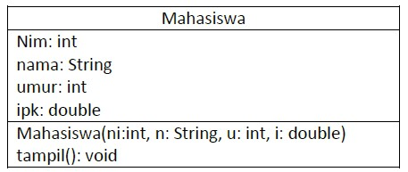


Berdasarkan  class  diagram  di  atas,  akan  dibuat  class  Mahasiswa  yang  berfunsi  untuk membuat  objek  mahasiswa  yang  akan  dimasukan  ke  dalam  sebuah  array.  Terdapat  sebuah konstruktor berparameter dan juga fungsi tampil() untuk menampilkan semua attribute yang ada. 


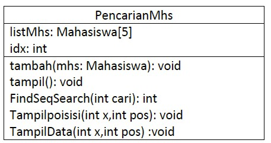


Selanjutnya class diagram di atas merupakan representasi dari sebuah class yang berfungsi untuk melakukan operasi-operasi dari objek array mahasiswa, misalkan untuk menambahkan objek mahasiswa,  menampilkan  semua  data mahasiswa,  untuk  melakukan  pencarian  berdasarkan  NIM menggunakan  algoritma  Sequential  Search,  menampilkan  posisi  dari  data  yang  dicari,  serta menampilkan data mahasiswa yang dicari. 

### **6.2.1 Langkah-langkah Percobaan Sequential Search** 
1. Buatlah Project baru pada Netbeans dengan nama **TestSearching**
2. Kemuadian buat packages baru dengan nama **minggu7**. 
2. Buat class **Mahasiswa**, kemudian deklarasikan atribut berikut ini:  

```
public class Mahasiswa {
    int nim;
    String nama;
    int umur;
    double ipk;
}
```

4. Buatlah konstruktor dengan nama **Mahasiswa** dengan parameter (**int ni, String n, int u, double i**) kemudian Isi konstruktor tersebut dengan kode berikut!  

```
    Mahasiswa(int ni, String n, int u, double i){
        nim = ni;
        nama = n;
        umur = u;
        ipk = i;
    }
```

5. Buatlah method **tampil** bertipe void. 

```
    void tampil(){
        System.out.println("Nim = "+nim);
        System.out.println("Nama = "+nama);
        System.out.println("Umur = "+umur);
        System.out.println("IPK = "+ipk);
    }
```

6. Buat class baru dengan nama **PencarianMhs** seperti di bawah ini! 

```
class PencarianMhs {
    Mahasiswa listMhs[] = new Mahasiswa[5];
    int idx;
}
```

7. Tambahkan method **tambah()** di dalam class tersebut! Method **tambah()** digunakan untuk menambahkan objek dari class Mahasiswa ke dalam atribut listMhs. 

```
    void tambah(Mahasiswa m){
        if(idx < listMhs.length){
            listMhs[idx] = m;
            idx++;
        }else{
            System.out.println("Data sudah penuh !!");
        }
    }
```

8. Tambahkan  method  **tampil()**  di  dalam  class  **PencarianMhs**!  Method  **tampil()** digunakan  untuk  menampilkan  semua  data  mahasiswa-mahasiswa  yang  ada  di  dalam  class tersebut! Perhatikan penggunaan sintaks for yang agak berbeda dengan for yang telah dipelajari sebelumnya, meskipun secara konsep sebenarnya mirip. 

```
    void tampil(){
        for(Mahasiswa m : listMhs){
            m.tampil();
            System.out.println("-------------------------------------------");
        }
    }
```

9. Tambahkan method **FindSeqSearch** bertipe integer dengan parameter **cari** bertipe integer. Kemudian  Deklarasikan  isi  method  **FindSeqSearch**  dengan  algoritma  pencarian  data menggunakan teknik sequential searching. 

```
    public int FindSeqSearch(int cari) {
        int posisi = -1;
        for(int j=0; j<listMhs.length; j++){
            if(listMhs[j].nim == cari){
                posisi = j;
                break;
            }
        }
        return posisi;
    }
```

10. Buatlah  method  **Tampilpoisisi**  bertipe  void  dan  Deklarasikan  isi  dari  method **Tampilpoisisi.**

```
    public void TampilPosisi(int x, int pos) {
        if(pos != -1){
            System.out.println("data\t : "+ x + " ditemukan pada indeks "+pos);
        }else{
            System.out.println("data\t : "+ x + "tidak ditemukan");
        }
    }
```

11. Buatlah method **TampilData** bertipe void dan Deklarasikan isi dari method **TampilData.**

```
    public void TampilData(int x, int pos) {
        if(pos != -1){
            System.out.println("Nim\t : "+x);
            System.out.println("Nama\t : "+listMhs[pos].nama);
            System.out.println("Umur\t : "+listMhs[pos].umur);
            System.out.println("IPK\t : "+listMhs[pos].ipk);
        }else{
            System.out.println("data "+x+"tidak ditemukan");
        }
    }
```

12. Buatlah class baru dengan nama **MahasiswaMain** tambahkan method **main** seperti pada gambar berikut! 

```
class MahasiswaMain_Sequential{
    public static void main(String[] args) {

    }
}
```

13. Di  dalam  method **main(),**  buatlah  sebuah  objek  PencarianMhs  dan  buatlah  5  objek mahasiswa kemudian tambahkan semua objek mahasiswa tersebut dengan memanggil fungsi tambah pada objek PencarianMhs.  

```
        Scanner s = new Scanner(System.in);
        Scanner s1 = new Scanner(System.in);
        
        PencarianMhs data = new PencarianMhs();
        int jumMhs = 5;
        
        System.out.println("-------------------------------------------");
        System.out.println("Masukkan data mahasiswa secara urut dari Nim Terkecil");
        for(int i=0; i<jumMhs; i++){
            System.out.println("-------------------------------------------");
            System.out.print("Nim\t : ");
            int nim = s.nextInt();
            System.out.print("Nama\t : ");
            String nama = s1.nextLine();
            System.out.print("Umur\t : ");
            int umur = s.nextInt();
            System.out.print("IPK\t : ");
            Double ipk = s.nextDouble();
            
            Mahasiswa m = new Mahasiswa(nim, nama, umur, ipk);
            data.tambah(m);
        }
```

14. Panggil method **tampil()** untuk melihat semua data yang telah dimasukan. 

```
            System.out.println("-------------------------------------------");
            System.out.println("Data keseluruhan Mahasiswa : ");
            data.tampil();
```

15. Untuk melakukan pencarian berdasarkan NIM mahasiswa. Buatlah variable **cari** yang dapat menampung  masukan  dari  keyboard  lalu  panggil  method  **FindSeqSearch**  dengan  isi parameternya adalah variable cari. 

```
            System.out.println("-------------------------------------------");
            System.out.println("-------------------------------------------");
            System.out.println("Pencarian data : ");
            System.out.println("Masukkan Nim Mahasiswa yang dicari : ");
            System.out.print("NIM : ");
            int cari = s.nextInt();
            System.out.println("menggunakan sequential search : ");
            int posisi = data.FindSeqSearch(cari);
```

16. Lakukan pemanggilan method **Tampilposisi** dari class **PencarianMhs.** 

```
            data.TampilPosisi(cari, posisi);
```

17. Lakukan pemanggilan method **TampilData** dari class **PencarianMhs.** 

```
            data.TampilData(cari, posisi);
```

18. Jalankan dan amati hasilnya.

### **6.2.2 Verifikasi Hasil Percobaan** 

Cocokkan hasil kode program anda dengan gambar berikut ini. 

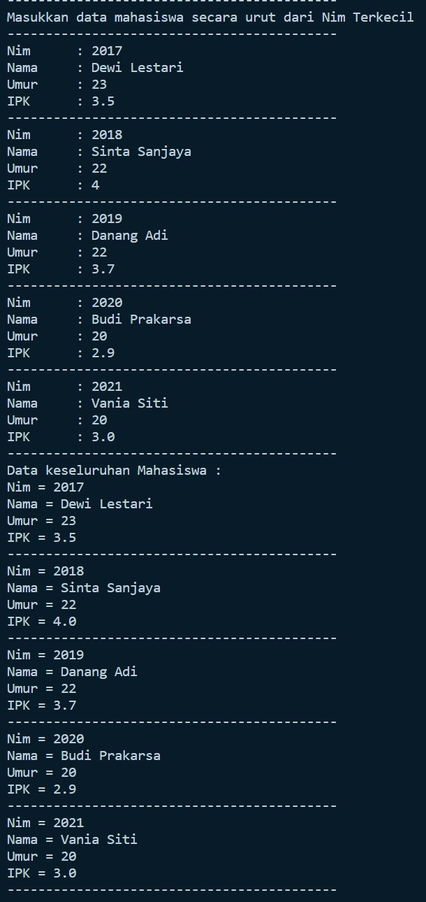


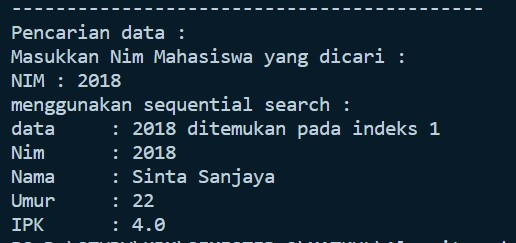


### **6.2.3 Pertanyaan** 
1. Jelaskan perbedaan metod **TampilData** dan **Tampilposisi** pada class PencarianMhs 

    **Jawab:**

    - Jika method **TampilData** digunakan untuk menampilkan secara rinci data yang dicari apabila ditemukan.
    - Sedangkan, method **TampilPosisi** digunakan untuk hanya mengkonfirmasi apakah data yang dicari ada/tidak ada dan menampilkan letak posisi dari data tersebut dalam array(data keseluruhan)


2. Jelaskan fungsi **break** pada kode program dibawah ini!  
    ```
    if(listMhs[j].nim == cari){
                posisi = j;
                break;
            }
    ```
    **Jawab:**

    Untuk menghentikan proses searching ketika data telah ditemukan, atau secara rinci ialah apabila data nim pada array lisMhs[j] itu sama dengan nilai dari variabel cari (data yang dicari), maka posisi = j (menandakan letak posisi data yang dicari berada). Dan dilakukan break setelah ditemukan agar tidak berulang terus menerus.


3. Jika Data Nim yang dimasukkan tidak terurut dari kecil ke besar. Apakah program masih dapat berjalan? Apakah hasil yang dikeluarkan benar? Mengapa demikian!

    **Jawab:**

    Masih dapat berjalan dan output yang dihasilkan tetap valid, karena pada program tersebut sudah disettings dengan konsep Algoritma Sequential Search yang mana hanya mencari data yang diinginkan user dan tanpa mengurutkan data terlebih dahulu.

## **6.3 Searching / Pencarian Menggunakan Binary Search** 

### **6.3.1 Langkah-langkah Percobaan Binary Search** 

1. Pada percobaan 6.2.1 (sequential search) tambahkan method **FindBinarySearch** bertipe integer pada class **PencarianMhs**. Kemudian Deklarasikan isi method **FindBinarySearch** dengan algoritma pencarian data menggunakan teknik binary searching. 

```
    public int FindBinarySearch(int cari, int left, int right){
        int mid;
        if(right >= left){
            mid = (left+right)/2;
            if(cari == listMhs[mid].nim){
                return (mid);
            }else if(listMhs[mid].nim > cari){
                return FindBinarySearch(cari, left, mid-1);
            }else{
                return FindBinarySearch(cari, mid+1, right);
            }
        }
        return -1;
    }
```

2. Panggil  method  **FindBinarySearch**  terdapat  pada  class  **PencarianMhs**  di  kelas **Mahasiswamain.** Kemudia panggil **method tampilposisi** dan **tampilData** 

```
            System.out.println("===========================================");
            System.out.println("menggunakan binary search");
            posisi = data.FindBinarySearch(cari, 0, jumMhs-1);
            data.TampilPosisi(cari, posisi);
            data.TampilData(cari, posisi);
```

3. Jalankan dan amati hasilnya.

### **6.3.2 Verifikasi Hasil Percobaan** 

Cocokkan hasil kode program anda dengan gambar berikut ini. 

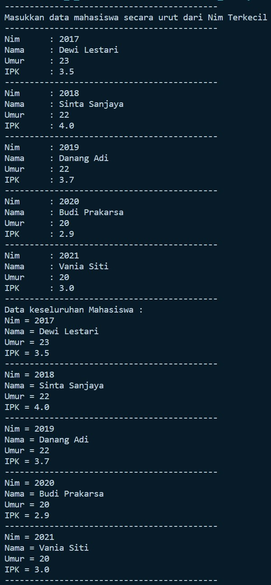


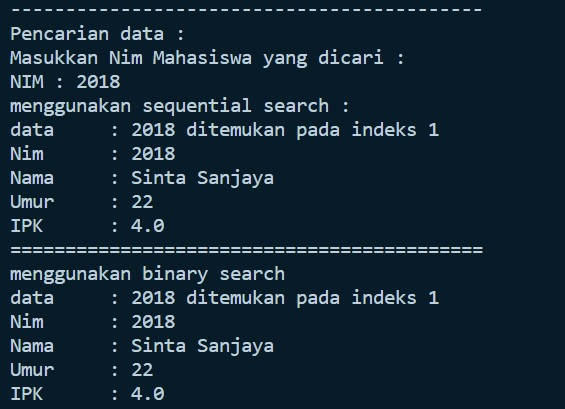

### **6.3.3 Pertanyaan** 
1. Tunjukkan pada kode program yang mana proses divide dijalankan!

    **Jawab:** Telah disebutkan pada kode program di bawah dengan komentar

    ```
        public int FindBinarySearch(int cari, int left, int right){
        int mid;
        if(right >= left){  // Ini adalah divide
            mid = (left+right)/2;
            if(cari == listMhs[mid].nim){    // Ini adalah divide
                return (mid);
            }else if(listMhs[mid].nim > cari){  // Ini adalah divide
                return FindBinarySearch(cari, left, mid-1);
            }else{  // Ini adalah divide
                return FindBinarySearch(cari, mid+1, right);
            }
        }
        return -1;
    }
    ```


2. Tunjukkan pada kode program yang mana proses conquer dijalankan! 
    
    **Jawab:** Telah disebutkan pada kode program di bawah dengan komentar

    ```
        public int FindBinarySearch(int cari, int left, int right){
        int mid;
        if(right >= left){  
            mid = (left+right)/2;  // Ini adalah proses conquer
            if(cari == listMhs[mid].nim){    
                return (mid);
            }else if(listMhs[mid].nim > cari){  
                return FindBinarySearch(cari, left, mid-1);
            }else{  
                return FindBinarySearch(cari, mid+1, right);
            }
        }
        return -1;
    }
    ```

3. Jika data Nim yang dimasukkan tidak urut. Apakah program masih dapat berjalan? Mengapa demikian! 

    **Jawab:**

    Masih dapat berjalan, tetapi output yang dihasilkan terkadang ditemukan dan terkadang tidak ditemukan. Hal ini dikarenakan ketepatan antara nilai tengah dengan data yang dicari. Sejatinya algortima binary search itu harus melewati proses sorting terlebih dahulu. Buktinya sebagai berikut:

    - Tidak ditemukan:


    


    - Ditemukan:


    

    
    


4. Jika Nim yang dimasukkan dari NIM terbesar ke terkecil (missal : 20215, 20214, 20212, 20211, 20210)  dan  elemen  yang  dicari  adalah  20210.  Bagaimana  hasil  dari  binary  search?  Apakah sesuai? Jika tidak sesuai maka ubahlah kode program binary seach agar hasilnya sesuai 

    **Jawab:** Hasilnya tidak sesuai, seperti pada gambar di bawah ini

    .jpg)


    Agar sesuai, maka dapat dimodifikasi kode programnya sebagai berikut:

    ```
    public int FindBinarySearch(int cari, int left, int right){
        int mid;
        if(right >= left){
            mid = (left+right)/2;
            if(cari == listMhs[mid].nim){
                return (mid);
            }else if(listMhs[mid].nim > cari){
                return FindBinarySearch(cari, mid+1, right);
            }else{
                return FindBinarySearch(cari, left, mid-1);
            }
        }
        return -1;
    }
    ```

    Perubahannya terletak pada proses perpindahannya (searching) nya, yakni yang mulanya :
    ```
                }else if(listMhs[mid].nim > cari){
                return FindBinarySearch(cari, mid+1, right);
            }else{
                return FindBinarySearch(cari, left, mid-1);
            }
    ```

    menjadi:

    ```
                }else if(listMhs[mid].nim > cari){
                return FindBinarySearch(cari, left, mid-1);
            }else{
                return FindBinarySearch(cari, mid+1, right);
            }
    ```

    hanya menukar perhitungan atau return dari ``listMhs[mid].nim > cari`` yang awalnya ``return FindBinarySearch(cari, left, mid-1)`` menjadi ``return FindBinarySearch(cari, mid+1, right``. Hanya mengganti dengan dibawahnya. Karena Code Program yang semula itu diperuntukan untuk nim yang nilainya dari kecil ke besar dan permintaan soal yaitu nilai nim dari besar ke kecil, maka hanya menukarnya saja.


5. Modifikasilah  program  diatas  yang mana  jumlah mahasiswa  yang  di  inputkan  sesuai  dengan masukan dari keyboard. 

    **Jawab:** File terletak pada Binary_Search/Pertanyaan_Mahasiswa.java

    - Code:

    ```
    import java.util.Scanner;
    public class Pertanyaan_Mahasiswa{
        
        int nim;
        String nama;
        int umur;
        double ipk;
        
        Pertanyaan_Mahasiswa(int ni, String n, int u, double i){
            nim = ni;
            nama = n;
            umur = u;
            ipk = i;
        }

        void tampil(){
            System.out.println("Nim = "+nim);
            System.out.println("Nama = "+nama);
            System.out.println("Umur = "+umur);
            System.out.println("IPK = "+ipk);
        }
    }

    class Pertanyaan_PencarianMhs{
        Pertanyaan_Mahasiswa listMhs[] = new Pertanyaan_Mahasiswa[5];
        int idx;
        
        void tambah(Pertanyaan_Mahasiswa m){
            if(idx < listMhs.length){
                listMhs[idx] = m;
                idx++;
            }else{
                System.out.println("Data sudah penuh !!");
            }
        }
        
        void tampil(){
            for(Pertanyaan_Mahasiswa m : listMhs){
                m.tampil();
                System.out.println("-------------------------------------------");
            }
        }
        
        public int FindSeqSearch(int cari){
            int posisi = -1;
            for(int j=0; j<listMhs.length; j++){
                if(listMhs[j].nim == cari){
                    posisi = j;
                    break;
                }
            }
            return posisi;
        }

        public int FindBinarySearch(int cari, int left, int right){
            int mid;
            if(right >= left){
                mid = (left+right)/2;
                if(cari == listMhs[mid].nim){
                    return (mid);
                }else if(listMhs[mid].nim > cari){
                    return FindBinarySearch(cari, left, mid-1);
                }else{
                    return FindBinarySearch(cari, mid+1, right);
                }
            }
            return -1;
        }

        // Untuk pertanyaan nomor 4 pada pertanyaan 6.3.3
        // public int FindBinarySearch(int cari, int left, int right){
        //     int mid;
        //     if(right >= left){
        //         mid = (left+right)/2;
        //         if(cari == listMhs[mid].nim){
        //             return (mid);
        //         }else if(listMhs[mid].nim > cari){
        //             return FindBinarySearch(cari, mid+1, right);
        //         }else{
        //             return FindBinarySearch(cari, left, mid-1);
        //         }
        //     }
        //     return -1;
        // }
        
        public void TampilPosisi(int x, int pos){
            if(pos != -1){
                System.out.println("data\t : "+ x + " ditemukan pada indeks "+pos);
            }else{
                System.out.println("data\t : "+ x + " tidak ditemukan");
            }
        }
        
        public void TampilData(int x, int pos){
            if(pos != -1){
                System.out.println("Nim\t : "+x);
                System.out.println("Nama\t : "+listMhs[pos].nama);
                System.out.println("Umur\t : "+listMhs[pos].umur);
                System.out.println("IPK\t : "+listMhs[pos].ipk);
            }else{
                System.out.println(" data "+x+"tidak ditemukan");
            }
        }
    }

    class Pertanyaan_MahasiswaMain_Binary{
        public static void main(String[] args) {
            Scanner s = new Scanner(System.in);
            Scanner s1 = new Scanner(System.in);
            
            Pertanyaan_PencarianMhs data = new Pertanyaan_PencarianMhs();
            System.out.print("Masukkan jumlah Mahasiswa: ");
            int jumMhs = s.nextInt();

            Pertanyaan_Mahasiswa[] x = new Pertanyaan_Mahasiswa[jumMhs];
            data.listMhs = x;
            
            System.out.println("-------------------------------------------");
            System.out.println("Masukkan data mahasiswa secara urut dari Nim Terkecil");
            for(int i=0; i<jumMhs; i++){
                System.out.println("-------------------------------------------");
                System.out.print("Nim\t : ");
                int nim = s.nextInt();
                System.out.print("Nama\t : ");
                String nama = s1.nextLine();
                System.out.print("Umur\t : ");
                int umur = s.nextInt();
                System.out.print("IPK\t : ");
                Double ipk = s.nextDouble();
                
                Pertanyaan_Mahasiswa m = new Pertanyaan_Mahasiswa(nim, nama, umur, ipk);
                data.tambah(m);
            }    
                System.out.println("-------------------------------------------");
                System.out.println("Data keseluruhan Mahasiswa : ");
                data.tampil();
                
                System.out.println("-------------------------------------------");
                System.out.println("-------------------------------------------");
                System.out.println("Pencarian data : ");
                System.out.println("Masukkan Nim Mahasiswa yang dicari : ");
                System.out.print("NIM : ");
                int cari = s.nextInt();
                System.out.println("menggunakan sequential search : ");
                int posisi = data.FindSeqSearch(cari);
                
                data.TampilPosisi(cari, posisi);
                data.TampilData(cari, posisi);

                // Binary Search
                System.out.println("===========================================");
                System.out.println("menggunakan binary search");
                posisi = data.FindBinarySearch(cari, 0, jumMhs-1);
                data.TampilPosisi(cari, posisi);
                data.TampilData(cari, posisi);
            }
    }
    ```

    - Output:

    


## **6.4 Percobaan Pengayaan Divide and Conquer** 

### **6.4.1 Langkah-langkah Percobaan Merge Sort** 

1.  Buatlah Package baru pada NetBeans dengan nama **MergeSortTest**

2.  Tambahkan class **MergeSorting** pada package tersebut 

3.  Pada class **MergeSorting**  buatlah method **mergeSort** yang menerima parameter data array yang akan diurutkan 

```
    public void mergeSort(int[] data){

    }
```

4.  Buatlah method **merge** untuk melakukan proses penggabungan data dari bagian kiri dan kanan.  

```
    public void merge(int data[], int left, int middle, int right){
    
    }
```

5.  Implementasikan proses **merge** sebagai berikut.  

```
    public void merge(int data[], int left, int middle, int right){
        int[] temp = new int[data.length];
        for(int i=left; i<= right; i++) {
            temp[i] = data[i];
        }
        int a = left;
        int b = middle+1;
        int c = left;

        // membandingkan setiap bagian
        while(a<=middle && b<=right){
            if(temp[a] <= temp[b]){
                data[c] = temp[a];
                a++;
            }else{
                data[c] = temp[b];
                b++;
            }
            c++;
        }
        int s = middle-a;
        for(int i=0; i<=s; i++){
            data[c+i] = temp[a+i];
        }
    }
```

6.  Buatlah method **sort**

```
    private void sort(int data[], int left, int right){

    }
```

7.  Implementasikan kode berikut pada method **sort**

```
    private void sort(int data[], int left, int right){
        if(left < right){
            int middle = (left+right)/2;
            sort(data, left, middle);
            sort(data, middle+1, right);
            merge(data, left, middle, right);
        }
    }
```

8.  Pada method **mergeSort**, panggil method **sort** dengan parameter data yang ingin diurutkan serta range data awal sampai dengan akhir. 

```
    public void mergeSort(int[] data){
        this.sort(data, 0, data.length-1);
    }
```

9.  Tambahkan method **printArray** 

```
    public void printArray(int arr[]){
        int n = arr.length;
        for(int i=0; i<n; i++){
            System.out.print(arr[i]+" ");
        }
        System.out.println();
    }
```

10. Sebagai langkah terakhir, deklarasikan data yang akan diurutkan kemudian panggil proses sorting pada class SortMain 

```
class SortMain{
    public static void main(String[] args) {
        int data[] = {10,40,30,50,70,20,100,90};
        System.out.println("sorting dengan merge sort");
        MergeSorting mSort = new MergeSorting();
        System.out.println("data awal");
        mSort.printArray(data);
        mSort.mergeSort(data);
        System.out.println("setelah diurutkan");
        mSort.printArray(data);
    }
}
```
 
### **6.4.2 Verifikasi Hasil Percobaan** 

Cocokkan hasil compile kode program anda dengan gambar berikut ini.  

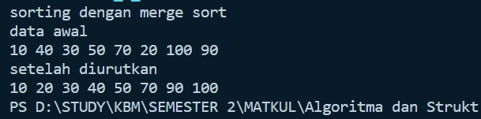

### **6.5 Latihan Praktikum** 

**1. Modifikasi percobaan searching diatas dengan ketentuan berikut ini** 
- Sebelum dilakukan searching dengan binary search data harus dilakukan pengurutan dengan menggunakan algoritma sorting (pilih salah satu algoritma sorting dari pertemuan sebelumnya)

**Jawab:**

- Code:


```
import java.util.Scanner;
public class Tugas_1 {
    int nim;
    String nama;
    int umur;
    double ipk;
    
    Tugas_1(int ni, String n, int u, double i){
        nim = ni;
        nama = n;
        umur = u;
        ipk = i;
    }

    void tampil(){
        System.out.println("Nim = "+nim);
        System.out.println("Nama = "+nama);
        System.out.println("Umur = "+umur);
        System.out.println("IPK = "+ipk);
    }
}

class PencarianMhs{
    Tugas_1 listMhs[] = new Tugas_1[5];
    int idx;
    
    void tambah(Tugas_1 m){
        if(idx < listMhs.length){
            listMhs[idx] = m;
            idx++;
        }else{
            System.out.println("Data sudah penuh !!");
        }
    }
    
    void tampil(){
        for(Tugas_1 m : listMhs){
            m.tampil();
            System.out.println("-------------------------------------------");
        }
    }
    
    public int FindSeqSearch(int cari){
        int posisi = -1;
        for(int j=0; j<listMhs.length; j++){
            if(listMhs[j].nim == cari){
                posisi = j;
                break;
            }
        }
        return posisi;
    }

    public void bubbleSort(){
        for(int i=0; i<listMhs.length-1; i++){
            for(int j=1; j<listMhs.length; j++){
                if(listMhs[j].nim < listMhs[j-1].nim){
                    Tugas_1 temp = listMhs[j];
                    listMhs[j] = listMhs[j-1];
                    listMhs[j-1] = temp;
                }
            }
        }
    } 

    public int FindBinarySearch(int cari, int left, int right){
        int mid;
        if(right >= left){
            mid = (left+right)/2;
            if(cari == listMhs[mid].nim){
                return (mid);
            }else if(listMhs[mid].nim > cari){
                return FindBinarySearch(cari, left, mid-1);
            }else{
                return FindBinarySearch(cari, mid+1, right);
            }
        }
        return -1;
    }
    
    public void TampilPosisi(int x, int pos){
        if(pos != -1){
            System.out.println("data\t : "+ x + " ditemukan pada indeks "+pos);
        }else{
            System.out.println("data\t : "+ x + "tidak ditemukan");
        }
    }
    
    public void TampilData(int x, int pos){
        if(pos != -1){
            System.out.println("Nim\t : "+x);
            System.out.println("Nama\t : "+listMhs[pos].nama);
            System.out.println("Umur\t : "+listMhs[pos].umur);
            System.out.println("IPK\t : "+listMhs[pos].ipk);
        }else{
            System.out.println("data "+x+"tidak ditemukan");
        }
    }
}

class Tugas1_Main{
    public static void main(String[] args) {
        Scanner s = new Scanner(System.in);
        Scanner s1 = new Scanner(System.in);
        
        PencarianMhs data = new PencarianMhs();
        int jumMhs = 5;
        
        System.out.println("-------------------------------------------");
        System.out.println("Masukkan data mahasiswa secara urut dari Nim Terkecil");
        for(int i=0; i<jumMhs; i++){
            System.out.println("-------------------------------------------");
            System.out.print("Nim\t : ");
            int nim = s.nextInt();
            System.out.print("Nama\t : ");
            String nama = s1.nextLine();
            System.out.print("Umur\t : ");
            int umur = s.nextInt();
            System.out.print("IPK\t : ");
            Double ipk = s.nextDouble();
            
            Tugas_1 m = new Tugas_1(nim, nama, umur, ipk);
            data.tambah(m);
        }    
            System.out.println("-------------------------------------------");
            System.out.println("Data keseluruhan Mahasiswa sebelum sorting");
            data.tampil();
            
            System.out.println("Data keseluruhan Mahasiswa setelah sorting");
            data.bubbleSort();
            data.tampil();

            System.out.println("-------------------------------------------");
            System.out.println("-------------------------------------------");
            System.out.println("Pencarian data : ");
            System.out.println("Masukkan Nim Mahasiswa yang dicari : ");
            System.out.print("NIM : ");
            int cari = s.nextInt();
            System.out.println("menggunakan sequential search : ");
            int posisi = data.FindSeqSearch(cari);
            
            data.TampilPosisi(cari, posisi);
            data.TampilData(cari, posisi);

            // Binary Search
            System.out.println("===========================================");
            System.out.println("menggunakan binary search");
            posisi = data.FindBinarySearch(cari, 0, jumMhs-1);
            data.TampilPosisi(cari, posisi);
            data.TampilData(cari, posisi);
        }
}
```
- Output:


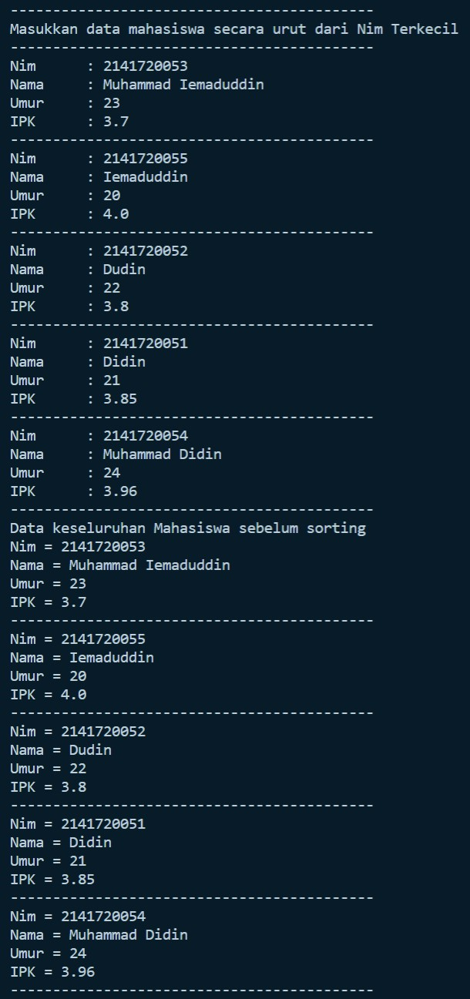


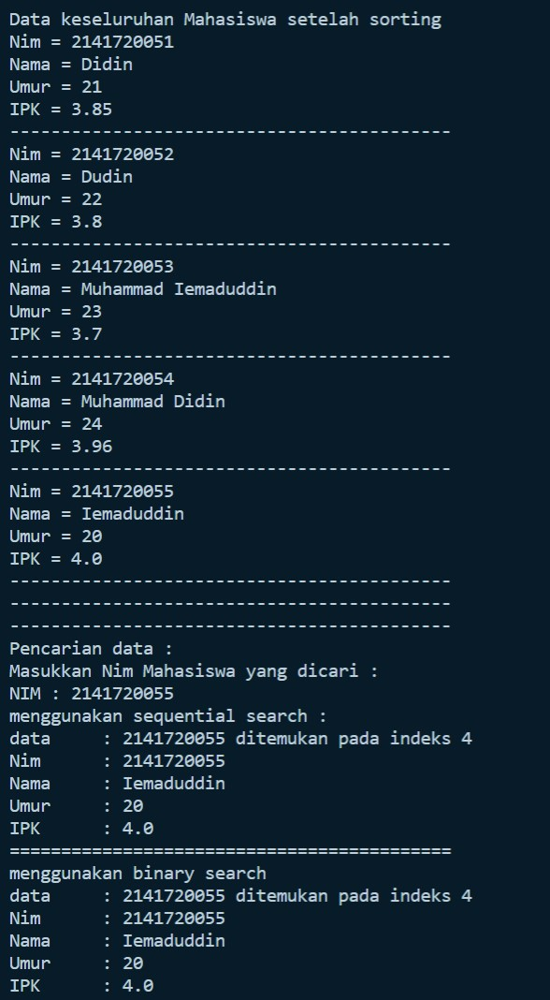


**2. Modifikasi percobaan searching diatas dengan ketentuan berikut ini** 
-   Pencarian dilakukan berdasarkan Nama Mahasiswa (gunakan Algoritma Sequential Search) 
-   Jika terdapat nama yang sama? Bagaimana keluaran dari kode program ketika pencarian dilakukan pada nama yang sama!

**Jawab:** Akan ditampilkan semua, dengan nama yang sama tetapi di indeks yang berbeda, seperti pada output di bawah ini.

- Code:


```
import java.util.Scanner;
public class Tugas_2 {
    int nim;
    String nama;
    int umur;
    double ipk;
    
    Tugas_2(int ni, String n, int u, double i){
        nim = ni;
        nama = n;
        umur = u;
        ipk = i;
    }

    void tampil(){
        System.out.println("Nim = "+nim);
        System.out.println("Nama = "+nama);
        System.out.println("Umur = "+umur);
        System.out.println("IPK = "+ipk);
    }
}

class Tugas_2_PencarianMhs{
    Tugas_2 listMhs[];
    int idx;
    
    void tambah(Tugas_2 m){
        if(idx < listMhs.length){
            listMhs[idx] = m;
            idx++;
        }else{
            System.out.println("Data sudah penuh !!");
        }
    }
    
    void tampil(){
        for(Tugas_2 m : listMhs){
            m.tampil();
            System.out.println("-------------------------------------------");
        }
    }
    
    public int FindSeqSearch(int cari){
        int posisi = -1;
        for(int j=0; j<listMhs.length; j++){
            if(listMhs[j].nim == cari){
                posisi = j;
                break;
            }
        }
        return posisi;
    }
    
    public int FindSequentialSearch(Tugas_2 listMHS[], String cari){
        int posisi = -1;
        for(int i=0; i<listMHS.length; i++){
            if(cari.equalsIgnoreCase(listMHS[i].nama)){
                posisi = i;
                TampilPosisi(cari, posisi);
                TampilData(cari, posisi);
            }
        }
        return posisi;
    }

    public void TampilPosisi(String x, int pos){
        if(pos != -1){
            System.out.println("data\t : "+ x + " ditemukan pada indeks "+pos+"\n");
        }else{
            System.out.println("data\t : "+ x + "tidak ditemukan");
        }
    }
    
    public void TampilData(String x, int pos){
        if(pos != -1){
            System.out.println("Nim\t : "+listMhs[pos].nim);
            System.out.println("Nama\t : "+x);
            System.out.println("Umur\t : "+listMhs[pos].umur);
            System.out.println("IPK\t : "+listMhs[pos].ipk);
        }else{
            System.out.println("data "+x+"tidak ditemukan");
        }
    }
}

class Tugas2_Main{
    public static void main(String[] args) {
        Scanner s = new Scanner(System.in);
        Scanner s1 = new Scanner(System.in);
        
        Tugas_2_PencarianMhs data = new Tugas_2_PencarianMhs();
        System.out.print("Masukkan jumlah Mahasiswa: ");
        int jumMhs = s.nextInt();
        Tugas_2[] mhs = new Tugas_2[jumMhs];
        data.listMhs = mhs;

        System.out.println("-------------------------------------------");
        System.out.println("Masukkan data mahasiswa secara urut dari Nim Terkecil");
        for(int i=0; i<jumMhs; i++){
            System.out.println("-------------------------------------------");
            System.out.print("Nim\t : ");
            int nim = s.nextInt();
            System.out.print("Nama\t : ");
            String nama = s1.nextLine();
            System.out.print("Umur\t : ");
            int umur = s.nextInt();
            System.out.print("IPK\t : ");
            double ipk = s.nextDouble();
            
            Tugas_2 m = new Tugas_2(nim, nama, umur, ipk);
            data.tambah(m);
        }    
            System.out.println("-------------------------------------------");
            System.out.println("Data keseluruhan Mahasiswa : ");
            data.tampil();

            System.out.println("-------------------------------------------");
            System.out.println("-------------------------------------------");
            System.out.println("Pencarian data : ");
            System.out.println("Masukkan Nama Mahasiswa yang dicari : ");
            System.out.print("Nama : ");
            String cari = s1.nextLine();
            System.out.println("\n\nMenggunakan sequential search ");
            data.FindSequentialSearch(data.listMhs, cari);
        }
}
```

- Output:


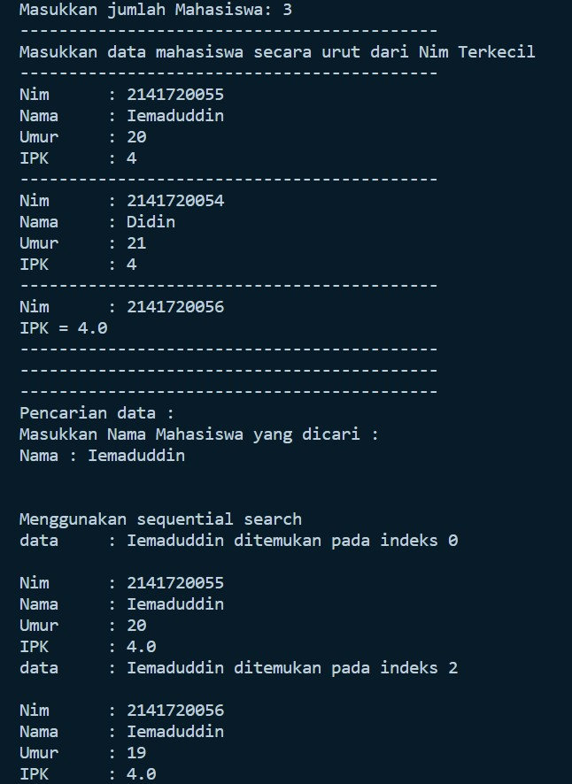


**3. Terdapat sebuah data array 1 dimensi sebagai berikut**  

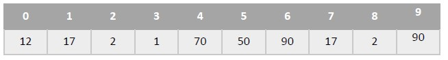

Buatlah  program  untuk  mengurutkan  array  tersebut  (boleh  memilih  metode  pengurutan) selanjutnya lakukan pencarian dan mencetak isi array yang nilainya terbesar, dan mencetak ada berapa  buah  nilai  terbesar  tersebut  serta  berada  dilokasi  mana  saja  nilai  terbesar  tersebut! (menggunakan binary search) 


**Jawab:**

- Code:


```
public class Tugas_3 {
    public int[] data;
    public int maks = 0;
    public int posisi;
    public int jumlah = 0;

    Tugas_3(int nilai[]){
        data = nilai;
    }

    void tampil(){
        for(int i=0; i<data.length; i++){
            System.out.println(data[i] + " ");
            System.out.println();
        }
    }

    void bubbleSort(){
        for(int i=0; i<data.length-1; i++){
            for(int j=1; j<data.length; j++){
                if(data[j]> data[j-1]){
                    int temp = data[j];
                    data[j] = data[j-1];
                    data[j-1] = temp;
                }
            }
        }
    }

    public int binarySearch(int cari, int left, int right){
        int middle;
        if(right >= left){
            middle = (left+right)/2;
            if(cari == data[middle]){
                return (middle);
            }else if(data[middle] > cari){
                return binarySearch(cari, middle+1, right);
            }else{
                return binarySearch(cari, left, middle-1);
            }
        }
        return -1;
    }

    public int nilaiTerbesar(){
        for(int i=0; i<data.length; i++){
            if(data[i] > maks){
                maks = data[i];
            }
        }
        System.out.print("Nilai yang paling besar adalah : "+maks);
        return maks;
    }

    public void tampilPosisi(int pos){
        for(int i=0; i<data.length; i++){
            if(data[i] == maks){
                jumlah++;
            }
        }
        System.out.print(" dengan jumlah "+ jumlah);
        System.out.println();
        posisi = maks;

        for(int i=0; i<data.length; i++){
            if(posisi == data[i]){
                pos = i;
                System.out.println("Data ditemukan pada indeks ke-"+pos);
            }
        }
    }
}

class Tugas_3_Main{
    public static void main(String[] args) {
        int angka[] = {12, 17, 2, 1, 70, 50, 90, 17, 2, 90};

        Tugas_3 arr = new Tugas_3(angka);

        int sum = 10, maks=0;
        System.out.println("=========================================");
        System.out.println("                TAMPILAN DATA            ");
        System.out.println("=========================================");
        System.out.println("Sebelum di sorting");
        arr.tampil();
        arr.bubbleSort();
        System.out.println("=========================================");
        System.out.println("Setelah di sorting");
        arr.tampil();
        System.out.println("=========================================");
        arr.nilaiTerbesar();
        arr.binarySearch(maks, 0, sum-1);
        arr.tampilPosisi(maks);
    }
}
```


- Output:


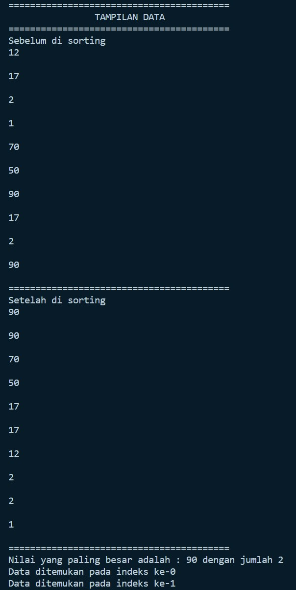


## **Terima Kasih**