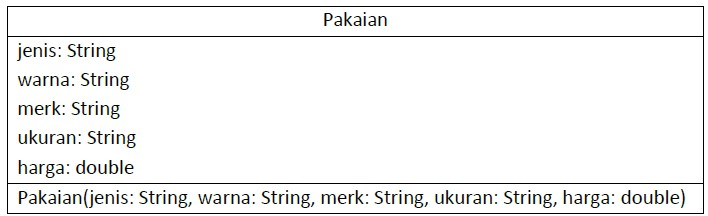
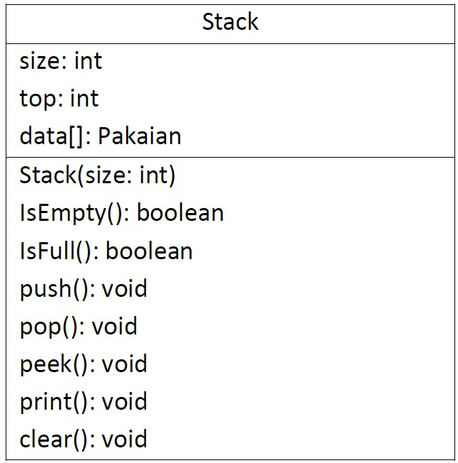
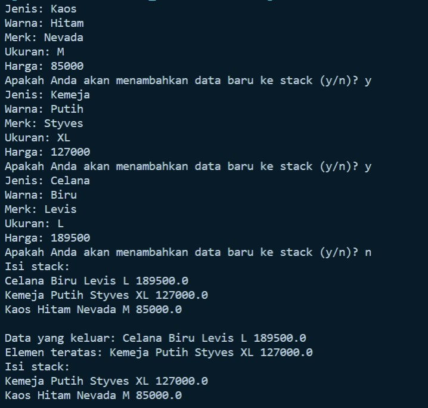
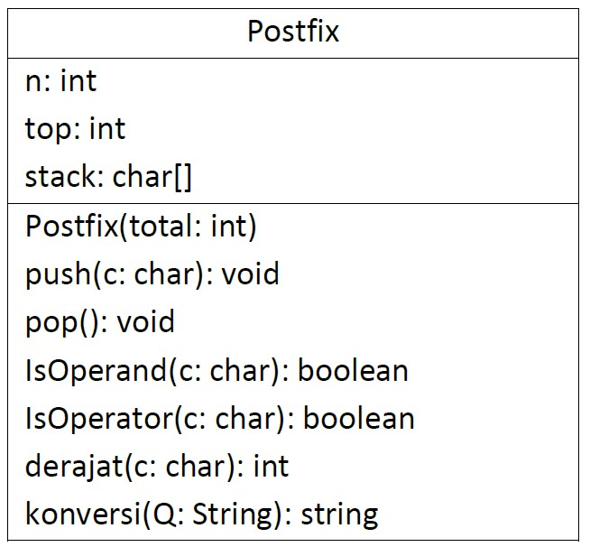
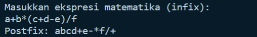
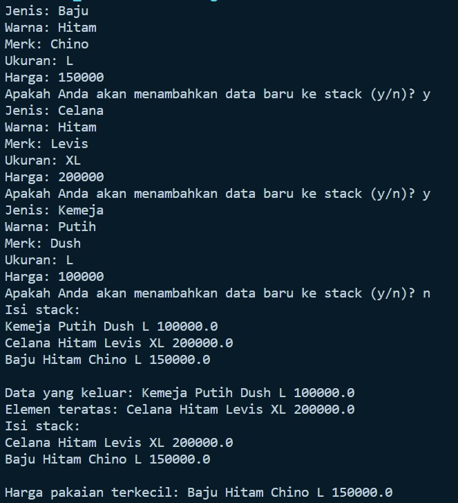
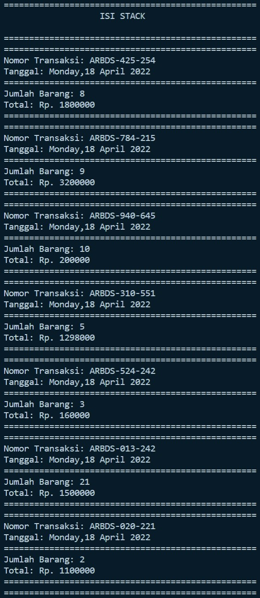
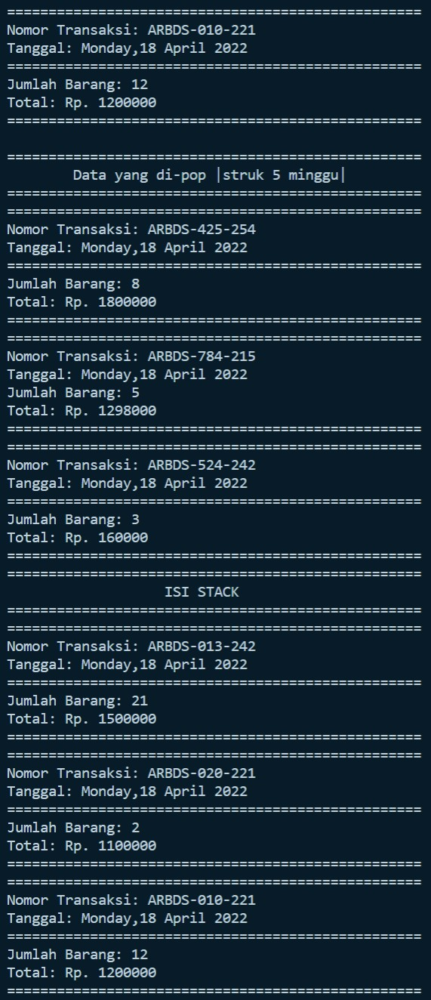

# **JOBSHEET VII STACK**
### **Nama: Iemaduddin**
### **No. Absen/Kelas: 16/TI-1F**
### **NIM: Iemaduddin**
#
## **7.1 Tujuan Praktikum**  

Setelah melakukan materi praktikum ini, mahasiswa mampu: 

1. Mengenal struktur data Stack 
2. Membuat dan mendeklarasikan struktur data Stack 
3. Menerapkan algoritma Stack dengan menggunakan array

## **7.2 Praktikum 1** 

**Waktu percobaan : 45 menit** 

Pada percobaan ini, kita akan membuat program yang mengilustrasikan tumpukan pakaian yang disimpan ke dalam stack. Karena sebuah pakaian mempunyai beberapa informasi, maka implementasi Stack dilakukan dengan menggunakan array of object untuk mewakili setiap elemennya. 

### **7.2.1 Langkah-langkah Percobaan** 
1. Perhatikan Diagram Class Pakaian berikut ini:
    
    

    Berdasarkan diagram class tersebut, akan dibuat program class Pakaian dalam Java. 

2. Buat package dengan nama **Praktikum1**, kemudian buat class baru dengan nama **Pakaian**. 
3. Tambahkan atribut-atribut Pakaian seperti pada Class Diagram Pakaian, kemudian tambahkan pula konstruktornya. 

    ```
    public class Pakaian{
        String jenis, warna, merk, ukuran;
        double harga;

        Pakaian(String jenis, String warna, String merk, String ukuran, double harga){
            this.jenis = jenis;
            this.warna = warna;
            this.merk = merk;
            this.ukuran = ukuran;
            this.harga = harga;
        }
    }
    ```

4. Setelah membuat class Pakaian, selanjutnya perlu dibuat  class **Stack** yang berisi atribut dan method sesuai diagram Class Stack berikut ini: 

    

    ***Keterangan**: Tipe data pada variabell **data** menyesuaikan dengan data yang akan akan disimpan di dalam Stack. Pada praktikum ini, data yang akan disimpan merupakan array of object dari Pakaian, sehingga tipe data yang digunakan adalah **Pakaian*** 

5. Buat  class  baru  dengan  nama  Stack.  Kemudian  tambahkan  atribut  dan  konstruktor. 

    ```
    class Stack {
        int size;
        int top;
        Pakaian data[];

        public Stack(int size){
            this.size = size;
            data = new Pakaian[size];
            top = -1;
        }
    }
    ```

6. Buat method **IsEmpty** bertipe boolean yang digunakan untuk mengecek apakah stack kosong. 

    ```
        public boolean IsEmpty(){
            if (top == -1){
                return true;
            }else{
                return false;
            }
        }
    ```

7. Buat method **IsFull** bertipe boolean yang digunakan untuk mengecek apakah stack sudah terisi penuh. 

    ```
        public boolean IsFull(){
            if (top == size-1){
                return true;
            }else{
                return false;
            }
        }
    ```

8. Buat method **push** bertipe void untuk menambahkan isi elemen stack dengan parameter **pkn** yang berupa object **Pakaian** 

    ```
        public void push(Pakaian pkn){
            if ( !IsFull()){
                top++;
                data[top] = pkn;
            }else{
                System.out.println("Isi stack penuh!");
            }
        }
    ```

9. Buat method **Pop** bertipe void untuk mengeluarkan isi elemen stack. Karena satu elemen stack terdiri dari beberapa informasi (jenis, warna, merk, ukuran, dan harga), maka ketika mencetak data juga perlu ditampilkan semua informasi tersebut 

    ```
        public void pop(){
            if (!IsEmpty()){
                Pakaian x = data[top];
                top--;
                System.out.println("Data yang keluar: " + x.jenis + " "+ x.warna + " " +
                x.merk + " " + x.ukuran + " " + x.harga);
            }else{
                System.out.println("Stack masih kosong");
            }
        }
    ```

10. Buat method **peek** bertipe void untuk memeriksa elemen stack pada posisi paling atas. 

    ```
        public void peek(){
            System.out.println("Elemen teratas: "+ data[top].jenis + " " + data[top].warna + " " +
            data[top].merk + " " + data[top].ukuran + " " + data[top].harga);
        }
    ```

11. Buat method **print** bertipe void untuk menampilkan seluruh elemen pada stack. 

    ```
        public void print(){
            System.out.println("Isi stack: ");
            for(int i=top; i>=0; i--){
                System.out.println(data[i].jenis + " " + data[i].warna + " " + data[i].merk + " " +
                data[i].ukuran + " " + data[i].harga + " ");
            }
            System.out.println("");
        }
    ```

12. Buat method **clear** bertipe void untuk menghapus seluruh isi stack. 

    ```
        public void clear(){
            if(!IsEmpty()){
                for (int i=top; i>=0; i++){
                    top--;
                }
                System.out.println("Stack sudah dikosongkan");
            }else{
                System.out.println("Stack masih kosong");
            }
        }
    ```

13. Selanjutnya,  buat  class  baru  dengan  nama  **StackMain**.  Buat  fungsi  main,  kemudian  lakukan instansiasi objek dari class **Stack** dengan nama **stk** dan nilai parameternya adalah 5. 

    ```
    class StackMain{
        public static void main(String[] args) {
            Stack stk = new Stack(5);
            Scanner sc = new Scanner(System.in);
        }
    }
    ```

14. Deklarasikan Scanner dengan nama **sc** 
15. Tambahkan kode berikut ini untuk menerima input data Pakaian, kemudian semua informasi tersebut dimasukkan ke dalam stack 

    ```
        char pilih;
        do{
            System.out.print("Jenis: ");
            String jenis = sc.nextLine();
            System.out.print("Warna: ");
            String warna = sc.nextLine();
            System.out.print("Merk: ");
            String merk = sc.nextLine();
            System.out.print("Ukuran: ");
            String ukuran = sc.nextLine();
            System.out.print("Harga: ");
            double harga = sc.nextDouble();

            Pakaian p = new Pakaian(jenis, warna, merk, ukuran, harga);
            System.out.print("Apakah Anda akan menambahkan data baru ke stack (y/n)? ");
            pilih = sc.next().charAt(0);
            sc.nextLine();
            stk.push(p);
        }while(pilih == 'y');
    ```

***Catatan**: sintaks sc.nextLine() sebelum sintaks st.push(p) digunakan untuk mengabaikan karakter new line* 

16. Lakukan pemanggilan method print, method pop, dan method peek dengan urutan sebagai berikut. 

    ```
        stk.print();
        stk.pop();
        stk.peek();
        stk.print();
    ```

17. Compile dan jalankan class **StackMain**, kemudian amati hasilnya. 


**7.2.2 Verifikasi Hasil Percobaan** 



### **7.2.3 Pertanyaan** 
1. Berapa banyak data pakaian yang dapat ditampung di dalam stack? Tunjukkan potongan kode program untuk mendukung jawaban Anda tersebut!

**Jawab:** Data pakaian yang dapat ditampung di dalam stack sebanyak 6, yang mana potongan kode yang mengalokasikan itu sebagai berikut:


Di atas terdapat parameter 5 yang menandakan maksimal isi stack berjumlah 6, kenapa 6 ? karena 5 itu merupakan berupa indeks dari data[top], yang berarti indeks dimulai dari 0.


2. Perhatikan class **StackMain**, pada saat memanggil fungsi push, parameter yang dikirimkan adalah **p**. Data apa yang tersimpan pada variabel **p** tersebut? 

    ```
    stk.push(p);
    ```

    **Jawab:** Data parameter ``pkn`` yang ada di fungsi push, data yang merupakan inputan dari scanner.


3. Apakah fungsi penggunaan **do-while** yang terdapat pada class **StackMain**?


    **Jawab:** Fungsinya ialah untuk melakukan perulangan sesuai dengan keinginan user, jika ingin menambahkan data ke stack, maka menginputkan 'y' jika tidak 'n'.


3. Modifikasi  kode  program  pada  class  **StackMain**  sehingga  pengguna  dapat  memilih  operasi- operasi  pada  stack  (push,  pop,  peek,  atau  print)  melalui  pilihan  menu  program  dengan memanfaatkan kondisi IF-ELSE atau SWITCH-CASE! 


    **Jawab:** Source Code yang lengkap ada di Folder Praktikum1/Pertanyaan/Pakaian.java.

    - Code:

    ```
    class StackMainPertanyaan{
        public static void main(String[] args) {
            Stack stk = new Stack(5);
            Scanner sc = new Scanner(System.in);
            Scanner sc1 = new Scanner(System.in);
            Scanner sc2 = new Scanner(System.in);
            Scanner sc3 = new Scanner(System.in);
            Scanner sc4 = new Scanner(System.in);

            char pilih, ulang;
            int pil;
            do{
                System.out.println("======================================================");
                System.out.println("                     DATA PAKAIAN                     ");
                System.out.println("======================================================");
                System.out.println("Pilihan Pemanggilan Fungsi: ");
                System.out.println("1. Push  ");
                System.out.println("2. Pop  ");
                System.out.println("3. Peek  ");
                System.out.println("4. Print  ");
                System.out.print("\nMasukkan pilihan: ");
                pil = sc.nextInt();
                switch(pil){
                    case 1:
                        do{
                            System.out.print("Jenis: ");
                            String jenis = sc1.nextLine();
                            System.out.print("Warna: ");
                            String warna = sc2.nextLine();
                            System.out.print("Merk: ");
                            String merk = sc3.nextLine();
                            System.out.print("Ukuran: ");
                            String ukuran = sc4.nextLine();
                            System.out.print("Harga: ");
                            double harga = sc.nextDouble();
                
                            Pakaian p = new Pakaian(jenis, warna, merk, ukuran, harga);
                            System.out.print("Apakah Anda akan menambahkan data baru ke stack (y/n)? ");
                            pilih = sc.next().charAt(0);
                            sc.nextLine();
                            stk.push(p);
                        }while(pilih == 'y' || pilih == 'Y');
                    case 2:
                    stk.pop();
                    break;

                    case 3:
                    stk.peek();
                    break;

                    case 4:
                    stk.print();
                    break;

                    default:
                    System.out.println("Inputan yang Anda masukkan salah!");
                }
                
                System.out.print("Apakah ingin melakukan pemanggilan fungsi lagi? (Y/N)");
                ulang = sc.next().charAt(0);
            }while(ulang == 'y' || ulang == 'Y');
            System.out.println("Terima kasih");
        }
    }
    ```

    - Output:

        


## **7.3 Praktikum 2** 

**Waktu percobaan : 30 menit** 

Pada percobaan ini, kita akan membuat program untuk melakukan konversi notasi infix menjadi notasi postfix. 

### **Langkah-langkah Percobaan** 
1. Perhatikan Diagram Class berikut ini: 



Berdasarkan diagram class tersebut, akan dibuat program class Postfix dalam Java. 

2. Buat  package  dengan  nama  **Praktikum2**,  kemudian  buat  class  baru  dengan  nama  **Postfix**. Tambahkan atribut **n**, **top**, dan **stack** sesuai diagram class Postfix tersebut. 

    ```
    package Praktikum2;
    public class Postfix {

        int n;
        int top;
        char stack[];
    }
    ```

3. Tambahkan pula konstruktor berparameter seperti gambar berikut ini. 

    ```
        public Postfix(int total) {
            n = total;
            top = -1;
            stack = new char[n];
            push('(');
        }
    ```

4. Buat method **push** dan **pop** bertipe void. 

    ```
        public void push(char c) {
            top++;
            stack[top] = c;
        }

        public char pop() {
            char item = stack[top];
            top--;
            return item;
        }
    ```

5. Buat method **IsOperand** dengan tipe boolean yang digunakan untuk mengecek apakah elemen data berupa operand. 

    ```
        public boolean IsOperand(char c) {
            if ((c >= 'A' && c <= 'Z') || (c >= 'a' && c <= 'z') ||
            (c >= '0' && c <= '9') || c == ' ' || c == '.') {

                return true;
            } else {
                return false;
            }
        }
    ```

6. Buat method **IsOperator** dengan tipe boolean yang digunakan untuk mengecek apakah elemen data berupa operator. 

    ```
        public boolean IsOperator(char c) {
            if (c == '^' || c == '%' || c == '/' || c == '*' ||
            c == '-' || c == '+') {
                return true;
            } else {
                return false;
            }
        }
    ```

7. Buat  method  **derajat**  yang  mempunyai  nilai  kembalian  integer  untuk  menentukan  derajat operator. 

    ```
        public int derajat(char c) {
            switch (c) {
                case '^':
                    return 3;
                case '%':
                    return 2;
                case '/':
                    return 2;
                case '*':
                    return 2;
                case '-':
                    return 1;
                case '+':
                    return 1;
                default:
                    return 0;
            }
        }
    ```

8. Buat method konversi untuk melakukan konversi notasi infix menjadi notasi postfix dengan cara mengecek satu persatu elemen data pada **String Q** sebagai parameter masukan. 

    ```
        public String konversi(String Q) {
            String P = "";
            char c;
            for (int i = 0; i < n; i++) {
                c = Q.charAt(i);
                if (IsOperand(c)) {
                    P = P + c;
                }
                if (c == '(') {
                    push(c);
                }
                if (c == ')') {
                    while (stack[top] != '(') {
                        P = P + pop();
                    }
                    pop();
                }
                if (IsOperator(c)) {
                    while (derajat(stack[top]) >= derajat(c)) {
                        P = P + pop();
                    }
                    push(c);
                }
            }
            return P;
        }
    ```

9. Selanjutnya, buat class baru dengan nama **PostfixMain** tetap pada package **Praktikum2**. Buat class main, kemudian buat variabel P dan Q. Variabel P digunakan untuk menyimpan hasil akhir notasi postfix setelah dikonversi, sedangkan variabel Q digunakan untuk menyimpan masukan dari pengguna berupa ekspresi matematika dengan notasi infix. Deklarasikan variabel Scanner dengan nama sc, kemudian panggil fungsi *built-in* **trim** yang digunakan untuk menghapus adanya spasi di depan atau di belakang teks dari teks persamaan yang dimasukkan oleh pengguna. 

    ```
    class PostfixMain{
        public static void main(String[] args) {
            Scanner sc = new Scanner(System.in);
            String P,Q;
            System.out.println("Masukkan ekspresi matematika (ivfix): ");
            Q = sc.nextLine();
            Q = Q.trim();
            Q = Q + ")";
        }
    ```

Penambahan string **“)”** digunakan untuk memastikan semua simbol/karakter yang masih berada di stack setelah semua persamaan terbaca, akan dikeluarkan dan dipindahkan ke postfix. 

10. Buat variabel total untuk menghitung banyaknya karaketer pada variabel Q. 

    ```
        int total = Q.length();
    ```

11. Lakukan instansiasi objek dengan nama **post** dan nilai parameternya adalah total. Kemudian panggil method **konversi** untuk melakukan konversi notasi infix Q menjadi notasi postfix P.

    ```
        Postfix post = new Postfix(total);
        P = post.konversi(Q);
        System.out.println("Postfix: "+P);
    ```

12. Compile dan jalankan class **PostfixMain** dan amati hasilnya.

### **7.3.2 Verifikasi Hasil Percobaan** 



### **7.3.3 Pertanyaan** 
1. Perhatikan class **Postfix**, jelaskan alur kerja method **derajat**!


    **Jawab:** Alur kerja method **derajat** ialah ketika input yang dimasukkan berupa operator:
    - '^', maka akan me-return nilai 3
    - '%', '/', dan '*', maka akan me-return nilai 2
    - '+' dan '-', maka akan me-return nilai 1
    - Jika selain itu, maka akan me-return nilai 0


2. Apa fungsi kode program berikut? 

    ```
    c = Q.charAt(i);
    ```

    **Jawab:** Kode program tersebut digunakan untuk mengecek setiap setiap karakter yang ada sebelum dimasukkan ke postfix, akan dipisah terlebih dahulu antara operand dan operator, setelah itu postfix akan dilakukan. C ialah sebuah variabel yang menampung setiap karakter-karakter tersebut.


3. Jalankan kembali program tersebut, masukkan ekspresi **3\*5^(8-6)%3**. Tampilkan hasilnya!


    **Jawab:**

    


4. Pada soal nomor 3, mengapa tanda kurung tidak ditampilkan pada hasil konversi? Jelaskan!


    **Jawab:** Karena tanda kurung yang ada tersebut akan di-pop kan saja tanpa dimasukkan ke dalam postfix


## **7.4 Tugas**

1. Perhatikan dan gunakan kembali kode program pada **Praktikum 1**. Tambahkan method **getMin** pada class **Stack** yang digunakan untuk mencari dan menampilkan data pakaian dengan harga terendah dari semua data pakaian yang tersimpan di dalam stack!

    **Jawab:**

    - Code:

    ```
    package Tugas;
    import java.util.Scanner;
    public class PakaianTugas{
        String jenis, warna, merk, ukuran;
        double harga;

        PakaianTugas(String jenis, String warna, String merk, String ukuran, double harga){
            this.jenis = jenis;
            this.warna = warna;
            this.merk = merk;
            this.ukuran = ukuran;
            this.harga = harga;
        }
    }
    class Stack {
        int size;
        int top;
        PakaianTugas data[];

        public Stack(int size){
            this.size = size;
            data = new PakaianTugas[size];
            top = -1;
        }

        public boolean IsEmpty(){
            if (top == -1){
                return true;
            }else{
                return false;
            }
        }

        public boolean IsFull(){
            if (top == size-1){
                return true;
            }else{
                return false;
            }
        }

        public void push(PakaianTugas pkn){
            if ( !IsFull()){
                top++;
                data[top] = pkn;
            }else{
                System.out.println("Isi stack penuh!");
            }
        }

        public void pop(){
            if (!IsEmpty()){
                PakaianTugas x = data[top];
                top--;
                System.out.println("Data yang keluar: " + x.jenis + " "+ x.warna + " " +
                x.merk + " " + x.ukuran + " " + x.harga);
            }else{
                System.out.println("Stack masih kosong");
            }
        }

        public void peek(){
            System.out.println("Elemen teratas: "+ data[top].jenis + " " + data[top].warna + " " +
            data[top].merk + " " + data[top].ukuran + " " + data[top].harga);
        }

        public void print(){
            System.out.println("Isi stack: ");
            for(int i=top; i>=0; i--){
                System.out.println(data[i].jenis + " " + data[i].warna + " " + data[i].merk + " " +
                data[i].ukuran + " " + data[i].harga + " ");
            }
            System.out.println("");
        }

        public void clear(){
            if(!IsEmpty()){
                for (int i=top; i>=0; i++){
                    top--;
                }
                System.out.println("Stack sudah dikosongkan");
            }else{
                System.out.println("Stack masih kosong");
            }
        }

        public void getMin() {
            if (!IsEmpty()) {
                int idxMin = 0;
                for (int i = 0; i <= top; i++) {
                    if (data[i].harga < idxMin) {
                        idxMin = i;
                    }
                }
                System.out.println("Harga pakaian terkecil: " + data[idxMin].jenis + " " + data[idxMin].warna + " " +
                data[idxMin].merk + " " + data[idxMin].ukuran + " " + data[idxMin].harga);
            } else {
                System.out.println("Stack masih kosong");
            }
        }
    }

    class StackMainTugas{
        public static void main(String[] args) {
            Stack stk = new Stack(5);
            Scanner sc = new Scanner(System.in);

            char pilih;
            do{
                System.out.print("Jenis: ");
                String jenis = sc.nextLine();
                System.out.print("Warna: ");
                String warna = sc.nextLine();
                System.out.print("Merk: ");
                String merk = sc.nextLine();
                System.out.print("Ukuran: ");
                String ukuran = sc.nextLine();
                System.out.print("Harga: ");
                double harga = sc.nextDouble();

                PakaianTugas p = new PakaianTugas(jenis, warna, merk, ukuran, harga);
                System.out.print("Apakah Anda akan menambahkan data baru ke stack (y/n)? ");
                pilih = sc.next().charAt(0);
                sc.nextLine();
                stk.push(p);
            }while(pilih == 'y' || pilih == 'Y');
        
            stk.print();
            stk.pop();
            stk.peek();
            stk.print();
            stk.getMin();
        }
    }
    ```

    - Output:
    

    


2. Setiap  hari  Minggu,  Dewi  pergi  berbelanja  ke  salah  satu  supermarket  yang  berada  di  area rumahnya. Setiap kali selesai berbelanja, Dewi menyimpan struk belanjaannya di dalam laci. Setelah dua bulan, ternyata Dewi sudah mempunyai delapan struk belanja. Dewi  berencana mengambil lima struk belanja untuk ditukarkan dengan voucher belanja. 

    Buat sebuah program stack untuk menyimpan data struk belanja Dewi, kemudian lakukan juga proses pengambilan data struk belanja sesuai dengan jumlah struk yang akan ditukarkan dengan voucher. Informasi yang tersimpan pada struk belanja terdiri dari: 

    - Nomor transaksi 
    - Tanggal pembelian 
    - Jumlah barang yang dibeli 
    - Total harga bayar 

    Tampilkan informasi struk belanja yang masih tersimpan di dalam stack!
    
    **Jawab:**

    - Code:


    ```
    package Tugas;

    import java.util.Date;
    import java.text.SimpleDateFormat;

    public class belanjaDewi {
        int top, size, jmlBrg, totalHrg;
        String noTrans, waktu;
        belanjaDewi[] stack;

        public belanjaDewi(String noTrans, int jmlBrg, int totalHrg, String waktu){
            this.noTrans = noTrans;
            this.jmlBrg = jmlBrg;
            this.totalHrg = totalHrg;
            this.waktu = waktu;
        }

        public belanjaDewi(int size){
            this.size = size;
            this.top =-1;
            stack = new belanjaDewi[this.size];
        }

        public boolean IsEmpty(){
            if(top <= -1){
                return true;
            }else{
                return false;
            }
        }

        public boolean IsFull(){
            if(top >= size-1){
                return true;
            }else{
                return false;
            }
        }

        public void push(belanjaDewi stk){
            if(!IsFull()){
                top++;
                stack[top] = stk;
            }else{
                System.out.println("Data sudah full!");
            }
        }

        public void pop(){
            if(!IsEmpty()){
                belanjaDewi st = stack[top];
                top--;
                line(50);
                System.out.printf("Nomor Transaksi: %-10s\n", st.noTrans);
                System.out.printf("Tanggal: %-20s\n", st.waktu);
                line(50);
                System.out.printf("Jumlah Barang: %-6d\n", st.jmlBrg);
                System.out.printf("Total: Rp. %d\n", st.totalHrg);
                line(50);
            }
        }
        
        public void line (int pjg){
            for(int i=0; i<pjg; i++){
                System.out.print("=");
            }
            System.out.println();
        }
        
        public void print(){
            line(50);
            System.out.println("\t\t   ISI STACK                   ");
            line(50);
            for(int i=top; i>=0; i--){
                line(50);
                System.out.printf("Nomor Transaksi: %-10s\n", stack[i].noTrans);
                System.out.printf("Tanggal: %-20s\n", stack[i].waktu);
                line(50);
                System.out.printf("Jumlah Barang: %-6d\n", stack[i].jmlBrg);
                System.out.printf("Total: Rp. %d\n", stack[i].totalHrg);
                line(50);
            }
            System.out.println();
        }
    }

    class belanjaDewiMain{
        public static void main(String[] args) {
            Date waktu = new Date();
            
            SimpleDateFormat sdf = new SimpleDateFormat("EEEE,dd MMMM YYYY");
            
            belanjaDewi struk = new belanjaDewi(8);
            belanjaDewi[] belanjaDewi = new belanjaDewi[8];
            String date = sdf.format(waktu);
            
            belanjaDewi[0] = new belanjaDewi("ARBDS-010-221", 12, 1200000, date);
            belanjaDewi[1] = new belanjaDewi("ARBDS-020-221", 2, 1100000, date);
            belanjaDewi[2] = new belanjaDewi("ARBDS-013-242", 21, 1500000, date);
            belanjaDewi[3] = new belanjaDewi("ARBDS-524-242", 3, 160000, date);
            belanjaDewi[4] = new belanjaDewi("ARBDS-310-551", 5, 1298000, date);
            belanjaDewi[5] = new belanjaDewi("ARBDS-940-645", 10, 200000, date);
            belanjaDewi[6] = new belanjaDewi("ARBDS-784-215", 9, 3200000, date);
            belanjaDewi[7] = new belanjaDewi("ARBDS-425-254", 8, 1800000, date);
            
            for (int i = 0; i < struk.size; i++) {
                struk.push(belanjaDewi[i]);
            }
            struk.print();
            struk.line(50);
            System.out.println("\tData yang di-pop |struk 5 minggu|");
            struk.line(50);
            for (int i = 0; i < 5; i++) {
                struk.pop();
            }
            struk.print();
        }
    }

    ```

    - Output:


    
    